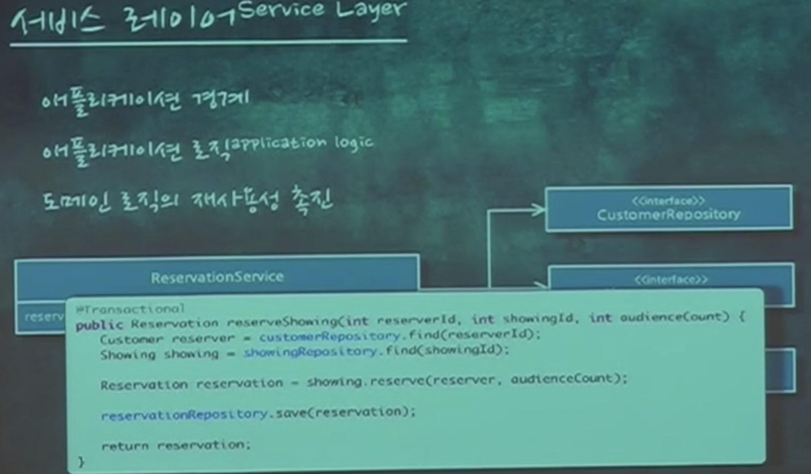

# [KSUG Seminar] Growing Application - 2nd. 애플리케이션 아키텍처와 객체지향

https://www.youtube.com/watch?v=26S4VFUWlJM

애플리케이션 로직과 도메인 로직을 분리하고, 어떻게 객체에 초점을 둔 로직을 작성하는지 알려주는 영상.
절차지향 코드와 객체지향 코드 예시를 통해 비교한다.

---

https://youtu.be/26S4VFUWlJM?t=46m57s
* 이 코드 가지고만 실제 어플리케이션을 짤 수는 없음. 데이터는 DB에 있기 때문에
* 800원 할인이라는 정보는 클래스가 아니라 디비에 있다.
* "여기서 왜 데이터베이스를 기준으로 코드를 맞추는게 아니라 코드를 기준이 되어야 하는지 알 거 같다"
* 어플리케이션 로직
  * 어플리케이션의 플로우
  * 도메인 로직의 전 후에 존재
  * 순수한 객체(도메인 객체)에 넣지 않음
  * 넣으면 디비나 네트워크에 의존이 생김
  * 도메인과 무관한 기술적인 내용들을 의미함
  * 도메인 로직을 캡슐화 해준다
  * 서비스

* 어플리케이션의 경계
* 서비스 시작과 끝은 트랜잭션의 시작 끝을 의미한다
* 데이터를 준비하고, 도메인 로직에 위임한다.

* 절치 지향이 되면 fat 서비스가 된다. 좋은 서비스는 thin 서비스

https://youtu.be/26S4VFUWlJM?t=55m37s

* 임피던스 미스매치
* 도메인 위주로 작성하고 데이터베이스를 구현 하면 어렵다는 단점이 있다.
* 위처럼 클래스와 테이블이 일치하지 않는 현상도 발생한다.
* "객체 지향적으로 갈수록 갭은 멀어진다. 이를 임피던스 미스매치라 한다"

https://youtu.be/26S4VFUWlJM?t=56m36s
* 테이블을 클래스로 매핑하는 데이터 매퍼 작성이 어려워 지기 때문에 ORM과 같은 기술을 쓴다.
* "클래스와 테이블의 간격이 멀어서 매핑하기가 너무 어려워서 JPA(ROM)을 쓰는 것이다."

https://youtu.be/26S4VFUWlJM?t=1h6m57s
* 트랜잭션 스크립트를 수정 할 때 최대 단점은 도메인이 코드에 암묵적으로 녹아 있다.
* 코드에 "중복할인"이라는 말은 없다. 그냥 N개의 할인이라는 코드가 있을 뿐
* (하나만 할인 => 중복 할인 허용 시)
* "우린 중복 할인 허용해" 라고 하지만 코드가 어떻게 돌아가는지 봐야만 알 수 있다.