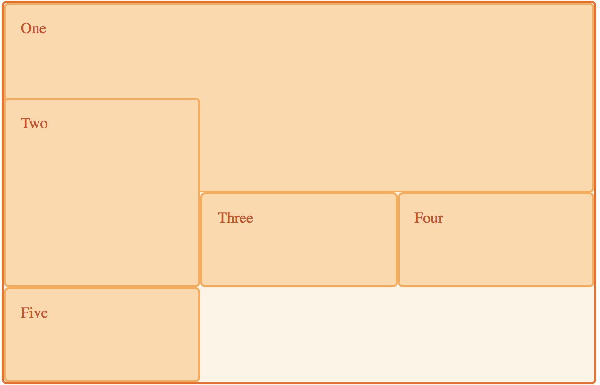

# Grid Layout

[MDN: 그리드 레이아웃 기본 개념](https://developer.mozilla.org/ko/docs/Web/CSS/CSS_Grid_Layout/%EA%B7%B8%EB%A6%AC%EB%93%9C_%EB%A0%88%EC%9D%B4%EC%95%84%EC%9B%83%EC%9D%98_%EA%B8%B0%EB%B3%B8_%EA%B0%9C%EB%85%90)

다음 페이지가 있지만 이 페이지만 읽었다. 번역이 잘 되어 있다.

```css
.item {
    display: grid;
}
```

안드로이드 배경화면에 위젯을 배치하는 것처럼 레이아웃을 구성할 수 있다. 모눈종이에 아이템을 배치하는 느낌이라 매우 직관적이다.

Flex Layout과 비교해서 레이아웃 내에 있는 아이템들을 모두 `flex-grow`나 `flex-shrink`로 크기를 결정한 거 같다.
다른 점은 그리드 레이아웃은 가로, 세로 모두 사용하는 점?

아이템들을 겹쳐서 표현할 때 그 간단함과 직관성이 드러난다.



## 스크롤 없는 화면의 레이아웃 구성 시 유용할 거 같다.

왜 그럴까?

* 고정된 좌표를 사용할 수 있다. 반면 다른 레이아웃으로 이를 구현하려면 화면 크기에 따라 좌표가 달라진다. `%`를 사용하거나.
    * 위치를 계산해야 하는 작업은 부담된다.
* 비슷하게 구현하려면 다른 레이아웃은 `top`, `bottom`, `left`, `right`로 좌표를 설정해야 한다.
* 일반(스크롤이 있는) 화면은 요소를 쌓아 나가며, 다른 레이아웃 속성도 여기에 맞춰져 있다.
* 반면에 그리드 레이아웃은 모든 아이템을 어디에 배치할 지 명시해야 한다.
    * A는 (1, 2)에 놓고, B는 (2, 4)에 놓고..
