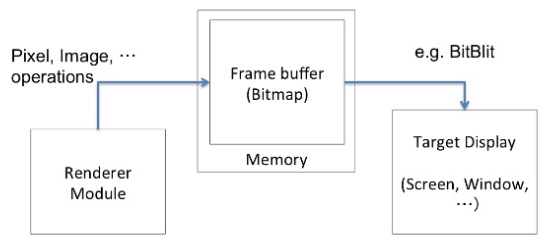
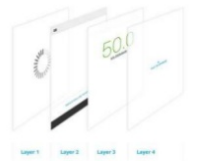
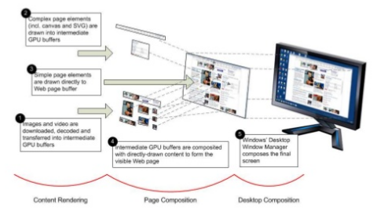
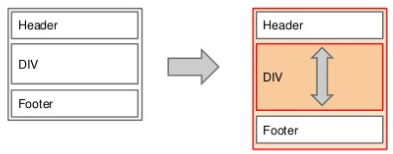
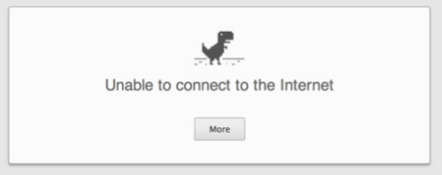

# 2016-08-27 GDG WebTech Workshop "측정하는 놈, 로딩하는 놈, 그리는 놈"

GDG WebTech 워크샵에 참여해서 들었던 크롬 브라우저를 이용한 성능 측정 방법을 정리한 것

## Slides

* http://www.slideshare.net/cwdoh/gdg-webtech-1
* http://www.slideshare.net/cwdoh/instant-and-offline-apps-with-service-worker
* http://www.slideshare.net/cwdoh/service-worker-101
* http://www.slideshare.net/cwdoh/overview-how-to-measure-your-web-app

## 프론트엔드 개발자를 위한 크롬 렌더링 성능 인자 이해하기

웹 브라우저(특히 크롬)에서 렌더링의 성능을 결정하는데 중요한 것이 무엇인지 알아보고 그 것의 개념과
개선하기 위한 방법을 알아본다.

### 하드웨어 가속

하드웨어 가속을 사용하는 것은 같은 기능을 하드웨어(GPU)의 도움을 받는 것을 의미한다.

**소프트웨어 렌더링 실행 구조**



계산, 메모리에 올리는 일, 출력하는 일을 모두 도맡아 하게 된다.

*소프트웨어 렌더링 성능 = 주요 기능의 수행시간 + 그래픽스 출력 시간*

따라서 주요 기능의 수행은 CPU에 맡기고 그래픽 관련 처리를 GPU에 맡기는 것이 포인트.

### CPU와 GPU 사이에 존재하는 이슈

#### 1. 서로 다른 메모리 공간

CPU가 어떤 것을 그려야 하는지 GPU에 넘겨 주는데 서로 다른 메모리 공간을 사용하기 때문에
BUS를 통해 CPU -> GPU 전달한다. 문제는 이 BUS를 통한 커뮤니케이션이 느리다는 것.

#### 2. 메모리 한계

처리할 모든 데이터는 메모리에 있지만, 이 메모리는 한계가 있다는 것.

#### 3. 데이터가 자주 변경된다.

CPU의 데이터 변경 시 GPU 메모리도 변경되어야 반영할 수 있다.

### GPU

GPU는 공간 좌표(Vertex)를 모아 도형(Polygon)을 만들고 여기에 이미지(Texture)를 씌워 그린다(Mapping).

#### GPU가 잘하는 것

GPU는 수신된 데이터로 무언가를 그리는데 적합하다.

1. 텍스쳐를 가지고 이미지를 빠르게 출력 가능
2. 이미 가진 텍스쳐는 다시 받지 않고 재활용
3. 변환(Transform, 회전, 확대, 축소, 기울임) 반투명 처리 등
4. 위 기능들을 동시에 처리하는 것도 매우 최적화

#### GPU의 약점

CPU -[BUS]-> GPU 데이터 전송 속도

##### 하지만 더 큰 이슈는 **CPU의 처리 시간**

GPU의 데이터는 CPU에서 생성 후 전송한다.

즉, CPU에서 데이터 가공 시간 + CPU -> GPU 데이터 전달 시간이 문제이다.

### 렌더링 성능의 주요 인자

1. 변환(회전, 확대, 축소, 기울임)과 반투명 처리 등은 GPU가 처리할 수 있도록 한다.
2. CPU가 새로운 데이터를 만드는 작업은 최소화한다.
3. CPU -> GPU 데이터 전송을 최소화 한다.

## 크롬의 하드웨어 가속 렌더링 메커니즘

### 웹페이지의 렌더링

```
[DOM Tree] --------
                  | --- [Render tree] --- [Paint!]
[Styles struct] ---
```

위에 서술한 부분들은 모두 Render tree 부분이다.

### 레이어 모델

레이어(Layer)는 웹페이지를 렌더링하기 위해 필요한 이미지 단위 요소.

CPU가 이 레이어를 생성한다. 즉, 레이어에서 생성되는 이미지는 CPU 시간 소모.



웹 페이지는 레이어들의 겹침으로 표현된다.

### 컴포지트 (Composite)

각 요소들을 텍스쳐 이미지를 합치는 GPU의 작업.



### 렌더링 이슈

#### Reflow

DOM 노드가 가지는 레이아웃 정보가 변경되면 재배치를 위한 계산이 필요하다.



레이아웃의 변경이 트리를 따라 전파되고, 많은 경우 레이어 이미지의 갱신이 필요하다.

#### Repaint

레이아웃 내 컨텐츠 변경 시 텍스쳐를 새로 생성 필요.

#### Reflow / Repaint 발생 요인

* DOM 노드의 동적인 추가 / 삭제 / 업데이트
* DOM 노드의 감춤 / 표시
   * display: none / visibility: hidden
* DOM 노드의 이동, 애니메이션
* 스타일시트의 추가 혹은 스타일 속성의 변경
   * 미디어 쿼리
* 브라우저 사이즈 변경
* 폰트 변경
* 스크롤

### 크롬 개발자도구

#### Timeline

https://developers.google.com/web/tools/chrome-devtools/profile/evaluate-performance/timeline-tool?hl=ko#timeline-overview

어떤 노드가 렌더링하는데 오래 걸리는지 알 수 있다.

#### Elements > Rendering

##### Paint Flashing

체크하면 repaint 되는 부분을 강조 표시해 준다.

애니메이션이 일어나는 부분들은 쉽게 볼 수 있다.

##### Layer Borders

체크하면 레이아웃의 레이어 구조를 볼 수 있다.

오렌지색 선이 레이어이며, 이는 GPU에 의해 렌더링 되는 것을 의미한다.

#### User Timing

크롬 개발자 도구는 GUI를 지원하므로 디테일한 시간으로 캐치하기 힘들다.

이를 위해서 코드 내에서 캐치할 수 있는 API가 존재한다.

*실제로 사용해보지 않았음.*

[window.performance.mark](https://developer.mozilla.org/en-US/docs/Web/API/Performance/mark)

*이하는 크롬에서만 동작할 것*

Reference: https://developers.google.com/web/tools/chrome-devtools/debug/console/console-reference

console.timeline

### 크롬에서의 전반적인 렌더링 흐름

1. DOM으로부터 노드들을 레이어 단위로 분리
2. 레이아웃을 계산하고 각 레이어가 그려져야 할 영역의 크기, 위치 등을 계산
   * 크기, 위치 정보 등을 계산하기 위한 **CPU 계산 오버헤드** 발생
3. 레이어들 각각은 렌더링을 위해 비트맵 출력
   * **CPU에서 레이어 이미지를 생성하는 오버헤드** 발생
4. 생성된 비트맵을 GPU에 업로드
   * **GPU의 비디오 메모리로 전송하는 오버헤드** 발생
5. 계산된 레이아웃으로 레이어 텍스쳐 이미지들을 최종 스크린 이미지로 합성

## 렌더링 최적화 방법

### 가장 간단한 방법 : 최소한으로 레이어 분리

레이어는 GPU가 그리기 때문에 빠른 성능을 요구하는 부분을 레이어로 분리하여 GPU가 그리게 하는 것.

하지만 모든 렌더링을 GPU에 전가하는 것 또한 병목현상을 유발하므로 **최소한**으로 분리하는 것이 좋다.

**크롬에서 DOM 노드가 레이어로 분리되는 조건**

1. 3D 혹은 Perspective를 표현하는 CSS transform 속성을 가진 경우
2. 하드웨어 가속 디코딩을 사용하는 ```<video>``` Element
3. 3D Context 또는 가속 2D Context를 가지는 ```<canvas>``` Element
4. (플래시 등) 플러그인 영역
5. opacity 속성, transform 애니메이션을 사용하는 경우
6. 가속 가능한 CSS 필터를 가진 경우
7. Compositing Layer를 하위 노드로 가지는 경우
8. 낮은 z-index를 가진 형제 노드가 Compositing Layer를 가진 경우

#### translateZ(0)

Z축 값으로 0을 주는 무의미한 코드이나 레이어 분리 조건에 들어간다.

필요한 경우가 아니라면 사용하지 않는 것이 좋다.

### 강제적인 레이어 분리가 만능이 아닌 이유

#### 레이어 분리는 텍스쳐 이미지의 분리를 의미한다.

이는 추가적인 메모리를 소모함을 의미하며, 메모리는 유한하다.

메모리 공간이 부족해지면 기존 데이터 릴리즈 후 새로운 메모리를 업로드 한다.

이 경우가 반복되면 레이어 분리를 통한 성능 이점이 오버헤드로 상쇄된다.

### CSS: will-change

**will-change: 속성명;**

이 속성이 변경 될 수 있음을 브라우저에 힌트를 준다. 브라우저는 실제 요소가 변화되기 전에 적절하게 최적화 할 수 있게 된다.

* 설명: https://developer.mozilla.org/ko/docs/Web/CSS/will-change
* 팁: https://dev.opera.com/articles/ko/css-will-change-property/

---

## Instant and offline apps

### Instant Loading

로딩을 개선하기 위해서 목표는 다음과 같다:

* 큰 이미지 사용 금지
* 필요한 것만 다운로드
* 가급적이면 바뀐 부분만 다운로드

그러면 위 목표들을 위해서 무엇을 해야 할까?

#### 압축

* 스크립트, 스타일시트 파일 압축하기
* webp 압축 이미지 포맷 사용 (크롬과 특정 브라우저만 지원)

#### 작은 이미지 사용

* 다양한 사이즈와 포맷을 지원한다.
* img 태그의 sizes 속성을 이용하여 반응형 지원 가능

#### Round Trips 줄이기

* Redirect은 Round Trip을 야기한다.
* link 태그 rel 속성에 힌트 정의하기
    * rel="dns-prefetch"
    * rel="preconnect"
    * rel="preload"
    * rel="prefetch"

#### Be interactive

* script 태그에 defer, async 사용하여 병렬 로드

#### iFrame

iFrame은 사용하지 않음에도 메인이 로드될 때 함께 로드된다. 메인 시스템이 로드 되는 것을 방해하는 것이다.

스크립트를 통해 메인 시스템 로드 후 로드될 수 있도록 한다.

**스크립트 예**
```html
<iframe data-src="https://example.com"></firame>
<iframe data-src="https://another.example.com"></firame>
<script>
    document.addEventListener('load', () => {
        Array.from(document.querySelectorAll('iframe'))
            .forEach(iframe => iframe.src = iframe.dataset.src);
    });
</script>
```

#### HTTP/2

기존의 HTTP 1.1은 분할된 이미지가 있으면 요청을 분할하여 여러번 나눠서 요청한다.

이미지를 255조각 내었다면 요청을 255번 하는 것이다.

반면에 HTTP/2는 한 번에 모두 요청한다.

HTTP/2를 사용하려면 https를 사용해야 한다.

---

## Service Worker

오프라인에 대응할 수 있고, 싱글 스레드인 자바스크립트에서 분리된 스레드로 앱의 백그라운드에서 동작하는
서비스 워커에 대해 알아본다.

### 오프라인 로딩

네트워크가 애매한 경우 (Lie-fi 라고 한다.) 앱은 느린 네트워크를 통해 데이터를 받아 오려고 시도하고
사용자는 언제 로드 될지 알 수 없는 컨텐츠를 하염없이 기다려야 한다.

서비스 워커의 캐싱을 사용하면 요청 중 오프라인이 되거나 서버로부터 컨텐츠를 받기 전까지 사용자에게
저장된 캐싱 데이터를 보여줄 수 있다.

### Web worker

서비스 워커는 특정한 워커 중 하나이다.

그리고 웹 워커는 메인 페이지와 병렬 **스크립트를 실행하는 백그라운드 워커를 생성**하는 API다.

**메시지 전송 기반의 Thread와 유사한 동작**을 가능하게 한다.

**즉, 병렬 스크립트 실행을 위한 API.**

특징으로는

* DOM 직접 접근, 조작 불가
* 자체 글로벌 스코프 (window가 아님)
* window가 아니므로 일부 속성과 API만 사용 가능

### Service Worker

**지속적인 백그라운드 처리를 하는 워커**로 **이벤트 드리븐 모델**이다.

지속적이라는 의미는 **페이지가 로딩되지 않았을 때도 동작**한다.

따라서 페이지가 실행되지 않더라도 브라우저가 관리한다.

#### 기능: 오프라인 캐쉬



크롬 브라우저는 오프라인일 때 간단한 게임을 할 수 있는 서비스 페이지를 제공한다.

오프라인 캐쉬는 이용자가 네트워크 요청시 **서버로 바로 가는 것이 아니라**
개발자가 어떻게 동작할 것인지 제어할 수 있는 기능이다.

#### 기능: 백그라운드 동기화

위에서 **페이지가 로딩되지 않았을 때도 동작**한다고 하였다.

이를 이용하여 사용자가 데이터 입력 중 인터넷이 끊어지더라도 데이터를 저장해 두었다가
나중에 네트워크 연결이 되면 **앱을 다시 실행하지 않더라도** 데이터를 서버에 보낼 수 있는 기능을 구현할 수 있다.

#### 규칙, 장점

> Using service worker you can hijack connections, fabricate, and filter responses. Powerful stuff. While you would use these powers for good, a man-in-the-middle might not. To avoid this, you can only register for service workers on pages served over HTTPS, so we know the service worker the browser receives hasn't been tampered with during its journey through the network.

HTTPS를 통해 제공되어야만 한다.
데이터의 신뢰성이 보장되지 않으면 사용자의 의도와는 다른 데이터를 서버에 전송할 수 있기 때문이다.

Polyfill이 없어서 시스템에서 지원하지 않으면 그냥 동작하지 않는다.
