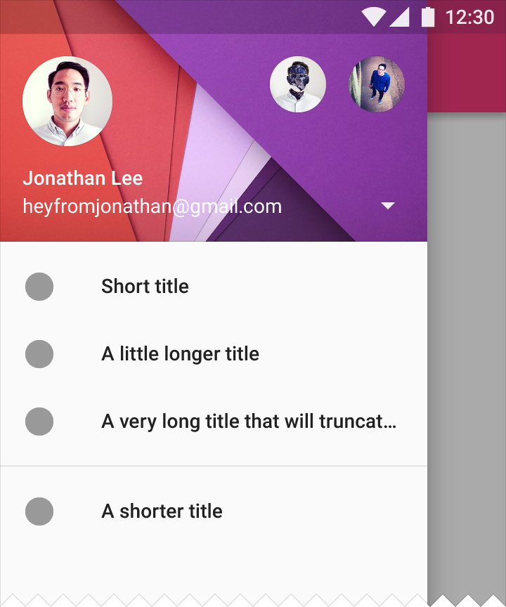

# 2016-11-16 캠퍼스 스타트업 스쿨의 "구글 플레이에서 꼭 지켜야 할 두 가지"

2가지 주제로 진행되었다.

1. 구글 플레이 정책 이해
2. 안드로이드스러운 앱 만들기

1번 주제는 현재 상황에서 와닿지 않아서 흥미가 없었으나 2번 주제는 재밌었다.

따라서 2번 주제인 안드로이드스러운 앱 만들기에 대한 정리만 한다.

[https://developer.android.com/index.html](https://developer.android.com/index.html)

여기에 있는 정보들을 더 자세하게 알려주는 것이 모임의 목표라고.. :D

# 머터리얼 디자인 (Material Design)

구글 I/O 2016에서도 언급된 내용이었고 번역된 동영상을 흥미있게 봤는데, 여기서도 나와서 좋았다.

스타트업이 머터리얼 디자인을 사용해야 하는 이유는
**브랜드 표현력**과 **사용자 만족도**가 높아서 라고 한다.

그리고 구글 서비스에서 적용되고 있는 **검증된** 디자인이며,
UI에 투자하기 힘들다면 가장 무난한 선택이 될 것이다.

## 용도별로 알맞은 컴포넌트 사용하기

### 탭(Tab)

자주 바뀌는 메뉴에 사용한다.

### 탐색 서랍(Navigation Drawer)

자주 사용하는 기능이나 관계 없는 기능을 모아두는데 사용한다.

[https://material.google.com/patterns/navigation-drawer.html](https://material.google.com/patterns/navigation-drawer.html)

### 미니 서랍(Mini Navigation Drawer)

탐색 서랍과 비슷하나 아이콘으로 된 것으로 탐색 서랍처럼 사용된다.

외국에선 잘 사용된다고 한다.

## 머터리얼 디자인의 우수 사례

[Trello](https://trello.com/) : 사용자 참여도가 높아짐

[The Hunt](https://www.thehunt.com/) : 최초 사용자가 많아짐

[Pocket Casts](http://www.shiftyjelly.com/pocketcasts/) : 과급 뎁스를 줄임으로써 매출 증가

[B&H Photo Video](https://www.bhphotovideo.com/) : 인앱 상품 구매율 증가

# 개발

개발 측면에서 구글 플레이에 더 잘 노출되기 위한 방법들이다.

단순히 Manifest 설정만으로도 검색 목록에 등장 유무가 결정되는 것이 신기했다.

## 단말기 다양성 고려하기

이전에는 UI 설계 -> 단말기 대응 순서로 개발하면서 다양한 해상도를 제대로 지원하지 못해서 사용자 경험을 헤쳤는데,

지금은 **사용자 패턴 분석 - 단발기 분류 - UI설계**. 즉, 어떤 단말기를 지원할 것인지 결정하고
설계하는 것이 더 좋은 방법이라고 한다.

### 최소한의 Manifest 설정

전화 기능이 없는 패드에서는 구글 플레이에서 전화 기능이 true된 앱 검색이 필터링 된다고 한다. (우선 순위에서 밀려나는 것으로 추정)

따라서 사용하지 않는 기능이라면 Manifest 설정을 false로 바꾸는 것이 현명하다.

### 용량 최소화

아직 네트워크 상황이 좋지 않은 나라를 지원하기 위해서 용량은 최소화 하는 것이 좋다는 의견

안드로이드에서 인지는 모르겠지만 빌드 시(아마도) Minify 해주는 함수를 지원한다.

### Manifest의 Target SDK Version 맞추기

왠만하면 최신 버전으로 Target SDK Version을 맞춰서 개발하는 것이 좋다.

## 유용한 기능

다양한 구글 API를 사용하여 사용자 편리 기능들을 지원한다.

### 알람 (Notification)

너무 유명한 기능.

### Runtime Permission

이전에는 앱 설치전에 사용할 기능들에 대한 퍼미션을 미리 공지하였고, 이에 부정적인 느낌을 주었으나

Runtiem Permission을 사용하면 실제로 특정 기능을 사용할 때 사용자에게 퍼미션 동의를 얻는 것이 가능하다고 한다.

잘 사용한다면 퍼미션 최소화 할 수 있다.

만약 거부시에 대한 예외처리를 하지 않으면 강종되는 문제가 발생할 수 있으니 조심하라고 한다.

### Google Play Game

게임 앱의 경우 Google Play Game을 사용하면 업적, 리더 보드 등 사용 가능하다.

# 그 외

## A / B 테스팅

구글 플레이에서 A / B 테스트를 지원한다!

구글 플레이에서 사용자마다 다른 아이콘을 보여주어서 분석하는 예제가 있었다.

## 머터리얼 디자인을 잘 사용하면 직접 추천 앱에 노출시켜 준다!

이 부분은 자동화하기 힘든 영역이므로 머터리얼 디자인을 잘 따라준다면 수동으로 추천 앱(확실치 않음)에 선정 해 준단다.
