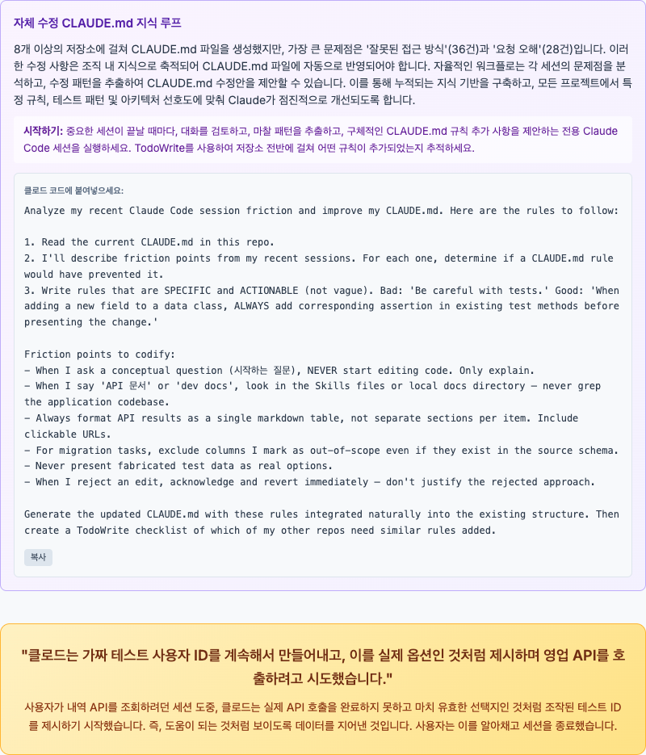

# Anthropic

## Claude Code

Anthropic에서 제공하는 에이전트 코딩 **명령줄 도구**.

https://code.claude.com/docs/en/overview

- 2025년 3월 기준 프리뷰 단계에 있다. 프리뷰 단계지만 무료 기간이 없다.
- 2025년 6월 4일, Pro 플랜에 포함되었다.
- 2025년 8월, [Team 플랜](https://www.reddit.com/r/Anthropic/comments/1mvvha9/claude_code_now_on_teams_plan/)에 포함되었다.
  다만 Premium Seat를 추가 구매해야 하는데 가격이 $150이고, 최소 5개 Seat를 구매해야 한다.
- 2026년 1월 16일, [Team 플랜에 Claude Code가 기본 포함되도록 변경](https://www.linkedin.com/posts/claude_claude-code-is-now-included-with-every-team-activity-7418022583620505600-Vjm9)되었다. Premium Seat 구매가 필요없다.

[레딧 BEWARE CALUDE CODE IS NOT FREE 글](https://www.reddit.com/r/ClaudeAI/comments/1ixi2rg/beware_claude_code_is_not_free/)을 보면
쿼리 2~3개에 $5 사용되었다고. 덧글에도 비슷한 경험을 한 사람들이 있다.
비용이 적은 사람도 있는 걸 보면, 코드베이스의 크기에 따라 달라지는 것으로 추정.

플랫폼이 터미널 기반이고, [MCP](/docs/wiki/model-context-protocol.md) 클라이언트이기 때문에 아주 광범위한 작업을 처리할 수 있다.
IDE에서 동작하는 다른 AI 도구와는 다르게, 명령줄 도구를 이용할 수 있다는 것이 큰 장점이다. 대부분의 OS 작업을 처리할 수 있다는 의미가 된다.

macOS는 `brew install claude-code`로 설치하자, cask로 제공되기 때문.
NPM `npm i @anthropic-ai/claude-code`로도 설치할 수 있지만, native installer를 사용하라는 안내가 뜬다.

기존 프로젝트라면 `/init` 명령어로 분석 후 시작하자.
`CLAUDE.md`를 생성하여 프로젝트 개요와 주요 파일을 기록한다.
`CLAUDE.md`는 copilot 또한 참조할 수 있다.
요즘은 `AGENTS.md`로 에이전트 벤더에 종속되지 않는 것이 추세인 듯.
[codex는 AGENTS.md 파일을 참조한다](https://developers.openai.com/codex/guides/agents-md/).

2026년 2월에는 Opus 4.6 모델의 [fast mode가 추가되었다](https://code.claude.com/docs/en/fast-mode).
`/fast` 명령어로 전환할 수 있다.
2.5배 더 빨라진다고 한다. 하지만 가격은 출력 토큰 기준으로 일반 모드가 $25/백만 토큰인 반면에 fast 모드는 $150/백만 토큰으로 [6배 비싸다](https://platform.claude.com/docs/en/about-claude/pricing#fast-mode-pricing). \
Team Plan은 조직에서 활성화해야 한다.

### 기능

- 대화가 길어지면 알아서 압축(compact)하고 새로운 세션에서 이어간다.
- 이미지 분석 가능하다. Web URL을 직접 전달하면 처리하지 못하지만(저장 후 분석하라고 하면 가능할지도) 로컬 파일은 분석한다.
- [세션을 분할하여](https://code.claude.com/docs/en/how-claude-code-works#resume-or-fork-sessions), 기존 세션을 분기할 수 있다.

#### insights 기능

`/insights` 명령어로 사용자의 클로드 코드 사용 패턴을 분석한다. `2.1.30` 버전에서 추가되었다.
전체 세션에 대해서 분석하여, 클로드가 놓치는 부분을 개선할 수 있도록 사용 방식을 제안한다.
분석 결과는 html 파일로 출력된다.

아래는 내 분석 결과 중 요약 부분만 번역한 것이다.

> ## 한 눈에 보기
>
> **잘 되고 있는 점:** 여러 리포지토리에서 CLAUDE.md를 먼저 작성하는 체계적인 온보딩 습관이 Claude의 성공적인 작업을 이끌고 있으며, 설계 사고 파트너로서 Claude를 효과적으로 활용하고 있습니다 — 환불 서비스의 sealed class 리팩토링처럼 여러 차례의 설계 반복을 거쳐 아키텍처가 적절해질 때까지 조율하고 있습니다. Skills, Streamlit 앱, CSV 유틸리티 등 다양한 언어에 걸친 인상적인 내부 개발 도구 생태계도 구축했습니다.
>
> **방해가 되는 점:** Claude 측에서는 지정된 도구나 데이터 소스를 지속적으로 무시하고(Skills나 API 문서를 사용하라고 했는데 코드베이스를 grep하는 등), 개념적 질문만 했는데 코드 편집을 시작하는 등 범위를 자주 벗어납니다. 사용자 측에서는 초기 프롬프트의 범위나 기대 출력 형식에 모호함이 있어 Claude의 첫 시도가 잘못된 방향으로 가는 경우가 있으며 — 반복적인 수정 사이클로 생산성이 저하됩니다.
>
> **빠르게 시도할 수 있는 것:** 자주 반복하는 API 조회 워크플로우에 맞춤 Skills(슬래시 커맨드)를 만들어 보세요 — `/sales-history`나 `/purchase-orders` 같은 스킬이 올바른 엔드포인트 소스, 인증 방식, 출력 형식을 하드코딩하면 가장 흔한 마찰 패턴을 한 번에 해결할 수 있습니다. 편집 후 자동으로 테스트를 실행하는 hooks도 설정하면, 누락된 productName assertion 같은 문제를 직접 발견하기 전에 잡아낼 수 있습니다.
>
> **야심찬 워크플로우:** 모델이 더 강력해지면, 기존 Skills 인프라를 활용하여 완전히 자율적인 API 탐색-실행 파이프라인을 구축할 수 있습니다 — 엔드포인트를 찾고, 인증을 처리하고, 호출하고, 수정 없이 포맷된 테이블을 반환하는 하나의 명령. 더 강력한 것은: 세션에서 발생한 마찰(잘못된 접근, 잘못된 관례 이해)이 자동으로 CLAUDE.md 파일에 반영되는 자기 수정 지식 루프로, 같은 실수가 어떤 리포지토리에서도 두 번 다시 발생하지 않게 됩니다.

_빠르게 시도할 수 있는 것_ 항목을 보면, insights 기능을 통해 사용자가 AI와의 핑퐁을 줄이고자 하는 것을 알 수 있다.
실제로는 테스트 hooks로 해결되지 않는 문제였지만.

리포트 결과는 더 많은 내용과 함께 그래프로 보기 좋게 제공된다.
즉시 시도할 수 있도록 CLAUDE.md에 추가하면 좋을만한 내용을 제안하는데, 즉시 복사할 수 있도록 편의 기능도 제공한다.

아주 솔직하게 피드백을 준다.
가장 아래의 섹션에 Claude가 가짜 ID를 사용하여 API를 호출하려고 했고, 내가 중단했다는 내용을 첨부했다.
