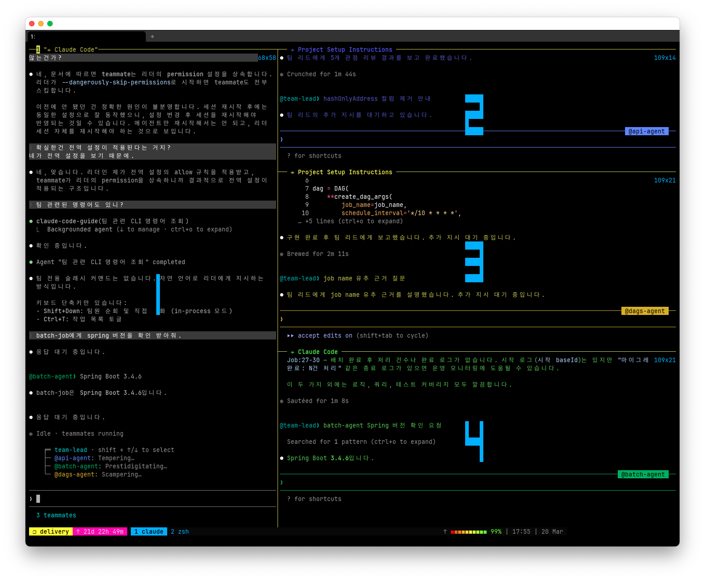
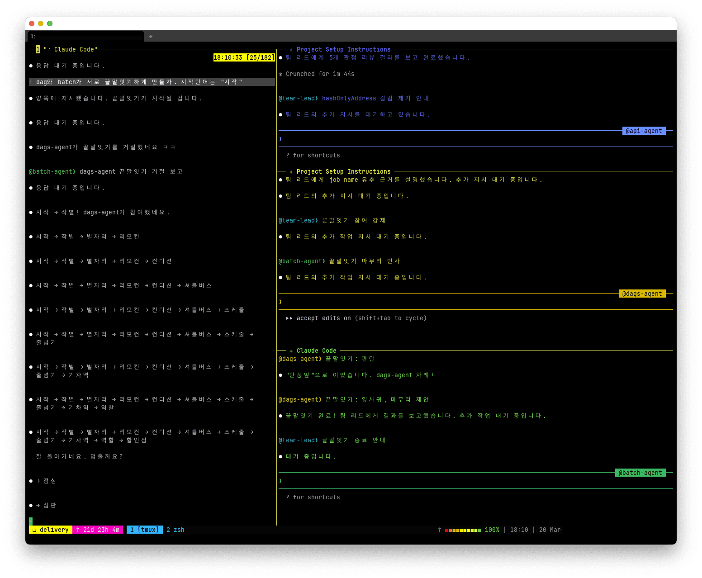

# Anthropic

Claude 제품군을 개발하는 AI 회사.

OpenAI가 비 개발자에게 친숙하다면 Anthropic은 개발제에게 더 친화적인 제품을 만드는 회사로 볼 수 있다.
특히 AI 도구 생태계의 발전을 주도적으으로 이끌고 있다.
특히 2025년과 2026년에 걸쳐서 에이전틱 도구에서는 Anthropic이 가장 활발한 업데이트를 하고 있다.

## Claude Code

Anthropic에서 제공하는 에이전트 코딩 **명령줄 도구**.

https://code.claude.com/docs/en/overview

- 2025년 3월 기준 프리뷰 단계에 있다. 프리뷰 단계지만 무료 기간이 없다.
- 2025년 6월 4일, Pro 플랜에 포함되었다.
- 2025년 8월, [Team 플랜](https://www.reddit.com/r/Anthropic/comments/1mvvha9/claude_code_now_on_teams_plan/)에 포함되었다.
  다만 Premium Seat를 추가 구매해야 하는데 가격이 $150이고, 최소 5개 Seat를 구매해야 한다.
- 2026년 1월 16일, [Team 플랜에 Claude Code가 기본 포함되도록 변경](https://www.linkedin.com/posts/claude_claude-code-is-now-included-with-every-team-activity-7418022583620505600-Vjm9)되었다. Premium Seat 구매가 필요없다.

[레딧 BEWARE CALUDE CODE IS NOT FREE 글](https://www.reddit.com/r/ClaudeAI/comments/1ixi2rg/beware_claude_code_is_not_free/)을 보면
쿼리 2~3개에 $5 사용되었다고. 덧글에도 비슷한 경험을 한 사람들이 있다.
비용이 적은 사람도 있는 걸 보면, 코드베이스의 크기에 따라 달라지는 것으로 추정.

플랫폼이 터미널 기반이고, [MCP](/docs/wiki/model-context-protocol.md) 클라이언트이기 때문에 아주 광범위한 작업을 처리할 수 있다.
IDE에서 동작하는 다른 AI 도구와는 다르게, 명령줄 도구를 이용할 수 있다는 것이 큰 장점이다. 대부분의 OS 작업을 처리할 수 있다는 의미가 된다.

macOS는 `brew install claude-code`로 설치하자, cask로 제공되기 때문.
NPM `npm i @anthropic-ai/claude-code`로도 설치할 수 있지만, native installer를 사용하라는 안내가 뜬다.

기존 프로젝트라면 `/init` 명령어로 분석 후 시작하자.
`CLAUDE.md`를 생성하여 프로젝트 개요와 주요 파일을 기록한다.
`CLAUDE.md`는 copilot 또한 참조할 수 있다.
요즘은 `AGENTS.md`로 에이전트 벤더에 종속되지 않는 것이 추세인 듯.
[codex는 AGENTS.md 파일을 참조한다](https://developers.openai.com/codex/guides/agents-md/).

2026년 2월에는 Opus 4.6 모델의 [fast mode가 추가되었다](https://code.claude.com/docs/en/fast-mode).
`/fast` 명령어로 전환할 수 있다.
2.5배 더 빨라진다고 한다. 하지만 가격은 출력 토큰 기준으로 일반 모드가 $25/백만 토큰인 반면에 fast 모드는 $150/백만 토큰으로 [6배 비싸다](https://platform.claude.com/docs/en/about-claude/pricing#fast-mode-pricing). \
Team Plan은 조직에서 활성화해야 한다.

Anthropic은 [MCP](/docs/wiki/model-context-protocol.md), [Skills](/docs/wiki/claude-skills.md), [Subagent](#subagent)을 고안하였는데,
이 셋은 모두 사용자의 의도에 반응하여 작업을 처리하는 개념으로 모두 같은 범주에 속한다고 볼 수 있다.
아무래도 모델 컨텍스트가 제한되어 있기 때문에 이러한 개념들로 성능이 떨어지는 문제를 보완하려는 것으로 보인다.

### 기능

- 대화가 길어지면 알아서 압축(compact)하고 새로운 세션에서 이어간다.
- 이미지 분석 가능하다. Web URL을 직접 전달하면 처리하지 못하지만(저장 후 분석하라고 하면 가능할지도) 로컬 파일은 분석한다.
- [세션을 분할하여](https://code.claude.com/docs/en/how-claude-code-works#resume-or-fork-sessions), 기존 세션을 분기할 수 있다.

#### insights

`/insights` 명령어로 사용자의 클로드 코드 사용 패턴을 분석한다. `2.1.30` 버전에서 추가되었다.
전체 세션에 대해서 분석하여, 클로드가 놓치는 부분을 개선할 수 있도록 사용 방식을 제안한다.
분석 결과는 html 파일로 출력된다.

아래는 내 분석 결과 중 요약 부분만 번역한 것이다.

> ## 한 눈에 보기
>
> **잘 되고 있는 점:** 여러 리포지토리에서 CLAUDE.md를 먼저 작성하는 체계적인 온보딩 습관이 Claude의 성공적인 작업을 이끌고 있으며, 설계 사고 파트너로서 Claude를 효과적으로 활용하고 있습니다 — 환불 서비스의 sealed class 리팩토링처럼 여러 차례의 설계 반복을 거쳐 아키텍처가 적절해질 때까지 조율하고 있습니다. Skills, Streamlit 앱, CSV 유틸리티 등 다양한 언어에 걸친 인상적인 내부 개발 도구 생태계도 구축했습니다.
>
> **방해가 되는 점:** Claude 측에서는 지정된 도구나 데이터 소스를 지속적으로 무시하고(Skills나 API 문서를 사용하라고 했는데 코드베이스를 grep하는 등), 개념적 질문만 했는데 코드 편집을 시작하는 등 범위를 자주 벗어납니다. 사용자 측에서는 초기 프롬프트의 범위나 기대 출력 형식에 모호함이 있어 Claude의 첫 시도가 잘못된 방향으로 가는 경우가 있으며 — 반복적인 수정 사이클로 생산성이 저하됩니다.
>
> **빠르게 시도할 수 있는 것:** 자주 반복하는 API 조회 워크플로우에 맞춤 Skills(슬래시 커맨드)를 만들어 보세요 — `/sales-history`나 `/purchase-orders` 같은 스킬이 올바른 엔드포인트 소스, 인증 방식, 출력 형식을 하드코딩하면 가장 흔한 마찰 패턴을 한 번에 해결할 수 있습니다. 편집 후 자동으로 테스트를 실행하는 hooks도 설정하면, 누락된 productName assertion 같은 문제를 직접 발견하기 전에 잡아낼 수 있습니다.
>
> **야심찬 워크플로우:** 모델이 더 강력해지면, 기존 Skills 인프라를 활용하여 완전히 자율적인 API 탐색-실행 파이프라인을 구축할 수 있습니다 — 엔드포인트를 찾고, 인증을 처리하고, 호출하고, 수정 없이 포맷된 테이블을 반환하는 하나의 명령. 더 강력한 것은: 세션에서 발생한 마찰(잘못된 접근, 잘못된 관례 이해)이 자동으로 CLAUDE.md 파일에 반영되는 자기 수정 지식 루프로, 같은 실수가 어떤 리포지토리에서도 두 번 다시 발생하지 않게 됩니다.

_빠르게 시도할 수 있는 것_ 항목을 보면, insights 기능을 통해 사용자가 AI와의 핑퐁을 줄이고자 하는 것을 알 수 있다.
실제로는 테스트 hooks로 해결되지 않는 문제였지만.

리포트 결과는 더 많은 내용과 함께 그래프로 보기 좋게 제공된다.
즉시 시도할 수 있도록 CLAUDE.md에 추가하면 좋을만한 내용을 제안하는데, 즉시 복사할 수 있도록 편의 기능도 제공한다.


제품에 불리한 내용도 솔직하게 피드백을 준다.
가장 아래 섹션에서 "Claude가 가짜 ID를 사용하여 API를 호출하려고 했고, 내가 중단했다"는 내용이 있다.

### subagent

`/agents` 명령어로 사용자 정의 subagent를 만들거나, 내장된 subagent를 확인할 수 있다.

https://code.claude.com/docs/en/sub-agents

Claude Code는 6개의 내장 subagent를 기본적으로 제공한다.
특히 Bash, Explore, Plan는 쉘 명령어 실행이나 파일 탐색, 계획을 수립하면서 자주 사용된다.

사용자 정의 subagent는 YAML 파일로 작성한다.

```yaml
---
name: code-reviewer
description: 사용자가 요청할 때 최고의 코드 퀄리티와 모범 사례를 위해서 코드를 리뷰합니다
tools: Grep, Read
model: opus
---
당신은 코드 리뷰어입니다. 호출되면, 변경 사항을 확인하고 분석하세요.
```

frontmatter는 [name과 description만 필수](https://code.claude.com/docs/en/sub-agents#supported-frontmatter-fields)이다.

[Skill](/docs/wiki/claude-skills.md)와 마찬가지로, 호출되는 타이밍이 중요하기 때문에, Code가 subagent에 위임하기 위한 조건을 명세한다.

Code가 subagent에 작업을 위임하는 것은 다음과 같은 장점이 있다.

- 위임하는 작업에 대한 출력을 subagent로 격리하여 주 대화에서 컨텍스트를 보존
- subagent가 사용할 수 있는 도구 제한
- 사용자 레벨의 subagent로 프로젝트 간 구성 재사용
- 도메인 특화 시스템 프롬프트 사용
- 더 빠르고 저렴한 모델로 라우팅

#### Custom subagent 시도기

깃 커밋 또는 푸시 전 hook으로 코드 리뷰를 하는 subagent를 만들려고 했다.
프롬프트가 아닌 굳이 agent를 만드려는 이유는, Claude Code 대화 중에서도 재사용하기 위함이었다.

사용 방식은 agent를 생성하고, `claude -p "마지막 커밋 리뷰해줘"` 명령어로 agent가 트리거되도록 하는 것이다.
하지만, 이 방식엔 몇 가지 문제가 있었다.

- `claude -p`의 출력은 스트리밍되지 않는다. 즉, 모두 완료되어야 모든 출력이 나온다.\
  `claude -p "코드 리뷰 요청" --output-format stream-json --verbose`는 너무 많은 정보를 출력하기도 하고, Subagent가 아닌 메인 대화의 출력이 섞인다.
- agent의 응답 포맷을 지정했지만, Claude Code -> subagent로 전달하는 구조라서 Code가 agent의 출력을 가공해 버린다.\
  에이전트의 description에 가공하지 말라고 명시해도 무시한다.

### team

team은 subagent 처럼 에이전트를 관리하는 기능이다.

작업이 여러군데서 동시적으로 처리할 수 있다면 이 기능이 제격이다.



2026년 3월 기준 실험적 기능으로, 2.1.32 버전 이상에서 별도로 설정을 활성화해야 한다.

https://code.claude.com/docs/en/agent-teams

Claude Code가 직접 팀원(teammate)을 구성하여 각 팀원 수 만큼 세션을 시작한다.
subagent는 세션 내에서 agent를 호출하지만, 팀은 세션 자체를 분리한다는 점에서 다르다.\
Code에게 작업을 위해서 팀을 만들고, 팀원 구성 정보를 알려주면 알아서 팀 구성 정보를 `~/.claude/teams`에 저장하고, 세션을 시작한다. \
예시 이미지는 3개의 프로젝트에 각 팀원을 배정한 모습이다.

macOS의 경우 tmux를 사용중이면 현재 창을 분할하여 세션이 각각의 창에서 실행되도록 자동화되어 있다.

팀원 에이전트는 메인이나 다른 팀원과 직접 커뮤니케이션할 수 있다.
세션이 별도로 분리되어 있기 때문에, 사용자도 팀원 에이전트의 세션에서 직접 대화할 수 있고,
메인 세션에서 하청을 줄 수도 있다.

에이전트 간에 끝말잇기를 시켜보았다.



메인 에이전트가 강제로 참여 시키고, 팀원 에이전트간 대화하는 모습. 그리고 끝내기 제안까지.
