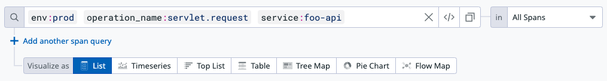
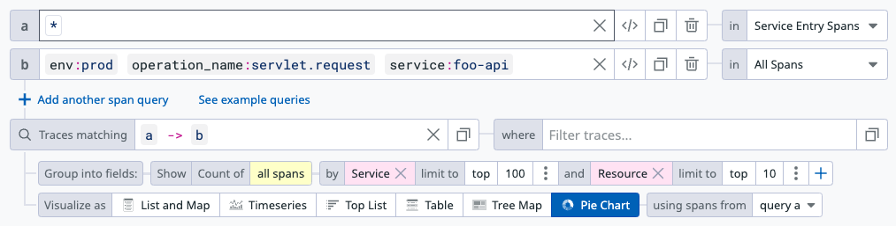
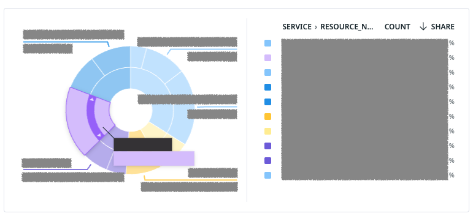

# APM

시스템(애플리케이션) 성능을 모니터링하고 분석하는 소프트웨어.

## DataDog

클라우드 기반 모니터링 서비스(SaaS). 직접 호스팅(self-hosting)할 수 없다.

### 서비스간 Trace 흐름 분석

APM -> Traces 화면에서는 서비스 호출을 분석할 수 있다.

https://docs.datadoghq.com/getting_started/tracing/#explore-traces-in-datadog

검색 쿼리로 특정 서비스로의 호출을 찾을 때 이미지와 같이 사용하는데,
MSA 환경이고 trace 공유하고 있다면 `Add another span query`로 두 번째 쿼리를 추가하여 **A -> B 방향의 서비스 호출을 찾을 수 있다**.

각 검색 결과는 `a`, `b`로 이름 붙는데, `Traces matching`을 통해 서비스 관계에 있는 trace를 찾을 수 있다.
위 이미지에서는 모든 서비스에서 `foo-api` 서비스로 호출하는 trace를 찾는데, 호출하는 서비스 이름(`Service`)와 리소스 이름(`Resource`)로 집계한다.

`Traces matching`의 `a => b`가 서비스간 관계를 나타낸다. `=>` 말고도 다른 관계도 있다.

차트를 이용하여 시각화도 가능하다.

Traces 기능은 서비스간 호출에서 특정 API를 찾는 등 서비스간 관계를 분석할 때 유용하다.
다만 단점은 `a`와 `b`의 항목을 조합하여 집계할 수 없다.
예를들어, `b`의 api를 호출하는 `a`의 서비스 이름을 찾을 수 없다.
`using span from`에서 집계 대상 span을 바꿔가며 찾아야 한다.
