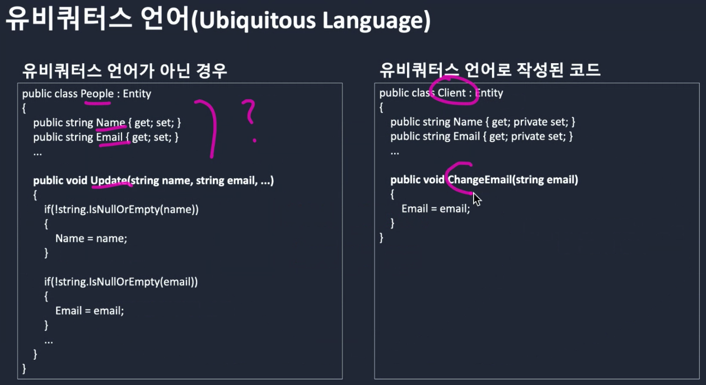

# Architecture

소프트웨어 아키텍처와 디자인.

<!--toc:start-->
- [Architecture](#architecture)
- [Robert C. Martin - Clean Architecture and Design](#robert-c-martin-clean-architecture-and-design)
- [JUnit A Cook's Tour](#junit-a-cooks-tour)
- [Entity Component System (ECS)](#entity-component-system-ecs)
  - [참조](#참조)
- [wine은 어떻게 동작하는가?](#wine은-어떻게-동작하는가)
<!--toc:end-->

# Robert C. Martin - Clean Architecture and Design

[Clean Architecture and Design](https://amara.org/videos/0AtjY87egE3m/url/1216370/)

2018년 처음 접했을 때 많은 생각을 들었다. 지금은 이 아키텍처 이야기로 책도 나오고 많이 언급된다.
왜 대부분 프로젝트의 구조가 같은지 의문에서 시작한다. 회사마다 관심있는 것은 다른데 왜 같은 구조를 가지는 것인가.
그에 반해 설계 도면은 어떤 건물을 말하는지 알기 쉽다고 한다.

# JUnit A Cook's Tour

https://curlunit.sourceforge.net/doc/cookstour/cookstour.htm

JUnit에 대해서 분석하고 테스트 프레임워크를 어떻게 구축하는지 설명하는 글.
바닥부터 여러 패턴을 적용하고 빌드업하는 글이라 구조를 이해하기 좋다.

**signature pollution**

> The canonical form of collecting parameter requires us to pass the collecting parameter to each method. If we followed this advice, each of the testing methods would require a parameter for the TestResult. This results in a "pollution" of these method signatures. As a benevolent side effect of using exceptions to signal failures we can avoid this signature pollution.

테스트 결과를 수집하기 위해서 각 테스트 메서드에서 수집할 파라미터를 전달 받아야 한다. 이런 이유로 테스트 메서드가 변경되는 것을 signature pollution이라고 한다.

내용은, 테스트 결과를 수집하기 위해서 테스트 메서드를 통해 `TestResult` 객체를 전달하고 전달하하는 대신, 사이드 이펙트지만(하지만 자비로운) Exception으로 실패를 잡음으로써 시그니처 오염을 막겠다고 한다.

비슷한, 피할 수 없는 시그니처 오염의 예로, 비동기처리가 아닐까.
[Javascript](javascript.md)의 Promise, async function은 사용하는 함수도 Promise나 async function이어야 한다.
[Spring](spring.md) WebFlux의 `Mono`도 마찬가지다. `block()`을 사용할 수 없기 때문에 계속 전파된다.
[Kotlin](kotlin.md)의 경우 `runBlocking`으로 언제든지 끝맺을 수 있어서 좋았다.

# Entity Component System (ECS)

**실제 코드를 본 적이 없어서 정리하는 것에 그침**

https://en.wikipedia.org/wiki/Entity_component_system

주로 게임에서 사용하는 구조적 패턴. 데이터 지향적이라고 한다:
> An ECS comprises *entities* composed from components* of data

ESC는 데이터의 구성요소로 이루어진 엔티티로 구성됩니다.

> ... This eliminates the ambiguity problems of deep and wide inheritance hierarchies often found in [Object Oriented Programming](https://en.m.wikipedia.org/wiki/Object-oriented_programming)
 techniques that are difficult to understand, maintain, and extend.

엔티티의 동작은 이해, 유지보수, 확장하기 어렵게하는 객체지향 프로그래밍에서 주로 발견되는 깊고 광범위한 상속 계층의 모호성 문제를 없앱니다.

## 참조

[Unreal Rust 공개 ](https://news.hada.io/topic?id=7345)

> Rust 게임엔진인 Bevy의 Entity Component System(ECS)을 사용

ECS 주제를 추가한 계기.

https://velog.io/@cedongne/Unity-새로운-컴포넌트-시스템-ECS와-Entity

Unity 3D가 ECS를 사용하고 있는 줄 알았는데 아니었다. 21년 기준으로 전환을 진행하고 있다고 한다.

# wine은 어떻게 동작하는가?

https://news.hada.io/topic?id=7661

* 에뮬레이터 방식은 아님. 에뮬레이터는 느리다.
* 윈도우 실행 파일을 읽고, 실행
* 시스템 호출은 라이브러리나 실행 파일에 포함되지 않고 os에서 제공한다. 따라서 커널에서 실행되어야 한다.
* wine의 system dispatcher가 리눅스에서 윈도우 혹은 그 반대로 호출할 수 있도록 스택을 변환한다.
  * 리눅스 → 윈도우 변환은 왜 필요할까? posix에서 윈도우 프로그램을 실행하는 것인데 그 반대로 변환해야 하는 경우가 있는지?

# 직교성 (Orthogonality)

내가 만들고 싶은 소프트웨어 형태이다. 직교성이 높은 것은 기능간 시너지가 좋다는 것이다.
게임에서도 개체간 시너지가 좋을 때 재미있다. 시너지가 없으면 눈에 뻔하고 금방 지루하다.
언뜻 서로 연관 관계가 없어 보이다가도 시너지가 발생했을 때 예상하지 못한 재미가 있다.

직교성은 팀 구조, 테스팅, 소프트웨어 설계 등 다양한 곳에서 불린다.

## reaper라는 프로그램이 있다. - 김창준

[https://www.facebook.com/cjunekim/posts/4677312722297258](https://www.facebook.com/cjunekim/posts/4677312722297258)

> reaper라는 프로그램이 있다. 음악 작업용 프로그램이다. winamp를 만든 Justin Frankel이 만들었다. 이 프로그램의 업그레이드 버전을 다운 받을 때마다 경이로운 게 있다.
> 이 프로그램의 전체 다운로드 크기는 14MB이다. 반면 이 프로그램의 사용자 매뉴얼의 크기는 25MB이다. 심지어 zip으로 압축해도 15MB 정도 된다. 즉, 프로그램의 크기가 그 프로그램의 문서 크기보다 작은 것.
> 작은 크기에 다양한 기능을 녹아 넣었다는 말일 수 있는데 보통은 직교성(A와 B라는 변수가 있을 때 각각의 변수를 독립적으로 조정해서 다양한 결과를 만들 수 있음을 의미)을 통해 가능하다. 한글이 좋은 예.
> 근데 이게 쉽지가 않다. 소프트웨어 설계에 대해 많은 고민을 해서 만들었을 거라고 생각한다.

ref. reaper? https://www.reaper.fm/download.php

## 지속 가능한 소프트웨어를 위한 코딩 방법 - NHN Meetup

[지속 가능한 소프트웨어를 위한 코딩 방법 - 첫 번째](https://meetup.nhncloud.com/posts/2h4)

> 두 백터는 한 공간에서 서로 마주치는 일은 단 한지점 밖에 없습니다. 그래서 두 백터의 성질이 다릅니다. 그래서 서로 공통점을 찾기는 어렵죠. 클래스 디자인도 마찬가지입니다. 각각의 클래스들은 서로 공통되는 특성이 없어야 합니다. 공통점이 없다는 성질은 앞에서 이야기한 DRY 원칙과 비슷합니다.
>
> `Art of UNIX programming`에서는 직교성을 다음과 같이 설명하고 있습니다.
>
> `Orthogonality is one of the most important properties that can help make even complex designs compact. In a purely orthogonal design, operations do not have side effects; each action (whether it’s an API call, a macro invocation, or a language operation) changes just one thing without affecting others. There is one and only one way to change each property of whatever system you are controlling.`

Art of UNIX programming의 글:\
직교성은 복잡한 설계를 compact하는데 도움이 되는 가장 중요한 속성 중 하나입니다. 순수한 직교 설계에는 side effects가 없습니다.
각 작업(API 호출, 매크로 호출, 언어 작업 등)은 다른 작업에 영향을 주지 않고 오직 한가지만 변경합니다. 제어하는 시스템의 각 속성을 변경하는 방법은 오직 한가지만 있습니다.

## 테스트에서 직교성

테스트를 예시하자. 함수가 여러개의 매개 변수를 받는다면, 각 조합으로 테스트를 작성할 때 변수 조합의 경우의 수 만큼 테스트 케이스가 발생한다.
독립적인 영향을 주도록 함수를 설계한다면, 각 변수에 대한 테스트만 작성하면 되므로 테스트 케이스를 간단하게 유지할 수 있다.
직교성이 없는 모듈은 같은 assertion을 여려번 하게된다.

## 비슷한 단어: pairwise

QA 툴 커뮤니티로 보이는데, 모든 경우의 수, 직교(Orthogonal), Pairwise 방식의 비교에 대한 내용이 있다.

[Pairwise 와 Orthogonal Array의 구체적인 차이는 ?](https://www.sten.or.kr/bbs/board.php?bo_table=test_story&wr_id=1446)

> Pairwise 와 Orthogonal Array 기법이 동일해보이는데 구체적인 차이는 뭔지 궁금합니다.
>
> ...(생략)
>
> 3. Pairwise
> 
> 동작모드    설정    이퀄라이저
> 순차        Hold    Off
> 순차        착신    Live
> 순차반복    Hold    Live
> 순차반복    착신    Off
> 
> 4. Orthogonal Array
> 
> 동작모드    설정    이퀄라이저
> 순차        Hold    Off
> 순차        착신    Live
> 순차반복    Hold    Live
> 순차반복    착신    Off

# Domain Driven Design (DDD)

## AWS DDD initiative program

2021/11 진행한 AWS 파트너사 세미나. DDD를 주제로 이야기했다.

서비스를 event storming을 통해 비즈니스를 분리하는 노하우에 대한 이야기.

DDD의 boundary context가 MSA를 구분짓는 토대가 된다.

**DDD란?**

* 도메인 별로 나눠서 설계하는 방식
* 사전적 의미는 영역, 집합
* loosely coupling과 high cohesion을 핵심 목표로 함

**시스템 설계**

* 시스템 모델인 객체와 event의 변화가 일으키는 행동(behavior)을 먼저 식별한다.
* ubiquitous language, 보편적인 언어를 사용해서 메인 모델을 식별하자
  * 같은 단어라도 이해 당사자에 따라서 생각하는 것이 달라진다. (커피하면 떠오르는 것? 스위치라는 단어에서 연상되는 것?)
* code as model. 모델 용어를 코드로 기술해본다.
* protecting domain knowledge. 도메인 모델이 다른 도메인에 의해 손상되지 않도록 한다.
  * ubiquitous language에서 결정된 단어가 다른 도메인으로 인해서 해석이 달라지면 안된다.
  * 같은 단어를 사용하면 도메인을 분리한다.

**DDD**

* 설계 방법에는 전략 Strategic, 전술 Tactical 방식으로 나뉜다.
* 전술
  * context 내에서 컴포넌트를 어떻게 나눌 것인지를 결정한다.
  * 컴포넌트는 pattern도 포함된다.
  * 대표적인 컴포넌트에는 layered architecture가 있다.
  * 전략 보다는 좀 더 구체적인 일들을 한다.
* 전략
  * ubiquitous language, bounded context, context map...

**ubiquitous language**

* 개발자와 사업 담당자가 같은 용어를 통해 대화할 수 있는 용어

**bounded context**

* "customer"라고 했을 때, 도메인에 따라서 의미가 달라진다. 이걸 구분짓는 최소 단위를 bounded context라 한다.
* bounded context 내에서 어떤 단어는 하나만 의미한다. (무결성)
* e.g. 토마토는 과학적 맥락에서는 과일, 요리적 맥락에서는 채소를 의미함

**event storming**

* bounded context를 식별하기 위한 방법 중 하나
* 복잡한 비즈니스 도메인을 빠르게 탐색하고 학습할 수 있는 워크숍
* steps
  1. 도메인 이벤트를 식별한다
    * 각자 알고있는 이벤트를 작성하고, 토론하지 말고, 각자 판단으로 모두 기록한다.
  2. 커맨드를 식별한다
  3. Aggregate를 식별한다
    * 커맨드와 도메인 이벤트가 영향을 주는 데이터 요소
    * 명령이 수행되고 이벤트가 발생하는 도메인 오브젝트 집합
  4. Bounded Context
    * 한 번에 Bounded Context를 결정하기는 어려움. iteration을 통해 지속적으로 정제한다.
    * 필요에 따라 액터와 시스템을 구분한다.
    * 단순히 '사용자' '고객' 보다는 구체적인 Role을 설정한다.
    * 외부 시스템, 레거시 모두 명세한다.
    * 정책 Policy. e.g. 회원가입 할 때 입력한 이메일로 컨펌 메일을 발송한다.
  5. Context Map
    * Context 간의 관계를 나타낸다.
    * e.g.
      * json, yaml, grpc 등으로 커뮤니이션한다 → Published Language
      * graphql, restapi로 통신한다 → Open Host Service
      * Upstream, Downstream 관계를 나타내고, 정책이 변경되면 따라간다 → Conformist
