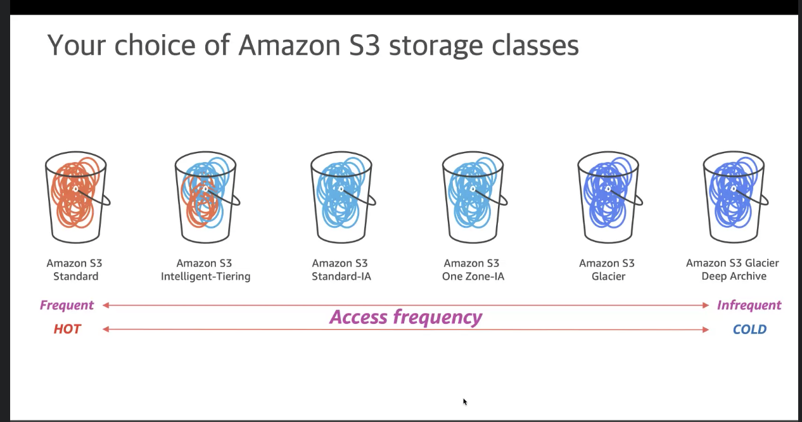

# Amazon Web Service

<!--toc:start-->
- [Amazon Web Service](#amazon-web-service)
- [`awscli`](#awscli)
  - [ECR 로그인하기](#ecr-로그인하기)
- [Storage Service](#storage-service)
  - [EBS - Elastic Block Storage](#ebs-elastic-block-storage)
  - [EFS - Elastic File System](#efs-elastic-file-system)
  - [Object Storage](#object-storage)
<!--toc:end-->

# `awscli`

## ECR 로그인하기

```bash
aws ecr get-login-password --region <REGION> | docker login --username AWS --password-stdin <AWS_ACCOUNT_ID>.dkr.ecr.<REGION>.amazonaws.com
```

`AWS_ACCOUNT_ID` 구하기:

```bash
aws sts get-caller-identity
```

e.g. account id = `1234`, region = `ap-northeast-2`:

```bash
aws ecr get-login-password --region ap-northeast-2 | docker login --username AWS --password-stdin 1234.dkr.ecr.ap-northeast-2.amazonaws.com
```

ref:
* https://docs.aws.amazon.com/AmazonECR/latest/userguide/getting-started-cli.html
* https://docs.aws.amazon.com/IAM/latest/UserGuide/console_account-alias.html

# Storage Service

2021-09-31 AWS CEP 내용 정리한 것.

Storage는 크게 Block, File, Object로 나뉜다.

* Block: 일반적인 저장소. AWS EBS.
* File: NAS 등. AWS EFS, FSx.
* Object: AWS S3, Glacier.

## EBS - Elastic Block Storage

EC2는 OS 등 모든 파일은 네트워크로 연결되는 EBS를 사용한다.
- EC2의 Instance Store(물리 호스트)도 제공되나, 별도 설정이 필요하고, 사라지는 영역이라서 특정 용도가 아니면 사용되지 않고, 추천하지 않는다.

**내구성**\
AWS에서는 99.999% 신뢰성 제공을 목적으로 설계 되며, 데이터를 잃어버리지 않는 것을 의미

EBS GP2는 Burst 기능을 제공하는데, 유후 시간 후 처음 30분간 3,000 IOPS를 제공하는 기능이다.
- 기본 성능은 3 IOPS/GB 인데, 따라서 1,000GB 이상 볼륨을 사용한다면, Burst 한 것과 같은 성능이므로 Burst 기능을 제공하지 않는다.
- GP3은 항상 3,000 IOPS 고정이나, 1TB(1,000GB)를 초과하더라도 3,000 IOPS 그대로다.

EBS의 스냅샷은 전체 Copy가 아니라 Incremental을 저장하므로, 스냅샷을 자주 사용하도록 설정하는 것이 좋다.

## EFS - Elastic File System

처음부터 얼마나 사용할 지 고민할 필요는 없다. 사용한 만큼 비용 지불. 사용할 때 마다 용량 확장된다.(Scalable)

## Object Storage



S3 에서 사용하는 스토리지 타입

HOT - COLD는 오브젝트에 접근했을 때 반응에 대한 내용. Observable과 같은 맥락 같다.
