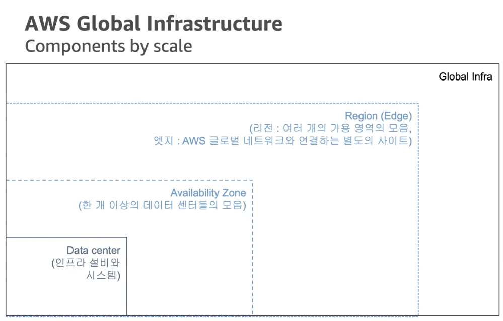

# Amazon Web Service

## awscli

linux, macos는 `brew install awscli`로 설치하자.
`pip install awscli`도 가능하지만, python 가상 환경을 사용하면 관리하기 번거롭다.

### ECR 로그인하기

```bash
aws ecr get-login-password --region <REGION> | docker login --username AWS --password-stdin <AWS_ACCOUNT_ID>.dkr.ecr.<REGION>.amazonaws.com
```

`REGION`은 서울 리전이라면 `ap-northeast-2`. \
`AWS_ACCOUNT_ID`는 `aws sts get-caller-identity` 명령어로 구할 수 있다. `Account` 필드의 값이다.

```bash
$ aws sts get-caller-identity
{
    "UserId": "",
    "Account": "",
    "Arn": ""
}
```

예를들어 account id = `1234`, region = `ap-northeast-2` 라면 다음과 같이 입력한다:

```bash
aws ecr get-login-password --region ap-northeast-2 | docker login --username AWS --password-stdin 1234.dkr.ecr.ap-northeast-2.amazonaws.com
```

ref:
* https://docs.aws.amazon.com/AmazonECR/latest/userguide/getting-started-cli.html
* https://docs.aws.amazon.com/IAM/latest/UserGuide/console_account-alias.html

### IAM 관련

[비밀번호 변경](https://docs.aws.amazon.com/cli/latest/reference/iam/change-password.html)(응답 메시지 없음):\
`aws iam change-password --old-password <OLD_PASSWORD> --new-password <NEW_PASSWORD>`

[Access Key 교체](https://docs.aws.amazon.com/ko_kr/IAM/latest/UserGuide/id_credentials_access-keys.html#rotating_access_keys_cli)

플로우가 조금 복잡하다. 새 access key 생성 -> 새 access key로 도구 업데이트 -> 기존 access key 비활성화 순서로 진행한다.

기존 access key는 비활성화만 하고 나중에 직접 삭제하자.

1. [새 access key 생성](https://docs.aws.amazon.com/cli/latest/reference/iam/create-access-key.html):\
foreground로 읽으니 파일로 저장하자.
```sh
aws iam create-access-key > access-key.json
```

2. [새 access key로 도구 업데이트](https://docs.aws.amazon.com/cli/latest/reference/configure/):
```sh
aws configure
```

3. [기존 access key 비활성화](https://docs.aws.amazon.com/cli/latest/reference/iam/update-access-key.html):
```sh
aws iam update-access-key --access-key-id <OLD_ACCESS_KEY_ID> --status Inactive
```

2번에서 [aws configure cli](https://awscli.amazonaws.com/v2/documentation/api/latest/reference/configure/import.html) 명으로로 `--csv` 포맷의 파일을 읽어서 업데이트 할 수 있다.
그러면 interactive로 secret key를 입력하지 않고 자동화할 수 있을 듯한데, 1번의 생성 명령어에서 csv 포맷을 제공하지 않는다.

기존 access-key를 확인하려면 [list-access-keys](https://docs.aws.amazon.com/cli/latest/reference/iam/list-access-keys.html)를 사용하면 된다:

```sh
aws iam list-access-keys
```

## LocalStack

로컬 환경에서 AWS 클라우드 스택을 구축하는 도구이다.

https://github.com/localstack/localstack

클라우드 기능을 사용하면 로컬 개발 환경을 구축하기 쉽지 않다.
서비스에 가입하거나 비용을 지불하기엔 개발하기 너무 가혹하다.

LocalStack은 AWS 기능 대부분을 구현한다.
https://docs.localstack.cloud/references/coverage/ 여기에서 어떤 기능을 커버하는지 확인할 수 있는데, 왠만한 서비스는 다 있는 것으로 보인다.

Docker로 실행하면 더 쉽다. LocalStack 저장소의 [docker-compose.yml](https://github.com/localstack/localstack/blob/master/docker-compose.yml) 그대로 사용해도 된다.

예를들어 Kinesis를 사용하기 위해서 다음과 같이 구성할 수 있다:

```yml
version: "3.8"

services:
  localstack:
    image: localstack/localstack
    ports:
      - "127.0.0.1:4566:4566"
      - "127.0.0.1:4510-4559:4510-4559"
    environment:
      - DEBUG=1
      - DOCKER_HOST=unix:///var/run/docker.sock
    volumes:
      - "/var/run/docker.sock:/var/run/docker.sock"
      - "./data:/var/lib/localstack"
      - "./kinesis-my-stream.sh:/etc/localstack/init/ready.d/kinesis-my-stream.sh"
```

공식 compose 파일과 다른 점은 볼륨의 마지막 부분인데, hook을 통해서 스트림을 생성하도록 했다.

```bash
#!/bin/bash

aws --endpoint-url=http://localhost:4566 kinesis create-stream --stream-name my-event-dev --shard-count 1 --region ap-northeast-2
aws --endpoint-url=http://localhost:4566 kinesis list-streams --region ap-northeast-2
```

hook은 localstack가 제공하는 라이프 사이클에 따라 실행되는 이벤트다.

`ready.d` 디렉토리는 LocalStack이 준비되어 요청을 받을 수 있는 상태가 되었을 때 실행되는 READY 단계의 스크립트를 모아놓는다.

hook에 대해선 다음 문서에서 설명한다:\
https://docs.localstack.cloud/references/init-hooks/

hook 스크립트를 보면 알 수 있듯이 `aws` 명령어가 LocalStack과 잘 호환된다.
`--endpoint-url`을 통해서 LocalStack와 통신한다.
`awslocal` 명령어도 제공하는데, endpoint를 명시하지 않아도 된다.

credentials 관련 오류가 있으면 `awslocal` 명령을 사용하자. 그러면 credentials(`~/.aws/credentials`)을 확인하지 않는다.
앱에서 접근해야 한다면 `awslocal`을 사용할 수 없으니, 임의로 넣어놓자:

```
[default]
aws_access_key_id = test
aws_secret_access_key = test
```

환경 변수를 사용해도 된다:

```
AWS_ACCESS_KEY_ID = test
AWS_SECRET_ACCESS_KEY = test
```

검증은 localstack이 넘길테니 임의로 넣어두면 클라이언트 단에서는 credentials 존재 여부 정도만 확인하니 어떤 값을 넣어도 무방하다.

## Kinesis

Consumer 라이브러리를 KCL(Kinesis Client Library)라고 부르고,
Producer 라이브러리를 KPL(Kinesis Producer Library)라고 부른다.
문서 설명이 모두 이 약자로 설명하고 있기 때문에 알아두는 편이 좋다.

[KCL 개념 - AWS Document](https://docs.aws.amazon.com/streams/latest/dev/shared-throughput-kcl-consumers.html#shared-throughput-kcl-consumers-concepts)

KCL은 Shard의 체크포인트를 표시하기 위해 DynamoDB를 사용한다.
따라서 Kinesis, DynamoDB 두 개의 AWS 서비스를 사용해야 한다.

AWS 공식 예제는 [KCL 2.0 for Java](https://docs.aws.amazon.com/streams/latest/dev/kcl2-standard-consumer-java-example.html)나
[amazon-kinesis-client 저장소의 테스트 코드](https://github.com/awslabs/amazon-kinesis-client/blob/master/amazon-kinesis-client/src/test/java/software/amazon/kinesis/utils/TestRecordProcessor.java)가 있다.

내 localstack + consumer 예제: https://github.com/Edunga1/practice-localstack-kinesis \
docker-compose로 localstack + consumer를 실행하고, aws cli로 `put-record`를 통해 데이터를 생성하도록 했다.

**push model and pull model**

https://docs.aws.amazon.com/streams/latest/dev/developing-consumers-with-sdk.html#kinesis-using-sdk-java-get-data

> The Kinesis Data Streams APIs include the getShardIterator and getRecords methods that you can invoke to retrieve records from a data stream. This is the pull model, where your code draws data records directly from the shards of the data stream.

Kinesis Data Stream API의 `getShardIterator`와 `getRecords`를 사용하면 pull model로 데이터를 가져올 수 있다.

> We recommend that you use the record processor support provided by KCL to retrieve records from your data streams. This is the push model, where you implement the code that processes the data.

KCL의 record processor를 사용하면 push model로 데이터를 가져올 수 있다.

### 개념

#### fan-out

**shared fan-out, enhanced fan-out**

consumer의 종류에는 shared fan-out과 enhanced fan-out 두 가지가 있다.

[Q: What is a consumer, and what are different consumer types offered by Amazon Kinesis Data Streams? - Amazon Kinesis Data Streams FAQs](https://aws.amazon.com/kinesis/data-streams/faqs/#Reading_and_processing_data_from_Kinesis_data_streams)

> The shared fan-out consumers all share a shard’s 2 MB/second of read throughput and five transactions per second limits and require the use of the GetRecords API

shared fan-out은 컨슈머간 공유되며, 초당 2 MB, 초당 5개의 transaction으로 제한된다.
transaction은 `GetRecrods` API 호출을 의미하는 거 같다.

> An enhanced fan-out consumer gets its own 2 MB/second allotment of read throughput, allowing multiple consumers to read data from the same stream in parallel, without contending for read throughput with other consumers.

enhanced fan-out은 consumer간 할당량 경쟁하지 않는다.

enhanced fan-out는 seoul region 기준 [1GB 당 0.062 비용이 든다](https://aws.amazon.com/kinesis/data-streams/pricing/)고 한다.

### 자바 외 언어로 Kinesis 앱 개발

Node.js consumer를 만든다면 [KCL for Node.js](https://github.com/awslabs/amazon-kinesis-client-nodejs/)를 사용한다.

주의할 점은 자바 외 언어로 제공하는 KCL은 모두 [KCL for JAVA](https://github.com/awslabs/amazon-kinesis-client)을 사용하기 때문에
자바 런타임이 필요하다. [데몬으로 KCL for Java와 통신하도록 구현](https://github.com/awslabs/amazon-kinesis-client-nodejs/blob/master/bin/kcl-bootstrap)되어 있다.

Node.js producer는 [aws-sdk](https://github.com/awslabs/amazon-kinesis-client-nodejs/)를 사용한다.

LocalStack으로 Node.js consumer는 구현하기 어려워 보인다.
먼저, LocalStack와 커뮤니케이션 하려면 endpoint 설정이 필요한데
KCL 2.0으로 업데이트되면서 `kinesisEndpoint` `dynamodbEndpoint` [설정이 제거](https://docs.aws.amazon.com/streams/latest/dev/kcl-migration.html#client-configuration-removals)되었다.

Client 생성 주체인 KCL for Node.js에서 진행해야 하지만, 여기엔 설정을 제공하지 않는다. 저장소가 거의 죽어있다.

KCL for Java는 client builder를 통해서 endpoint를 설정할 수 있다. 저장소도 자주 업데이트 된다.

```java
KinesisAsyncClient.builder().endpointOverride(URI.create("https://<kinesis endpoint>")).build().
```

## Storage Service

2021-09-31 AWS CEP 내용 정리한 것.

Storage는 크게 Block, File, Object로 나뉜다.

* Block: 일반적인 저장소. AWS EBS.
* File: NAS 등. AWS EFS, FSx.
* Object: AWS S3, Glacier.

### EBS - Elastic Block Storage

EC2는 OS 등 모든 파일은 네트워크로 연결되는 EBS를 사용한다.
- EC2의 Instance Store(물리 호스트)도 제공되나, 별도 설정이 필요하고, 사라지는 영역이라서 특정 용도가 아니면 사용되지 않고, 추천하지 않는다.

**내구성** \
AWS에서는 99.999% 신뢰성 제공을 목적으로 설계 되며, 데이터를 잃어버리지 않는 것을 의미

EBS GP2는 Burst 기능을 제공하는데, 유후 시간 후 처음 30분간 3,000 IOPS를 제공하는 기능이다.
- 기본 성능은 3 IOPS/GB 인데, 따라서 1,000GB 이상 볼륨을 사용한다면, Burst 한 것과 같은 성능이므로 Burst 기능을 제공하지 않는다.
- GP3은 항상 3,000 IOPS 고정이나, 1TB(1,000GB)를 초과하더라도 3,000 IOPS 그대로다.

EBS의 스냅샷은 전체 Copy가 아니라 Incremental을 저장하므로, 스냅샷을 자주 사용하도록 설정하는 것이 좋다.

### EFS - Elastic File System

처음부터 얼마나 사용할 지 고민할 필요는 없다. 사용한 만큼 비용 지불. 사용할 때 마다 용량 확장된다.(Scalable)

### Object Storage


S3 에서 사용하는 스토리지 타입

HOT - COLD는 오브젝트에 접근했을 때 반응에 대한 내용. Observable과 같은 맥락 같다.

## Networking

2021-09-31 AWS CEP 내용 정리한 것.



Region에는 2개의 Transit이 존재한다. 다른 Region, 외부와의 연결 통로가 된다.

AZ간 통신은 내부망을 통해서만 이루어진다.

### 주요 네트워킹 서비스

* VPC: AWS 클라우드상에 만드는 가상 네트워크
* VPN: On-premise 데이터 센터와 VPC의 IPSec VPN 연결
* Direct Connect: On-premise 데이터 센터와 VPC의 전용선 연결
* Route 53: 관리형 DNS 서비스

AWS에서 자원 레벨은 Global과 Regional으로 나뉜다.
EC2는 Regional 서비스에 포함된다.

AWS에서는 Static의 반대되는 용어로 `Elastic`을 사용한다.

#### VPC - Virtual Private Cloud

독립된 가상 클라우드 네트워크. 나만의 네트워크라고 이해하면 된다.

IP 대역은 CIDR(Classes Inter-Domain Routing) 블록 /16 ~ /28 까지 사용 가능하다.

공인 IP는 비싼 자원이므로 서버 Stop시 해제된다는 등 제약이 있다.

DNS는 기본으로 제공되는 Private, Public DNS가 제공됨

**IP 대역** \
172.16.0.0/16 CIDR 내에서 네트워크 구성된다.

**VPC Peering**
* 동일 Region 내 VPC간 네트워크 연결 옵션
* VPC간 IP가 중복 불가하며, 하나의 Peering만 제공

#### Direct Connect

Direct Connect는 물리적으로 전용선으로 연결한다.

#### Route 53

Route53은 FQDN + 다양한 기능을 제공한다.
