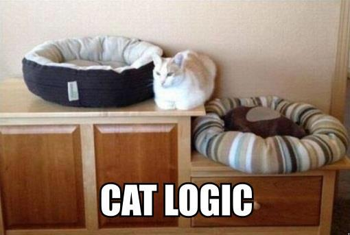

# The Cat Logic

Cat Logic은 내 [TIL](https://github.com/topics/today-i-learned), 개인 지식 저장소 별명이다.

Git 저장소는 https://github.com/edunga1/cat-logic

이 로고 이미지는 저장소의 성격을 잘 표현한다. 내 마음대로 작성하고 싶다.
어떠한 에디터를 사용해도 좋다. 그래서 마크다운으로 작성한다.
렌더링 전과 후의 괴리가 가장 적은 형식이다.
대부분 [vim](./vim.md)과 [vimwiki](./vimwiki.md) 기반으로 작성하지만 VSCode도 사용하고 있고,
GitHub 모바일 앱이나 웹에서 제공하는 간이 에디터도 사용한다. 모토는 "자유롭게 작성하는 것"이다.

형식에 구애받고 싶지 않으므로, 모든 문서를 일괄적으로 변경하는 것은 피하고자 한다.
최근에 일괄적으로 [front matter를 추가](https://github.com/Edunga1/cat-logic/commit/e46f1ac6f08acfc175ea5f4cbb7a375e1c257b4c)하거나
[`#`헤더를 변경](https://github.com/Edunga1/cat-logic/commit/ee34ec929ca5967011a21066c20f3f1b9f8c7fbe)했는데, 더 이상 일괄적인 변경은 하지 말자.

**Header**는 하나의 1레벨 헤더와 나머지는 2레벨 이상의 헤더만 사용하는 것인데,
찾아보니 SEO나 의미론적 관점에서 이점이 있다고 해서 수정했다. 사실 제대로 지키고 싶지 않다.

**Front Matter**는 문서의 메타데이터를 기록할 방법이 없어서 추가했다.
Git 데이터에 파일 생성 시간이나 수정 시간이 잘 기록되는 줄 착각했었다.
Git으로 파일 수정 내역을 확인해서 보여줄 방법도 생각했으나, 파일 이동에 취약했다.
그래서 front matter는 필수적으로 추가할 수 밖에 없었다. 다만 강박적으로 추가하지는 않겠다.
일반적으로 front matter는 블로그 등 정적 사이트나 다른 산출물을 만들 때 적극적으로 사용하는데, 나는 그러지 않고자 한다.

**정적 사이트**를 저장소에 함께 포함했다.
지금은 [Gatsby](./gatsbyjs.md)로 만들었는데, 이전에는 Gitbook으로 만들었었다.
형식이 없으면 사이트를 만들 때 불편한 점이 몇 개 있다.
위키 목록을 보여준다면 어떤 정보를 문서 제목으로 할 지, 요약 정보를 보여준다면 어떻게 요약해야 할 지.
front matter를 사용했다면 편리했을지 모른다.
지금은 첫 번째 헤더를 문서 제목으로, 첫 번째 헤더의 내용을 요약 정보로 사용하고 있다.
연관 문서 기능이 있으면 좋겠다. 이건 front matter로도 구현하기 어려운 기능이다.
[임베딩](./machine-learning.md) 섹션에서도 언급했지만, 텍스트 임베딩으로 처리해보려고 한다.

정적 사이트를 위한 웹 프론트 작업을 하거나 텍스트 임베딩과 같은 새로운 기술을 사용해 보는 등
Cat Logic은 실험적인 프로젝트이기도 하다.

## 추가할만한 기능

[블로그/개인 웹사이트에서 좋아하는 마이크로 기능들 글](https://news.hada.io/topic?id=15503)을 보면 간단하지만 좋은 아이디어가 많다.
주석은 스크롤을 최하단으로 이동시키기 때문에 다시 돌아오는 앵커가 있더라도 읽는 것을 방해한다.
사이드노트 기능은 주석 표현 대신 [팝업](https://gwern.net/me)이나 동적으로 문단을 추가한다.
PC는 Hover로 팝업을 띄우고 누르면 주석 기능도 유지한다.
사용성이 개선되는 듯 해서 추가해보고 싶다.

[진행상황 표기하는 기능](https://www.quantamagazine.org/)은 스크롤바와 역할이 겹친다.
링크된 사이트는 수평 진행바를 제공하지만 눈길을 너무 끈다. 스크롤바로 충분히 대체 가능하다.
[css로만 목차에 진행 상황을 표기하는 예제](https://css-tricks.com/sticky-table-of-contents-with-scrolling-active-states/)가 있어서 이건 추가해 볼 만하다.

위 글에 대한 내용은 아니지만, 이미지 첨부가 너무 고통스럽다.
직접 이미지를 `docs/wiki/res` 경로에 저장하고 경로를 마크다운 링크로 작성해야 한다.
클립보드 이미지를 자동으로 업로드하고 링크를 생성하는 플러그인을 고려한 적이 있는데, WSL 지원을 잘 하지 못해서 포기했다.

## 검색

2023년 11월 21일 구글 검색 엔진에 등록했다.
GitHub Page 문제인지 인덱싱 실패가 자주 발생한다.
대부분 redirection error, page not found 등이 원인이다.
그래서 매번 검색 콘솔에 들어가서 다시 요청을 보낸다.
GitBook v1을 사용할 때는 직접 관리할 필요가 없었고, 검색도 잘 되었다.

## Journal

### 2023-11-10

임베딩을 이용한 관련 문서 기능을 추가했다.
기존에는 관련 문서 기능이 있었지만, 문서 내용의 내부 링크를 찾아서 추천해주는 것이었다.
이것도 관련 문서라고 볼 수 있겠지만, 임베딩 쪽이 더 많은 것을 추천할 듯.

작업 커밋: https://github.com/Edunga1/cat-logic/commit/0e1b06f160df3d1425dd64962f8ac8b34a62bd21

### 2023-11-15

한국어 path를 지원하도록 했다.
나무위키처럼 한글과 depth path로 구조적인 문서로 좀 더 보기 좋게 만들고 싶다.

작업 커밋: https://github.com/Edunga1/cat-logic/commit/b8b32647aaf301e38acb61cfaabba9cc906f8bbe

### 2024-03-26

커밋 날짜를 기준으로 문서를 정렬하도록 했다.

https://github.com/Edunga1/cat-logic/commit/10f5d680de2aa422dee3258101b4c4341956f276

github actions/checkout의 fetch-depth를 0으로 설정하면 모든 커밋 내역을 가져올 수 있다.\
`gatsby-transformer-gitinfo` gatsby 플러그인은 git 정보를 graphql로 가져올 수 있게 해준다.

## Google Search Console 인덱싱 실패

`Page with redirect` 오류로 인덱싱이 지속적으로 실패하는 문제.
