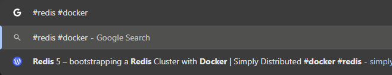

# 크롬 브라우저

## 구글 로그인 팝업 차단하기

PC 기준 설정이다.

특정 사이트에 들어갈 때마다 오른쪽 위에 뜨는 그것. 매우 성가시다.
이 기능의 이름은 "Third-party sign-in"이다.

검색해보면 https://myaccount.google.com/connections/settings 에서 비활성화 할 수 있다고 하는데, 이 방법은 동작하지 않는다.

사실 이 기능은 팝업의 `x` 버튼을 누르면 해당 사이트는 더 이상 뜨지 않는다.
하지만 모든 사람이 마우스 커서를 올려서 `x` 버튼을 누르는 수고를 하는 것은 아니다.
귀찮아서 esc 키를 누르는데, 이러면 새로고침이나 재방문할 때마다 다시 뜬다.
다크 패턴이라면 바로 이게 아닐까? [구글 커뮤니티](https://support.google.com/chrome/thread/308316030?hl=en)에 보면 원성의 소리가 많다.

해결하기 위해선 2가지 방법이 있다.

**첫 번째 방법. 크롬 설정에서 차단하기**

- 브라우저에서 다음을 입력한다: `chrome://settings/content/federatedIdentityApi`
- `Block sign-in prompts from identity services` 라디오 버튼 선택하면 끝.

위 URL 대신 직접 메뉴로 들어가려면: 설정 -> 개인 정보 보호 및 보안 -> 사이트 설정 -> 추가 콘텐츠 설정 -> 서드 파티 로그인

**두 번재 방법. 광고 차단 프로그램 사용하기**

uBlock Origin 기준으로 필터에 `||accounts.google.com/gsi/*$xhr,script,3p` 추가하면 된다.

- 참조: https://www.reddit.com/r/chrome/comments/1cdsikx/how_to_disable_the_new_sign_in_popup/
- 공식 문서: https://support.google.com/chrome/answer/14264742

## 북마크

파이어폭스와 달리 크롬은 북마크에 태그 기능이 없다.
흉내는 낼 수 있는데, 북마크 저장할 때 이름에 `#태그`를 붙이고 검색할 때 `#태그`로 검색하는 것이다.
주소창 등에서 fuzzy search가 되므로 `#태그1 #태그2`로 검색해도 어느정도 검색이 된다.

이미지와 같이 북마크 이름 끝에 태그를 붙이고, 태그 순서를 바꿔도 검색이 된다.
단점은 북마크 이름에 의해 검색이 방해되어 원하는 북마크가 나오지 않기도 한다.
