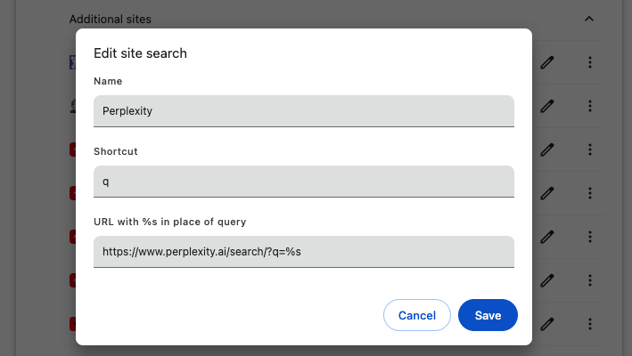

# 크롬 브라우저

## 구글 로그인 팝업 차단하기

PC 기준 설정이다.

특정 사이트에 들어갈 때마다 오른쪽 위에 뜨는 그것. 매우 성가시다.
이 기능의 이름은 "Third-party sign-in"이다.

검색해보면 https://myaccount.google.com/connections/settings 에서 비활성화 할 수 있다고 하는데, 이 방법은 동작하지 않는다.

사실 이 기능은 팝업의 `x` 버튼을 누르면 해당 사이트는 더 이상 뜨지 않는다.
하지만 모든 사람이 마우스 커서를 올려서 `x` 버튼을 누르는 수고를 하는 것은 아니다.
귀찮아서 esc 키를 누르는데, 이러면 새로고침이나 재방문할 때마다 다시 뜬다.

해결하기 위해선 2가지 방법이 있다.

**첫 번째 방법. 크롬 설정에서 차단하기**

- 브라우저에서 다음을 입력한다: `chrome://settings/content/federatedIdentityApi`
- `Block sign-in prompts from identity services` 라디오 버튼 선택하면 끝.

위 URL 대신 직접 메뉴로 들어가려면: 설정 -> 개인 정보 보호 및 보안 -> 사이트 설정 -> 추가 콘텐츠 설정 -> 서드 파티 로그인

**두 번재 방법. 광고 차단 프로그램 사용하기**

uBlock Origin 기준으로 필터에 `||accounts.google.com/gsi/*$xhr,script,3p` 추가하면 된다.

- 참조: https://www.reddit.com/r/chrome/comments/1cdsikx/how_to_disable_the_new_sign_in_popup/
- 공식 문서: https://support.google.com/chrome/answer/14264742

## 북마크

파이어폭스와 달리 크롬은 북마크에 태그 기능이 없다.
흉내는 낼 수 있는데, 북마크 저장할 때 이름에 `#태그`를 붙이고 검색할 때 `#태그`로 검색하는 것이다.
주소창 등에서 fuzzy search가 되므로 `#태그1 #태그2`로 검색해도 어느정도 검색이 된다.

이미지와 같이 북마크 이름 끝에 태그를 붙이고, 태그 순서를 바꿔도 검색이 된다.
단점은 북마크 이름에 의해 검색이 방해되어 원하는 북마크가 나오지 않기도 한다.

## 검색 엔진

크롬에서 검색 엔진이라는 것은, 주소창에 입력했을 때 검색할 사이트를 말한다.
여러개의 검색 엔진을 추가하고, shortcut을 지정하면 검색어를 원하는 사이트에서 빠르게 검색할 수 있다.

주소창에 `chrome://settings/searchEngines` 입력하면 관리 페이지로 이동한다.

검색 엔진 추가 버튼을 누르면 다음과 같은 팝업이 뜬다.

- `Name` 필드는 주소창에 표기될 이름이라 중요하지 않다.
- `Shortcut`은 주소창에서 이 단어를 입력하고 Tab키를 누르면 진입한다. 일종의 시작어다.
- `URL with %s in place of query`는 검색어를 입력할 URL이다. `%s`는 검색어가 들어갈 자리다.

**내 사용 예시** \
위 이미지는 `Perplexity`라는 검색 엔진을 추가하는 모습이다.
크롬에서 `Command + L`을 눌러 주소창에 포커스를 맞춘 후 `q`, `Tab`을 순서대로 누르면 `Perplexity` 검색 엔진으로 진입한다.
이제 검색어를 입력하면 Perplexity에서 검색된다.
구글, Perplexity, 사전 등 자주 가는 사이트를 추가해두면 빠르게 해당 사이트에서 검색할 수 있다.

### 유용한 검색 엔진

개인적으로 유용한 검색 엔진 설정이다.

**Perplexity**

- Name: `Perplexity`
- Shortcut: `q`
- URL: `https://www.perplexity.ai/search/?q=%s`

**네이버 영어사전**

- Name: `Naver 사전`
- Shortcut: `dic`
- URL: `https://en.dict.naver.com/#/search?query=%s&range=all`

**Jira** \
지라 이슈 번호로 검색할 때 유용하다.
`COMPANY`를 도메인에 맞게 대체하자.

- Name: `Jira`
- Shortcut: `jira`
- URL: `https://COMPANY.atlassian.net/browse/%s`

**Confluence** \
지라와 마찬가지로, `COMPANY`를 도메인에 맞게 대체하자.

- Name: `Confluence`
- Shortcut: `conf`
- URL: `https://COMPANY.atlassian.net/wiki/search/?text=%s`

### 파이어폭스의 검색 엔진

파이어폭스는 이 검색 엔진 기능의 지원이 매우 열악하다.
이 기능의 부재로 인해 파이어폭스로의 전환을 망설인다.

파이어폭스는 브라우저 자체 제공하거나, 확장 프로그램으로 제공하거나, 웹 사이트의 메타 태그를 읽어서 검색 엔진을 추가한다.
**사용자가 브라우저에서 직접 추가할 수 없다.**

[Mycroft Project](https://mycroftproject.com/)는 파이어폭스 검색 엔진을 추가하기 위한 메타 태그를 제공하는 사이트다.
사용자들이 자신이 원하는 검색 엔진을 추가할 수 있는 기능을 제공한다.
브라우저에 검색 엔진을 추가하기 위해서 별도 사이트에 방문해야 하는 어이없는 상황이다.
