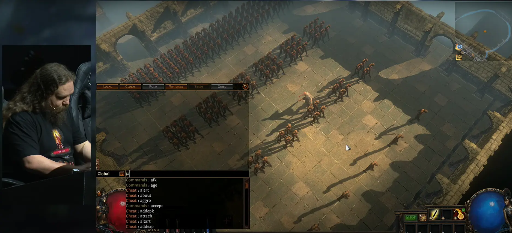
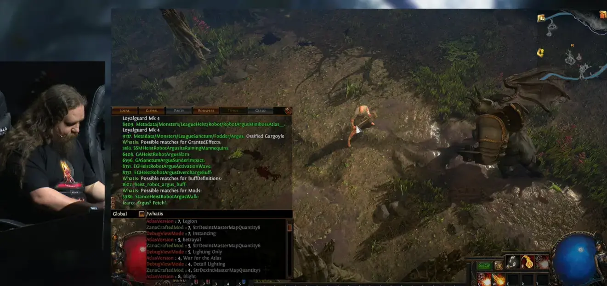

# 회사

회사 문화에 대한 이야기.

## Grinding Gear Games

**G**rinding **G**ear **G**ames는 뉴질랜드에 위치한 패스 오브 엑자일 개발사.
유저 사이에선 GGG로 줄여서 부른다.

2024년에 두 번째 작으로 path of exile 2를 개발, 오픈 베타 테스트를 시작했다.
유료 상품을 기존 게임인 path of exile 1과 연동 지원한다고 발표했다.
문제는 이 통합 작업과 pc 콘솔 등 계정 통합 마이그레이션 중 문제가 발생해 공개가 지연되었다.
재밌는 점은 개발 이슈의 상세한 내용을 공지사항으로 공개하였다는 점이다.

요약하면:

- 새로운 계정 시스템을 적용하기 위한 마이그레이션을 위해 서버를 내렸다.
- 대규모 데이터베이스 마이그레이션 작업중이었기 때문에 복구가 느렸다.
- 원인은 계정 이름 길이를 나타내는 상수를 잘못 설정해서, 길이가 27자보다 긴 계정을 마이그레이션하는데 문제가 생겼다.

이 공지사항의 유저 반응은 대체로 긍정적이다.
어떤 일이 있었는지 투명하게 공개해줘서 고맙다는 반응이다.

- 게임 공지사항(Incident Report for Today's Deploy): https://www.pathofexile.com/forum/view-thread/3586510/
- 한국 커뮤니티 반응: https://gall.dcinside.com/mgallery/board/view/?id=pathofexile&no=736348&exception_mode=recommend&page=1

### GGG 컨텐츠 개발 속도 이야기

패스 오브 엑자일은 3개월 주기로 새로운 컨텐츠를 제공하는 시즌 시스템을 가지고 있다.
각 시즌마다 새로운 컨텐츠를 추가하고, 기존 컨텐츠를 개선하는데, 그 양이 방대하다.
예를 들어 [24년 3월에 진행된 3.24 시즌 패치노트](https://www.pathofexile.com/forum/view-thread/3496784)를 보면, 스크롤을 한참 내려야 끝에 도달한다.
이 게임을 플레이 하면서도 매번 어떻게 이렇게나 많은 컨텐츠를 생산해 내는지 의문이다. 내 역량이 부끄러울 정도의 생산성이다.
그런데 컨텐츠가 많은데도 사용자들은 1개월이면 지루해한다. 그래서 이 게임을 주로 하는 사람들은 다른 게임은 금방 식상해한다.

[디스코드에 개발 속도와 관련해서 이야기한 것을 누군가 번역해서 올렸다.](https://gall.dcinside.com/m/pathofexile/556537)
다음은 이야기한 내용.

> 내 관점으로는
>
> 1\. 프로그래밍 작업을 처음부터 시작할 필요가 거의 없도록 발달하고 확장된 코드 기반.
>
> 2\. 모든 것에 프로그래밍이 필요한 대신 여러 역할을 중심으로 새로운 컨텐츠를 생성하고 연결할 수 있는 기능을 확장시킬 수 있는 강력한 내부 툴
>
> 3\. 5번의 회의를 먼저 하는 것이 아니라 "일단 완료한 후 반복"하는 사내 문화

1, 2는 회사 차원에서 격려해야 가능한 일이라 생각한다.
덧글에도 비슷한 의견이 있는데, 플레이어라면 공감할 수 밖에 없는 이야기다:

> GGG 개발하는걸 보면, 일관성이나 규격화 하는걸 정말 좋아한다.
> 3.13 때 뜬금없이 폭풍보주, 겨울보주, 서리폭탄 등을 별도 ORB 태그로 분류한거라던가.
> 이거 태그 때문에 헷갈린다 싶어서 마그마 오브를 롤링 마그마로 이름 바꾼다던가.
> 이런 일관성들이 쌓여서 저런 개발 속도가 나올 수 있는 것 같음.

시스템을 만드는 모든 이해관계자들이 규격화에 공감하고, 노력해야 가능한 일이 아닐까?
구성원 모두가 거시적인 시각을 가지고 있고, 그 방향성을 공감하고 있어야 가능한 일이다.
가끔은 내 작업을 설득할 생각부터 지쳐서, 그냥 필요한 작업만 하도록 자체 타협을 한다.
내가 생각하는 좋은 회사 문화는 이런 것에서 편안한 느낌을 받는 것이다.

2023년 7월 29일에 있었던 ExileCon의 [Wacky  PoE 1 Mechanics Q&A](https://www.youtube.com/live/Vvah-HfhkYc?t=28689) 시간에서
개발 속도가 어떻게 빠를 수 있는지 조금 엿볼 수 있다.
게임 디렉터와 개발자들이 플레이어들과 소통하는 시간인데, 그 주제가 "게임 메커니즘"이다.
상술했듯 이 게임은 광범위한 메커니즘을 가지고 있다.
그래서 이런 자린을 마련해서 질답 시간을 갖는데, 예를 들어 게임 내 밸런스를 위해서 최대치를 제한한 파라미터를 해제하면 어떻게 되는지 등이다.
이를 단순 구두 설명하는 것이 아니라, 개발자가 게임 내에서 직접 시연한다! 게임 내에서 디버그 명령어로 파라미터를 조절하고, 테스트하는 시간이다.

[이 장면](https://www.youtube.com/live/Vvah-HfhkYc?t=29033)에서 개발자가 게임 내 명령어로 속성을 조절하는 것을 보여준다.
디버그 명령어지만 자동 완성이 되고 있는 모습이다. 수 많은 능력치들이 자동 완성되고 있다.
개발자가 없더라도 빠르게 테스트할 수 있는 샌드박스 환경을 제공한다.
내가 봤을 때 GGG의 개발자는 게임을 만드는 것이 아니라, 게임을 만드는 플랫폼을 만드는 것 같다.

[다음 장면](https://www.youtube.com/live/Vvah-HfhkYc?t=29782)은 사용한 명령어의 히스토리를 보여준다.
개발 도구 경험을 향상시키기 위해 사소한 사항들도 노력했다는 것을 알 수 있다.

[흥미로운 장면](https://www.youtube.com/live/Vvah-HfhkYc?t=30930)은 게임 내에서 유명한 보스 몬스터 둘을 소환하고, 싸움을 붙이는 장면이다.
실제로 두 몬스터는 게임 내에서 만날일이 없다. 하지만 구조적으로 잘 설계했기 때문에 적대 관계를 설정 가능하다.
기능간 [직교성](/docs/wiki/architecture.md#직교성orthogonality)을 가지고 있어서 운영 환경에서 사용하지 않는 기능도 쉽게 활성화할 수 있다고 예상한다.

명령어가 많다 보니, `/whatis` 명령어로 사용법을 확인하는 장면이 인상적이다.

우리가 만드는 시스템을 보통 이런 시스템이 아니다. 지속 가능성을 고려하지 않는다.
반면에 GGG의 철학은 지속 가능한 시스템을 만드는 것이다.
초기 비용은 들겠지만, 조금만 지나도 비용은 회수하고도 남는다.
내가 이런 시스템을 만들자고 다른 이들을 설득할 수 있을까?

### 컨텐츠 개발 방향

이 회사는 기능 하나를 추가하는데도 많은 고민을 한다.
예를 들어 패스 오브 엑자일의 시즌 [3.25](https://www.pathofexile.com/settlers) 이전까지는 게임 내에 화폐 거래소가 없었다.
게임 특징으로 수많은 화폐가 존재하는데, 이는 모두 웹 사이트로 된 거래소에서 검색하고 자동으로 전송되는 귓속말로 거래를 했다.
웹과 게임 사이의 간극으로 인해 다른 사람과 거래를 마쳤거나, 거래소에만 올려두고 실제로 판매하지 않는 경우도 있는 등 구매하기 불편한 점이 많았다.

[3 25 시즌](https://www.pathofexile.com/settlers)에 들어서서 게임 내에 화폐 거래소가 추가되었다. 하지만 그냥 툭 놓는 것이 아니다.
3.25 시즌은 정착민들이 주인공이 있는 대륙에 정착하면서 이전 대륙과 물물 교환을 한다는 스토리를 가진다.
이런 설정을 바탕으로 화폐 거래소를 추가한 것이다. 그래서 정착민 npc 중 하나가 화폐 거래소를 운영한다.

[화폐 거래소](https://www.youtube.com/watch?v=tXCY88yWV9M)는 또한 다른 게임에서 흔하게 볼 수 있는 형태가 아니다.
기존 웹 사이트 거래소의 특징과 정착민 컨셉인 물물 교환의 특징을 살렸다.
거래소는 실제 주식 거래소처럼 동작한다. 실시간으로 가치가 변동하고, 판매한다면 매도 주문을 등록하고, 구매한다면 매수 주문을 등록한다.
구매할 수 있는 더 저렴한 주문이 있거나, 판매할 수 있는 더 비싼 주문이 있으면, 거래소에서 자동으로 거래가 체결된다.
커뮤니티의 반응은 매우 긍정적이다. 사람들과 이야기해 보면 기능 자체도 좋지만 그 구현 방식에 호감을 가진다.

### 개발 일정

POE1, POE2 모두 개발하는 것은 무리였는지 1과 2 모두 개발이 지연되어 플레이어들의 원성이 컸다.

> ... 그래서 이제는, 그리고 이게 POE1에도 훨씬 건강한 방식이 될 거라고 생각하는데, 날짜를 고정하고 있습니다. 언제 뭐가 나올지 알고 있죠. 만약 뭔가가 제때 완료되지 않으면 그냥 넣지 않고 다음번에 넣을 겁니다. 이게 훨씬 나은 개발 방식이라고 생각합니다.

> 그래서 그 말은 6월에 POE1 출시가 예정되어 있다는 뜻입니다. 그리고 그 두 달 후에는 POE2가 출시될 거고요. 그러니까 하나에서 다른 하나까지 4개월이 걸리는 거죠. 하지만 이미 확정된 것이 있습니다. 6월 POE1 출시 후 4개월 뒤에 또 다른 POE1이 출시될 겁니다. 그건 확정입니다. 그리고 그 4개월 뒤인 12월에는 또 다른 POE2가 출시될 거고요. 기본적으로 4개월 주기로 진행한다는 말입니다. 일관성 있게, 항상 그렇게 될 겁니다. 더 이상 이런 불확실성을 원하지 않습니다. 날짜를 고정하는 또 다른 장점은 실제로 뭔가를 출시하도록 강제하는 역할을 한다는 것입니다. 그게 아주 중요한 요소죠. 그래서 효과적으로, 개발 모델을 날짜 고정으로 되돌린 것은 훨씬 더 나아질 거라고 생각합니다.

이를 해결하기 위해서 [2025년 5월 인터뷰를 통해 4개월 확정 일정을 발표](https://gall.dcinside.com/mgallery/board/view/?id=poe2&no=210654)했다.
이전에는 만족할 때까지 개발하고 거기에 출시일을 맞추는 방식이었다면, 이제는 출시는 확정하고 그에 맞춰 개발하는 방식으로 전환하겠다는 것이다.

## 창업자 모드

2024년 9월, YCombinator 행사에서 Airbnb CEO인 Brian Chesky가 이야기한 내용이 화두다.

관련 아티클

- [창업자 모드](https://news.hada.io/topic?id=16567)
- 원문: [Founder Mode](https://paulgraham.com/foundermode.html)
- [창업자 모드가 창업자 만을 위한 것이 되어서는 안됩니다](https://news.hada.io/topic?id=16614)
- 원문(비회원 불가): [Founder Mode Shouldn't Be Just for Founders](https://www.theinformation.com/articles/founder-mode-shouldnt-be-just-for-founders)

이야기의 골자는 스타트업이 성장하면서 기존의 역할을 벗어나고, 관리자 모드로 전환해선 안된다는 것이다.
체계를 두고 보고를 받는 대신, 창업자가 직접 구성원과 이야기하고 문제를 해결해야 한다.

사례로는 스티브 잡스가 창업자 모드와 가깝다고 한다.
잡스는 연례 워크샵에서 100명의 직원과 이야기를 나누는데, 이 100명은 상위 100명이 아니라는 것.
중요하다고 생각하는 사람들과 직접 만났다는 것이다.

두 번째 아티클은 창업자 뿐만 아니라 책임자들도 창업자 모드로 운영해야 한다는 글이다.
마크 주커버그가 이런 방식을 잘 취했다고. 창업자 모드의 자질을 가진 사람에게 보상을 준다고 한다.
