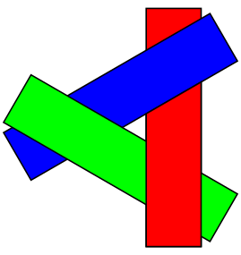

# Computer Graphics

## 화가 알고리즘(painter's algorithm)

https://en.wikipedia.org/wiki/Painter%27s_algorithm

가장 간단한 알고리즘. 먼 곳부터 순서대로 그리면서 가까운 물체가 이전에 그린 먼 물체를 가리는 방법이다.
depth-sort 알고리즘 또는 priority fill 라고도 한다.

**복잡하지 않다는 점**, **메모리 효율이** 좋다는 장점이 있다.

다만 제한 사항도 있다.

위와 같이 순환적으로 겹치는 경우에는 우선순위를 정할 수 없다.
비슷한 문제로 물체를 관통하는 경우에도 처리할 수 없다.

이 경우에는 물체를 잘라서 처리한다.

효율성 문제도 있는데, 완성된 화면 기준으로 가려지는 부분도 먼저 그려야 하기 때문에, 물체가 많은 경우에는 느려질 수 있다.
