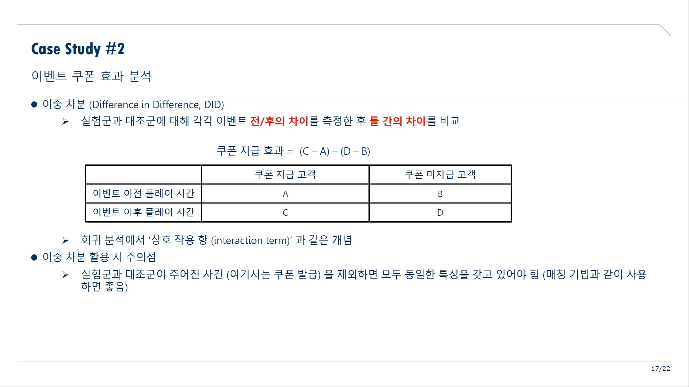

# Data analysis

<!--toc:start-->
- [Data analysis](#data-analysis)
- [이중차분법](#이중차분법)
  - [게임 데이터로 인과 추론 분석하기](#게임-데이터로-인과-추론-분석하기)
- ["데이터 엔지니어 부업을 해봅시다" 라는 구인글](#데이터-엔지니어-부업을-해봅시다-라는-구인글)
  - [문서(질문) 내용](#문서질문-내용)
<!--toc:end-->

# 이중차분법

이중차분(difference in differences, DID)은 두 집단의 difference를 difference한 두 시기로 비교해보는 것이다.

## 게임 데이터로 인과 추론 분석하기

https://youtu.be/sbUaqX4mX00

한국 R 컨퍼런스에서 NC소프트, 게임 데이터로 인과 추론 분석 발표 내용.

이중차분법은 말 그대로 차분을 두 번하는 것.

e.g.) 이벤트 쿠폰의 효과를 검증하고 싶다.

* 쿠폰이 지급된 집단의 지급 전, 후를 비교하면 이벤트 후에 있었던 모든 환경에 영향을 받는다.(C-A)
* 쿠폰을 지급받은 집단의 전과 후, 쿠폰 미지급 집단의 시간상 전과 후의 차이를 각각 구하고, 집단간 차이를 구하면{(C-A) - (D-B)} 시간에 따른 환경을 무시하고 비교할 수 있다.

# "데이터 엔지니어 부업을 해봅시다" 라는 구인글

https://www.facebook.com/yonghosee/posts/4044676965571406

데이터 엔지니어 역할을 파트타임으로 할 사람을 구인하는 글인데, 구글 docs로 접수받고 있다.
문서 내용은 데이터 분석과 관련된 질문이 적혀있다.
특히 몰라서 사용하지 않았떤 SQL Clause나 함수, 도구에 대한 질문이 있어서 정리해두려고 한다.

## 문서(질문) 내용

좋았던 질문은 **Bold**, 이름 등 불필요한 건 생략

1. 스스로 볼 때 파이썬 구현 수준이 어느정도 인가요?
2. AWS athena를 써보신 적이 있으신가요?
3. Google BigQuery를 써보신적 있으신가요?
4. Sqoop을 써보신적 있으신가요?
5. MongoDB는 어느정도로 써보셨나요?
6. **SQL에서 WITH문을 많이 쓰시는 편인가요?**
7. **SQL에서 LEAD, LAG등을 이용해 일간, 주간 리텐션을 구현 해본 적 있으신가요?**
8. Jupyter Notebook에서 pyspark으로 데이터 분석해보신 적 있으신가요?Jupyter Notebook에서 비주얼라이제이션 라이브러리 (matplotlib, seaborn, plotly등등) 은 어떤 것을 좋아하시며, 왜 좋아하시나요?
9. 본인이 써보신 워크플로우 디펜던시 엔진(Airflow, prefect, luigi등)을 쓰면서 느꼈던 불편했던 점, 고쳐지면 좋을 점에 대해서 말씀해주실 수 있나요? (써본적 없으면 패스)
10. 데이터 모니터링을 구현하거나 관련 툴을 써보신적 있으실까요?
11. redash나, superset 또는 그외 오픈소스 BI툴 경험이 있으시다면 소개해주세요 😃
12. 데이터레이크는 데이터웨어하우스와 어떤 차이가 있다고 생각하시나요? 데이터 레이크를 구축하신 경험이 있다면, 어떤 기술들을 사용해서 어떤 형태로 작업하셨는지 간단히 소개해주실 수 있으실까요?
13. **구현하시면서 ETL에서 ELT로의 변화를 느껴보신적이 있으실까요? ELT에 레디 되려면 어떤 점들이 필요할까요?**
