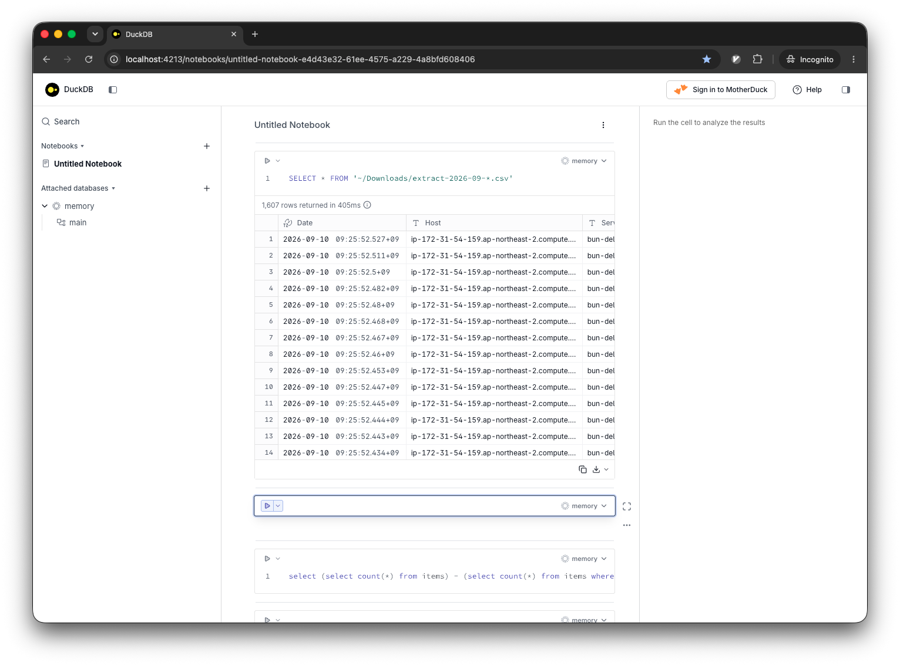

# DuckDB

분석용 인프로세스 SQL 데이터베이스 관리 시스템.

> DuckDB is an analytical in-process SQL database management system

https://github.com/duckdb/duckdb

MacOS는 `brew install duckdb`로 설치 가능.
`duckdb` 명령어를 제공한다.

로컬에서 csv, json 등 포맷의 **다중 파일**을 한 번에 조회할 수 있는 편리성을 제공한다.
기존에는 SQLite나 python의 csv, pandas를 이용하여 파일을 순회 및 적재해야 했는데 그 과정이 생략된다.

다음과 같이 GLOB 패턴으로 하나로 합칠 수 있다:

```sql
SELECT * FROM '~/Downloads/extract-2026*.csv'
```

뷰로 만들면 파일 경로 명세는 한 번으로 줄일 수 있다:

```sql
CREATE VIEW items AS select * from '~/Downloads/extract-2026*.csv'
```

---

"DuckDB"로 이름지은 이유가 재밌다.
오리는 날기 걷기 수영을 할 수 있고, 어려운 환경에서의 탄력성과 울음소리는 사람을 살리고-_- 데이터베이스 연구에 영감을 주는 등 다재다능하고 복원성 있는 데이터 관리 시스템에 완벽한 마스코트라고.

> Ducks are amazing animals. They can fly, walk and swim. They can also live off pretty much everything. They are quite resilient to environmental challenges. A duck's song will bring people back from the dead and [inspires database research](https://duckdb.org/images/wilbur.jpg). They are thus the perfect mascot for a versatile and resilient data management system.
>
> \- [*FAQ*](https://duckdb.org/faq)

## DuckDB UI

`-ui` 옵션은 내장된 노트북을 호스팅한다. `duckdb -ui`:


