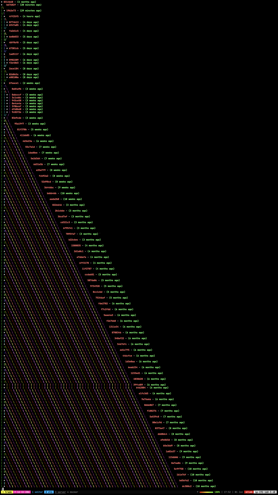
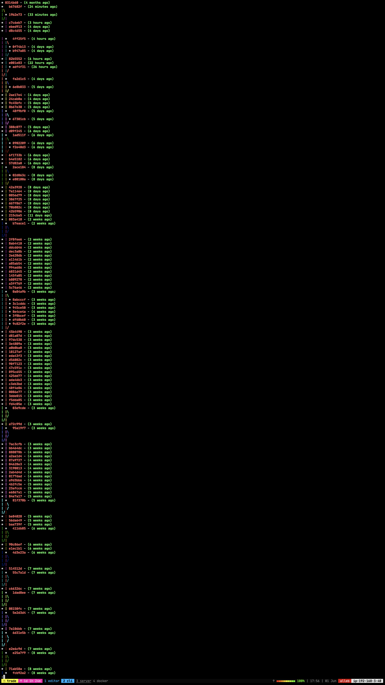
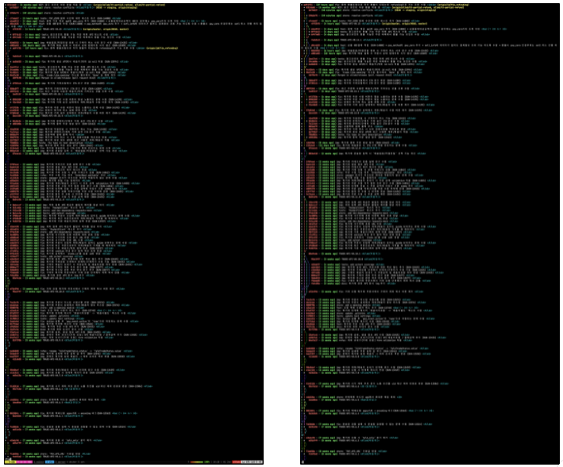

# Git

the stupid content tracker.

위는 `man git` 입력하면 볼 수 있는 Git을 설명하는 문구이다.

Git은 2005년 4월 3일에 리누스 토발즈가 개발을 시작해서,
17일 후인 4월 20일에 리눅스 2.6.12-rc3 커널을 [Git으로 공개](https://patrickcollison.com/fast)했다.

[2.6.12-rc3의 릴리즈 메일](https://lkml.iu.edu/hypermail/linux/kernel/0504.2/0784.html)에 Git에 대해서 언급된다.

> Ok,\
> you know what the subject line means by now, but this release is a bit\
> different from the usual ones, for obvious reasons. It's the first in a\
> _long_ time that I've done without using BK, and it's the first one ever\
> that has been built up completely with "git".

> 제목이 무슨 뜻인지 이제는 알고 계실 테지만,\
> 이 릴리스는 명백한 이유로 평소와는 조금 다릅니다.\
> BitKeeper를 사용하지 않고 내가 한 첫 번째 릴리스가 오랜만이고,\
> "git"으로 완전히 구축된 첫 번째 릴리스입니다.

git에서 언급하는 `HEAD`, `upstream` 등 용어에 대한 설명은 `git help glossary`로 확인할 수 있다.

## 역사

국내 기사로는 2005년 4월 22일에 개시한 [전자신문의 '토발즈, 새 리눅스 관리 툴 선보여'](https://m.etnews.com/200504210061)가 있다.

그 후 20년 후, 2025년 4월 17일 개시한 [바이라인 네트워크의 '리누스 토발즈의 Git 20주년 소회'](https://byline.network/2025/04/17-440/) 기사에는 20년이 지난 25년에 리누스 토발즈가 밝히는 Git에 대한 소회가 담겨 있다.

10일로 알려진 개발 기간은 사실 아이디어 구상까지 4개월 이상 걸렸다고 한다:

> 깃 개발은 시작부터 공개까지 10일밖에 걸리지 않은 것으로 알려진다. 그러나 토발즈는 실제로 비트키퍼의 대안을 고민한 기간은 4개월 이상이었다고 밝혔다. 코드 작성은 10일 남짓 걸렸지만, 아이디어를 구상한 기간은 꽤 길었다는 얘기다.
>
> (중략)
>
> 깃의 첫번째 버전은 1만줄의 코드로 작성됐다. 그는 깃 개발 초반에 장기적으로 어떻게 될 지 확신할 수 없었다고 했다.

토발즈는 본인을 라이트 유저라고 표현한다. 이유는 몇 가지 명령어만 사용하기 때문:

> 깃 생태계는 풍부한 도구를 갖고 있다. 그러나 토발즈는 깃 명령 언어를 사용할 뿐 편집기 통합 기능을 사용하지 않는다고 했다. 그가 사용하는 깃의 명령어는 ‘git merge’, ‘git blame’, ‘git log’, ‘git commit’, ‘git pull’이라면서 “나는 아주 라이트한 깃 사용자”라고 말했다.

Git 배포 후 본격적으로 사용하기 시작된 계기는 3년이 지난 2008년의 Ruby on Rails 개발자들이었다고 한다.
개발 패러다임을 많이 바꿨던 Rails 생태계가 여기서도 돋보인다:

> 그는 “깃을 본격적으로 사용하기 시작한 건 낯선 웹 개발자들이었는데, 루비온레일즈 개발자들이 깃을 2008년쯤 사용하기 시작했다”며 “완전히 새로운 유형의 깃 사용자가 생겨난 게 이상했는데, SCM을 한번도 사용해 본 적 없는 젊은이들이 갑자기 깃을 사용하게 된 게 확연히 드러났다”고 말했다.

본인이 무언가를 개발한다면 그건 세상의 실패라고 재밌는 말을 했다:

> 그는 “내가 만들어야 했던 모든 프로젝트는 다른 사람이 만든 것 중에서 더 나은 걸 찾을 수 없었기 때문에 만들 수밖에 없었다”며 “하지만 나는 다른 사람이 내 문제를 해결해 주는 게 훨씬 더 좋으며, 내가 프로젝트를 구상한다는 건 사실상 세상의 실패”라고 말했다.

## 자동 완성

탭을 통한 *명령어 자동 완성*하려면 [shell completion](https://github.com/bobthecow/git-flow-completion/wiki/Install-Bash-git-completion)을 설치해야 한다.
Homebrew로 설치했다면 `git-completion.bash`가 자동으로 설치된다.

### 브랜치 이름 중간에서 자동 완성

[macOS](/docs/wiki/mac-os.md)은 git과 함께 자동 완성 스크립트가 내장되어 있는데,
이 스크립트가 브랜치 이름 중간에서 자동 완성을 제공한다.
예를들어 `git switch lo`에서 탭을 누르면 feature/**lo**g가 자동 완성된다.
만약 Homebrew로 설치했다면 동작하지 않을 수도 있다. 첫 글자인 `f`에서만 **f**eature/log가 자동 완성된다.

이 스크립트는 `/usr/share/zsh/<version>/functions`에 위치하고 있다.
Homebrew로 git을 설치하면, `/opt/homebrew/share/zsh/site-functions`에 `git-completion.bash`가 설치되는데,
`.zshrc`에 `eval "$(brew shellenv)"`을 추가함으로써 Homebrew의 site-functions가 `$fpath`에 추가된다.
Homebrew site-functions는 `$fpath`의 가장 앞에 추가하기 때문에, 내장된 자동 완성 스크립트보다 우선적으로 동작한다.

개선된 git completion을 구해서 macOS 외 운영체에서도 사용할 수 있으면 좋을텐데, 찾지 못했다.
그래서 Homebrew `shellenv` 후 `$fpath` 가장 앞에 추가된 경로를 뒤로 이동시키는 것으로 우선 순위 문제를 임시 해결했다.

```bash
if command -v brew &> /dev/null; then
  eval "$(brew shellenv)"
  fpath=("${fpath[@]:1}" "${fpath[1]}")
fi
```

WSL 2 Ubuntu 기준에는 중간 자동 완성 기능이 없어서, 찾아봐야겠다.

## 깃 커밋 해시 충돌에 관하여

어느날 커밋 해시는 어떤 정보를 기반하여 만들어지는지 궁금했다.
커밋 해시는 `git commit` 할 때 생성되고, 커밋 해시로 `git checkout`하여 특정 revision으로 이동한다.

따라오는 질문은 "커밋 할 때 해시가 충돌할 여지는 없는가" 였다.

먼저, [git-scm](https://git-scm.com/book/ko/v1/Git-도구-리비전-조회하기)의 글
[SHA-1 해시 값에 대한 단상](https://git-scm.com/book/ko/v2/Git-%EB%8F%84%EA%B5%AC-%EB%A6%AC%EB%B9%84%EC%A0%84-%EC%A1%B0%ED%9A%8C%ED%95%98%EA%B8%B0#:~:text=%EB%85%B8%ED%8A%B8-,SHA%2D1%20%ED%95%B4%EC%8B%9C%20%EA%B0%92%EC%97%90%20%EB%8C%80%ED%95%9C%20%EB%8B%A8%EC%83%81,-Git%EC%9D%84%20%EC%93%B0%EB%8A%94)에서
이러한 걱정에 대한 현실적인 조언을 해 준다. 또 실제로 발생하면 어떤 일이 일어나는지 알려준다.

요약하면, 해시 중복이 생성되면, 현재 구현으로는 커밋은 성공하지만, checkout하면 최초의 revision으로 이동한다.
하지만 충돌이 발생할 확률은 현실적으로 불가능하다.

> SHA-1 해시 값에 대한 단상
>
> Git을 쓰는 사람들은 가능성이 작긴 하지만 언젠가 SHA-1 값이 중복될까 봐 걱정한다. 정말 그렇게 되면 어떤 일이 벌어질까?
>
> 이미 있는 SHA-1 값이 Git 데이터베이스에 커밋되면 새로운 개체라고 해도 이미 커밋된 것으로 생각하고 이전의 커밋을 재사용한다. 그래서 해당 SHA-1 값의 커밋을 Checkout 하면 항상 처음 저장한 커밋만 Checkout 된다.
>
> 그러나 해시 값이 중복되는 일은 일어나기 어렵다. SHA-1 값의 크기는 20 바이트(160비트)이다. 해시 값이 중복될 확률이 50%가 되는 데 필요한 개체의 수는 280이다. 이 수는 1자 2,000해 ('자’는 '경’의 '억’배 - 1024, 충돌 확률을 구하는 공식은 p = (n(n-1)/2) * (1/2^160) )이다. 즉, 지구에 존재하는 모래알의 수에 1,200을 곱한 수와 맞먹는다.
>
> 아직도 SHA-1 해시 값이 중복될까 봐 걱정하는 사람들을 위해 좀 더 덧붙이겠다. 지구에서 약 6억 5천만 명의 인구가 개발하고 각자 매초 Linux 커널 히스토리 전체와(650만 개) 맞먹는 개체를 쏟아 내고 바로 Push 한다고 가정하자. 이런 상황에서 해시 값의 충돌 날 확률이 50%가 되기까지는 약 2년이 걸린다. 그냥 어느 날 동료가 한 순간에 모두 늑대에게 물려 죽을 확률이 훨씬 더 높다.

### 리누스 토발즈의 의견

그래도 운이 정말 나빠서, 해시 충돌 문제에 벗어날 수 없다면, 리누스 토발즈도 이 이슈에 대해 언급했다.
아쉽게도 원글이 있던 google+가 종료되어 볼 수 없지만 예전에 올라온 나프다 게시글에 누군가 요약해 주었다.

https://www.facebook.com/iamprogrammer.io/posts/1379005945454259

사람이 소스코드의 변경을 지켜보고 있기 때문에 괜찮고, 또 대안은 있다고 한다.

### 해시 충돌을 재현한 SO 글

사실 충돌 문제에 대해 가장 먼저 접한 것은 StackOverflow의 질문이었다.

https://stackoverflow.com/questions/9392365

[답변](https://stackoverflow.com/questions/9392365/how-would-git-handle-a-sha-1-collision-on-a-blob/34599081#34599081)에서,
해시 사이즈를 4-bit로 줄여서 실제로 재현했다. `push`, `clone` 할 때 에러가 발생한다.

### 커밋 해시를 결정하는 요소

커밋 해시가 무엇으로 결정되는지 알려주는 SO 글. 부모 커밋, 커미터, 메시지 등.

https://stackoverflow.com/questions/34764195

### 해시 총돌 유머

여기 있는 사이트가 사라졌다 :|

> 뻘글) git 불안해서 못쓰겟음니다 -.-;

https://www.codentalks.com/t/topic/2973

찾다가 나온 유머글 ㅎㅎ. [덧글에 있는 만화](https://www.codentalks.com/uploads/default/original/2X/9/98fa43031c7cfbf44c714ad5819ea504ef37e70c.jpg)처럼
걱정, 우려만 해서는 안되겠다.

### sha1 층돌 설명

여기도 사이트가 사라졌다 :-|

sha1 충돌 이슈에 설명. 해시에 대한 기초 설명, 구글이 sha-1 충돌 재현에 대한 주변 설명.

https://zariski.wordpress.com/2017/02/25/sha-1-%EC%B6%A9%EB%8F%8C/

### md5 충돌 예제

여기 예제 사이트에서는 다른 파일인데 같은 MD5 sum을 가진 예제를 제공한다.
근데 다운받아보면 실행도 안되고, 바이너리지만 열어보면 내용도 같아 보이는데.. 심지어 파일 크기도 같다. 제대로 된 예제가 맞나?

https://www.mathstat.dal.ca/~selinger/md5collision

## Configurations

`.gitconfig` 파일에 설정을 저장하거나 `git config` 명령어로 설정을 추가하거나 확인한다.

### Conflict Style

```bash
[merge]
  conflictStyle = zdiff3
```

커밋 충돌 시 diff를 보여주는 방식을 개선한다.
기본값의 경우 다음과 같이 나타난다면:

```bash
++<<<<<<< HEAD
 +python -m SimpleHTTPServer 1234
++=======
+ python -m SimpleHTTPServer 4321
```

`zdiff3`은 원본 코드를 중간에 함께 보여준다:

```bash
++<<<<<<< HEAD
 +python -m SimpleHTTPServer 1234
++||||||| parent of dbecef5 (4321)
++python -m SimpleHTTPServer 8080
++=======
+ python -m SimpleHTTPServer 4321
++>>>>>>> dbecef5 (4321)
```

### Commit

`git commit --verbose` 옵션을 자주 사용한다.
커밋 메시지를 작성할 때 변경  내용을 함께 보여줘서 유용하기 때문이다.

다음 설정은 옵션 생략하고, 기본 설정을 변경한다:

```bash
[commit]
  verbose = true
```

위 예시는 `git rebase`의 충돌 결과라 `parent of dbecef5` 메시지와 함께 rebase를 시작한 커밋의 원본 코드를 보여준다.

## 명령어

### git clone

저장소를 복제하는 명령어. 가장 기본적인 명령어 중 하나라서 모르는 사람은 없겠다.

#### --depth

`--depth` 옵션은 저장소의 최신 커밋만 복제한다. 얕은 복제라 한다:

> Create a shallow clone with a history truncated to the specified number of commits.

예를 들어 `--depth 1`로 복제하면 최신 커밋만 복제한다. 이 옵션을 사용하면 저장소의 용량이 줄어드는 장점이 있다.

내 위키 프로젝트의 경우 전체 복제하는 경우 `.git` 폴더의 용량은:

```bash
$ du -sh .git
295M    .git
```

`--depth 1`로 복제하는 경우:

```bash
$ du -sh .git
25M     .git
```

10배의 차이가 있다.

---

GitHub Actions와 같이 배포 시스템을 구축하는 경우 최신 리비전만 필요한 경우가 많다.

https://github.com/actions/checkout 프로젝트는 저장소에 접근하기 위해서 많이 사용하는데, 기본적으로 `--depth 1` 옵션을 사용한다.

이 설정은 변경 가능하다:

```yaml
with:
  # Number of commits to fetch. 0 indicates all history for all branches and tags.
  # Default: 1
  fetch-depth: ''
```

내 경우는 정적 사이트를 빌드하면서, 커밋 내역을 확인해서 파일의 정보를 사이트에 보여주는 기능이 있었는데,
기본값으로 사용하면서 제대로 정보를 보여줄 수 없었다.

### git rebase -i

https://meetup.toast.com/posts/39

여러개의 커밋을 묶는데, `git reset HEAD~#` 후 다시 커밋을 생성하는 방법도 있지만,
여러개의 커밋을 남겼을 경우, 메시지들이 사라진다는 단점이 있다.
애초에 일련의 과정이 아니라, 수동으로 처리하는 행동 자체에서 꺼림칙함을 느낀다.

위 글은 `git rebase -i`를 이용하여 어떤 커밋을 하나로 합칠지 알려준다.
하지만 정말 유용한 기능 하나가 빠져있는데, 커밋 순서를 정렬할 수 있는 것이다.
이는 `git rebase -i`하면 나오는 설명에도 나온다
`These lines can be re-ordered;`

각 커밋을 의미하는 라인을 다시 정렬하면 git history가 그렇게 바뀐다.

예를들어 A라는 작업과 B라는 작업이 있다.
A는 기능 하나를 추가하는 것이고, B는 A 작업을 하다보니 파일을 옮기고, 스타일을 바꾸는 작업들을 했다.

```bash
* 5d31146 (HEAD -> master) A2
* 90bb25a B
* b94056d A1
* 5fc47ec A
* 325da60 init
```

문제는 A 작업을 처리하기 위해서 3개의 커밋을 남겼는데, 그 사이에 B 작업이 껴 있을 때다.

이 때 `git rebase -i 325da60` 수정할 수 있는 화면이 뜬다.

```bash
pick 5fc47ec A
pick b94056d A1
pick 90bb25a B
pick 5d31146 A2

# Rebase 325da60..5d31146 onto 325da60 (4 commands)
#
# Commands:
# p, pick = use commit
# r, reword = use commit, but edit the commit message
# e, edit = use commit, but stop for amending
# s, squash = use commit, but meld into previous commit
# f, fixup = like "squash", but discard this commit's log message
# x, exec = run command (the rest of the line) using shell
# d, drop = remove commit
#
# These lines can be re-ordered; they are executed from top to bottom.
#
# If you remove a line here THAT COMMIT WILL BE LOST.
#
# However, if you remove everything, the rebase will be aborted.
#
# Note that empty commits are commented out
```

내가 원하는 히스토리는

```
B
A
init
```

이런 순서다.

밑에 커밋이 위로 합쳐지므로, 다음과 같이 바꾼다.

```bash
pick 5fc47ec A
squash b94056d A1
squash 5d31146 A2
pick 90bb25a B

# Rebase 325da60..5d31146 onto 325da60 (4 commands)
#
# Commands:
# p, pick = use commit
# r, reword = use commit, but edit the commit message
# e, edit = use commit, but stop for amending
# s, squash = use commit, but meld into previous commit
# f, fixup = like "squash", but discard this commit's log message
# x, exec = run command (the rest of the line) using shell
# d, drop = remove commit
#
# These lines can be re-ordered; they are executed from top to bottom.
#
# If you remove a line here THAT COMMIT WILL BE LOST.
#
# However, if you remove everything, the rebase will be aborted.
#
# Note that empty commits are commented out
```

B를 가장 밑으로 빼고, A1과 A2는 squash로 바꾼다. 이러면 A와 B만 남는다.

이제 저장하고 나오면..

```bash
# This is a combination of 3 commits.
# This is the 1st commit message:

A

## This is the commit message #2:

A1

## This is the commit message #3:

A2

# Please enter the commit message for your changes. Lines starting
# with '#' will be ignored, and an empty message aborts the commit.
#
# Date:      Mon Mar 25 22:49:24 2019 +0900
#
# interactive rebase in progress; onto 325da60
# Last commands done (3 commands done):
#    squash b94056d A1
#    squash 5d31146 A2
# Next command to do (1 remaining command):
#    pick 90bb25a B
# You are currently rebasing branch 'master' on '325da60'.
#
# Changes to be committed:
#	modified:   README
#
```

A + A1 + A2에 대한 커밋 메시지를 작성하게 된다.

```bash
A

- 1
- 2
# Please enter the commit message for your changes. Lines starting
# with '#' will be ignored, and an empty message aborts the commit.
#
# Date:      Mon Mar 25 22:49:24 2019 +0900
#
# interactive rebase in progress; onto 325da60
# Last commands done (3 commands done):
#    squash b94056d A1
#    squash 5d31146 A2
# Next command to do (1 remaining command):
#    pick 90bb25a B
# You are currently rebasing branch 'master' on '325da60'.
#
# Changes to be committed:
#	modified:   README
#
```

위처럼 커밋메시지를 작성하고, `log`를 보면 의도한대로 정리된 것을 볼 수 있다.

```bash
$ glog
* e3c5f82 (HEAD -> master) B
* aa6f7ef A
* 325da60 init
```

만약 A와 B가 같은 파일을 작업하게 되면, 당연하게도 conflict 발생한다.

### git revert -m

`-m`, `--mainline` 옵션은 merge commit을 되돌리는데 사용한다. merge는 2개의 커밋을 병합하는 것이므로, 둘 중 어느 상태로 돌릴 것인지 결정해야 한다.

> Usually you cannot revert a merge because you do not know which side of the merge should be considered the mainline. - `git revert --help`

따라서 사용법은 다음과 같다: `git revert -m 1` or `git revert -m 2`

revert는 새 커밋에 되돌리는 작업이 포함되므로 history로는 어떤 커밋을 선택했는지 알 수 없다.

친절하게도 커밋 메시지에 둘 중 어떤 커밋으로 되돌아가는지 알려준다:

```
Revert "Add a feature"

This reverts commit 5c54ea679164eaca0bab639667bfcebb88769e63, reversing
changes made to b73ce1b168428a561e2dbcac96f97defaffa0e36.
```

`5c54ea` 되돌려서 parent commit 중 하나인 `b73ce1`로 돌아간다. 물론 새로운 커밋이기 때문에 hash는 별개다.

### git log

#### git log --graph

TL;DR

- `--date-order` 로 그래프를 정렬하는데 힌트를 줄 수 있다.
- `--author-date-order` 로 작성자 및 날짜 정렬
- 옵션에 대한 정보: https://git-scm.com/docs/git-log#_commit_ordering
- 기본 값은 `--topo-order`로 보인다.

##### --date-order 로 피라미드 그래프 방지하기

```bash
git log --graph --abbrev-commit --decorate --date=relative --format=format:'%C(bold red)%h%C(reset) - %C(bold green)(%ar)%C(reset) %C(white)%s%C(reset) %C(cyan)<%an>%C(reset)%C(bold yellow)%d%C(reset)' --all
```

git log를 그래프로 보기위해 이렇게 사용 중이다.

문제는 `staging -> master` 머지 커밋이 아래 이미지와 같이 피라미드로 보여진다.



머지 커밋의 경우 2개의 부모를 가지고 있기 때문에, 두 부모 중 어느 것을 우선적으로 보여줄 지 힌트가 없다.
따라서 피라미드로 보여지는 것으로 추정한다.

`--date-order` 옵션을 추가하여, 시간 기준으로 보여주도록 옵션을 주면 완화된다:

```bash
git log --graph --abbrev-commit --decorate --date=relative --format=format:'%C(bold red)%h%C(reset) - %C(bold green)(%ar)%C(reset) %C(white)%s%C(reset) %C(cyan)<%an>%C(reset)%C(bold yellow)%d%C(reset)' --all --date-order
```



##### 옵션 설명

`git log --help` 에서 정렬과 관련된 내용을 확인하면 어떻게 정렬 방법에 대해서 설명하고 있다.

```bash
Commit Ordering
       By default, the commits are shown in reverse chronological order.

       --date-order
           Show no parents before all of its children are shown, but otherwise show commits in the commit timestamp order.

       --author-date-order
           Show no parents before all of its children are shown, but otherwise show commits in the author timestamp order.

       --topo-order
           Show no parents before all of its children are shown, and avoid showing commits on multiple lines of history intermixed.

           For example, in a commit history like this:

                   ---1----2----4----7
                       \              \
                        3----5----6----8---

           where the numbers denote the order of commit timestamps, git rev-list and friends with --date-order show the commits in the timestamp order: 8 7 6 5 4 3 2 1.

           With --topo-order, they would show 8 6 5 3 7 4 2 1 (or 8 7 4 2 6 5 3 1); some older commits are shown before newer ones in order to avoid showing the commits from two
           parallel development track mixed together.
```

`--topo-order`에 대한 내용을 보면

```bash
                   ---1----2----4----7
                       \              \
                        3----5----6----8---
```

위 그래프가 있을 때, 숫자는 시간 순서로 작성되었다고 하자.

- `--topo-order` 8 6 5 3 7 4 2 1 순서로 표기한다.
- `--date-order` 8 7 6 5 4 3 2 1 순서로 표기한다.

#### --date-order 와 `--author-date-order` 비교



왼쪽이 `--date-order` 오른쪽이 `--author-date-order`이다.

#### --follow

기본적으로 `git log FILENAME`은 현재 파일 이름에 대해서만 로그를 보여준다.

`git log --follow FILENAME`으로 파일이 이동하더라도 추적한다.

다음은 예시.

```bash
$ git log --pretty=format:"%ad %h %s" --date=short docs/wiki/book.md
2023-12-02 8520c0d1f Add frontmatters
2023-11-11 f5b670292 Revise book.md and jetbrains.md
2023-10-26 e5832cc77 Revise tennise inner game
2023-10-15 146a5d7b2 Revise book.md
2023-10-13 9ac5d1ea3 Add heads
2023-10-11 3c2f6a0c3 Update tennis inner game book
2023-10-09 3af35024d Update tennis inner game book
2023-09-14 740f1e230 Add tennis inner game
2023-07-22 ee34ec929 Update document headings
2023-01-08 a0fc19715 Update book.md to include "만들면서 배우는 클린 아키텍처"
2023-01-05 e89f4febd Update book
2023-01-01 e8b5e5e97 Update all documents to include their own titles
2023-01-01 de99d7338 Migrate book
```

`Migrate book` 커밋에서 파일 이동이 있었다.

`--follow`를 추가하면 `Migrate book` 커밋 이전 내용도 확인할 수 있다.

```bash
$ git log --follow --pretty=format:"%ad %h %s" --date=short docs/wiki/book.md
2023-12-02 8520c0d1f Add frontmatters
2023-11-11 f5b670292 Revise book.md and jetbrains.md
2023-10-26 e5832cc77 Revise tennise inner game
2023-10-15 146a5d7b2 Revise book.md
2023-10-13 9ac5d1ea3 Add heads
2023-10-11 3c2f6a0c3 Update tennis inner game book
2023-10-09 3af35024d Update tennis inner game book
2023-09-14 740f1e230 Add tennis inner game
2023-07-22 ee34ec929 Update document headings
2023-01-08 a0fc19715 Update book.md to include "만들면서 배우는 클린 아키텍처"
2023-01-05 e89f4febd Update book
2023-01-01 e8b5e5e97 Update all documents to include their own titles
2023-01-01 de99d7338 Migrate book
2020-06-12 0bd294112 Update tags
2018-07-23 1ef0e7f22 Update front matters
2018-07-06 1605cfcf4 폴더 구조 변경 및 개발 환경 개선
2018-01-11 1c18d58bd Update "Chocolate Problem"
2018-01-11 ebd76bb05 Add "Chocolate Problem"
```

#### 브랜치간 커밋 비교

bitbucket, github에서 Pull Request를 머지할 때, 예를들어 staging -> master 머지한다면 staging의 커밋만 보여준다.
이는 `git log`로 구현할 수 있다.

```bash
$ git log --oneline --no-merges --left-only staging...master

8447882a feature: add something
abdb9882 fix: update something
316ec8c6 chore: fix typo
```

- `--left-only` 옵션은 왼쪽인 staging 브랜치에만 존재하는 커밋을 보여준다.
- `--no-merges`는 머지 커밋을 제외한다.

### git-worktree

`git worktree add <path> <branch>`로 현재 프로젝트를 `<path>`에 생성하고 `<branch>`로 체크아웃한다. 현재 프로젝트와 연결된다.
git에서는 작업 영역을 working tree라 부르니, 알아두면 좋겠다.

`git worktree`는 현재 작업중인 내용을 stash나 commit 등으로 저장하지 않고, 다른 작업을 처리할 때 유용하다.
다만, [java](./java.md)나 [kotlin](./kotlin.md) 프로젝트 같이 [IDE](./jetbrains.md)에서 인덱싱하여 작업 영역이 무거운 경우에는 비효율적일 수 있다.
새 worktree에서 다시 인덱싱을 하기 때문이다.

`git worktree list`로 목록을 확인할 수 있으며, 복사된 프로젝트나 원본 프로젝트에서도 확인 가능하다.

```bash
$ git worktree list
/Users/me/workspace/some-api         e9169a43 [staging]
/Users/me/workspace/some-api-new     e826395c [new-branch]
```

worktree가 사용하는 branch는 `git branch`에서 구분되어 표시된다:

```bash
$ git branch
* new-branch  # 현재 worktree에서 사용하는 branch
  master
+ staging     # 다른(원본) worktree
```

worktree를 제거하기 위해서는 `git worktree remove <path>`를 사용한다. Tab을 통한 경로 자동 완성이 된다.
worktree에서 사용한 브랜치는 계속 유지된다.

### git-bisect

1. `git bisect start` 명령어로 시작.
2. `git bisect bad <commit>` 명령어로 버그 발생 지점 지정.
3. `git bisect good <commit>` 명령어로 정상 지점 지정.
4. 자동으로  중간 커밋으로 체크아웃 됨. 동작 확인.
5. `git bisect good` or `git bisect bad` 명령어로 계속 진행.
6. 버그가 처음 발생한 커밋에서 자동 종료.

`git bisect` 명령은 이진 탐색을 이용하여 버그가 처음 발생한 커밋을 찾는데 사용한다.
메뉴얼 상으로는 버그라고 하지만, 특정 커밋을 찾는데 사용할 수 있다고 보면 된다.
`bisect`는 2등분한다는 의미다.

이진 검색을 사용하기 때문에, 아무리 커밋이 많아도 `log(n)` 안에 찾을 수 있다.
커밋이 1억개가 있더라도 27번만 검색하면 된다.

흐름은 올바른 커밋과 잘못된 커밋을 먼저 선정하면, git이 자동으로 중간 커밋으로 체크아웃한다.
사용자는 현재 커밋에서 동작을 확인하고 올바른지 잘못되었는지 알려주면, git이 다음 중간 커밋으로 체크아웃을 반복한다.
올바른 커밋과 잘못된 커밋이 변경되는 지점을 찾으면 git은 경계 지점을 찾아서 멈춘다.

다음은 사용 예시.

```bash
~/myproject                                                                      master*
❯ git bisect start
status: waiting for both good and bad commits

~/myproject                                                                      master|bisect
❯ git bisect bad HEAD
status: waiting for good commit(s), bad commit known

~/myproject                                                                      master|bisect
❯ git bisect good 9867149b9a0097a8830159a14ca23182828a352c
Bisecting: 36 revisions left to test after this (roughly 5 steps)
[c5adff3fa82925bbbf12dde653af264a54e002d6] V1.0.27

~/myproject                                                                      @c5adff3f|bisect
❯ git bisect good
Bisecting: 17 revisions left to test after this (roughly 4 steps)
[e31a874ebfdd7d254f8e90541d367b310b6168c0] V1.0.33

~/myproject                                                                      @e31a874e|bisect
❯ git bisect good
Bisecting: 8 revisions left to test after this (roughly 3 steps)
[c634c9cbbb6c023ae068dad96cf945e2295272ef] V1.0.37

~/myproject                                                                      @c634c9cb|bisect
❯ git bisect good
Bisecting: 3 revisions left to test after this (roughly 2 steps)
[7977f9b61481a366a50afd263f57c88591e858f5] V1.0.39

~/myproject                                                                      @7977f9b6|bisect
❯ git bisect good
Bisecting: 1 revision left to test after this (roughly 1 step)
[3f30e3a9f617c7acd6e9310573564b3e56fecb30] V1.0.40

~/myproject                                                                      @3f30e3a9|bisect
❯ git bisect good
Bisecting: 0 revisions left to test after this (roughly 0 steps)
[e0b7dbc3921062a6f06a1997efb891b0b1b6041d] imp: improve some logic

~/myproject                                                                      @e0b7dbc3|bisect
❯ git bisect bad
e0b7dbc3921062a6f06a1997efb891b0b1b6041d is the first bad commit
commit e0b7dbc3921062a6f06a1997efb891b0b1b6041d (HEAD, origin/imp-logic)
Author: John Doe
Date:  Fri Mar 25 22:49:24 2022 +0900

    imp: improve some logic


 src/foo.py
 src/bar.py
 src/tests/foo_test.py |
 3 files changed, 2 insertions(+), 238 deletions(-)
```

`git bisect run` 명령은 good, bad를 자동 판단하는 스크립트를 작성하여, 커밋 탐색을 자동화하는 명령이다.
<!-- TODO: 예시 추가 -->

### git-reset

`git reset`은 HEAD를 이동시키는 명령어다. 즉, 작업 영역을 변경한다.

remote branch의 변경이 있으면, `fatal: Not possible to fast-forward, aborting.` 에러가 발생하는 fast-forward가 불가능한 경우를 피하기 위해서
일반적으로 `git reset --hard origin/<branch>`로 변경하곤 한다. 다만 문제는 브랜치 이름이 길어지면 입력이 번거롭다는 점.
git completion으로 해결할 수 있지만, 별칭을 사용하는 것도 편리한 방법이다.

`git reset --hard @{u}`를 사용하면 upstream branch로 reset할 수 있다. `@{u}`는 `@{upstream}`의 축약어다.

```bash
# ~/workspace/my-project new-awesome-feature-wip-and-too-long-branch-name
$ g reset --hard @{u}
HEAD is now at 93a0251b work-in-progress
```

### git-shortlog

`git shortlog`는 커밋 내역을 요약한다.

```bash
$ git shortlog

Alleb (2):
      Implment something
      Fix something

Bella (3):
      Initial commit
      Add something
      Update something
```

기본 옵션으로는 사용자 별로 커밋 내역을 요약한다.

`-s` 옵션은 커밋 수만 보여준다.

```bash
$ git shortlog -s
     2  Alleb
     3  Bella
```

### git-checkout

브랜치를 변경하거나, 파일을 복구하는 기능.

2개의 기능을 가지고 있어서, [2019년 8월, 2.23.0 버전](https://github.blog/2019-08-16-highlights-from-git-2-23/)부터 `git switch`와 `git restore`로 분리되었다.
`switch`는 브랜치의 변경, `restore`는 파일 복구를 담당한다.

`git checkout -p`로 interactive 파일을 복구할 수 있다. \
`git add -p`와 같은 방식으로 hunk 단위로 선택하거나 파일을 직접 수정하여 복구한다.

인자 없이 `git checkout`은 현재 브랜치에 다시 체크아웃한다.
메뉴얼에는 추적 정보를 보여주는 비싼 부수효과라지만, hook이 있다면 다시 실행한다.
나는 브랜치 설명을 `$PS1`에 추가해 두고, checkout hook에 갱신하고 있어서 유용하게 사용하고 있다.

> You could omit `<branch>`, in which case the command degenerates to "check out the current branch", which is a glorified no-op with rather expensive side-effects to show only the tracking information

## Revisions

revision은 `dae86e1950b1277e545cee180551750029cfe735`, `{upstream}`, `v1.7.4.2-679-g3bee7fb`, `master` 등 커밋을 가리키는 표현이다.

`git help revisions`에서 설명한다.

`git rebase @{u}`은 현재 브랜치의 upstream branch로 rebase한다.
현재 브랜치가 리모트에서 변경되고, 일일이 이름을 모두 타이핑하지 않고 `@{u}`로 간단하게 사용할 수 있어서 자주 사용한다.

`git checkout master@{10.days.ago}`는 10일 전의 master 브랜치로 checkout한다.
`bisect`와 더불어 디버깅하기 용이한 명령어다.
`days` 이외에도 `minutes`, `years` 그리고 조합하여 사용도 가능하고, `1979-02-26 18:30:00`와 같은 날짜 포맷도 사용할 수 있다.

> A ref followed by the suffix @ with a date specification enclosed in a brace pair (e.g.  {yesterday}, {1 month 2 weeks 3 days 1 hour 1 second ago} or {1979-02-26 18:30:00}) specifies the value of the ref at a prior point in time.

## Git Large File Storage(LFS)

Git Large File Storage는 대용량 파일의 버전 관리를 위한 도구이다.

Git은 리모트 저장소로부터 clone 받을 때 대용량 파일은 실제 파일이 아닌, 참조만 받아온다.\
그래서 clone 받을 때 빠르게 받을 수 있다.

References:

- git-lfs 공식 사이트: https://git-lfs.com/
- GitHub의 LFS 설명: https://docs.github.com/ko/repositories/working-with-files/managing-large-files/about-git-large-file-storage

Git LFS는 Git의 확장으로 분류한다:

> An open source Git extension for versioning large files

`git lfs` 명령어로 제공하지만, Git에 내장된 것은 아니다. 별도 설치가 필요하다.\
Linux, macOS는 `brew install git-lfs`로 설치 가능.

### 사용법

최근 Huggingface에서 [모델](https://huggingface.co/Trelis/Llama-2-7b-chat-hf-function-calling-v2)을 다운로드 받고 실행해 보면서 처음 사용해 보았다.\
`.git` 폴더는 모든 리비전에 대한 내용을 담고 있어서 그런지, 모델 저장소의 경우 용량이 매우 커졌다.

대용량 파일을 업로드 할 일이 없어서 업로드에 대한 내용은 생략한다.

git clone 전에 하거나 clone 후에 하는지에 따라 사용 방법이 다르다.

---

**Clone 전**

1. `git lfs install`로 LFS 사용을 활성화한다. (비활성화는 `git lfs uninstall`)
  ```bash
  $ git lfs install
  Updated Git hooks.
  Git LFS initialized.
  ```
2. `git clone` 한다.

`git lfs install`은 한 번만 실행하면 전역으로 적용된다.
앞으로 clone 받는 저장소에 대해서 대용량 파일을 실제 파일로 받겠다는 의미다.

다운로드 진행 상황이 UI로 표시되지 않기 때문에 clone이 멈춘듯한 모습으로 보이지만,
`du -sh .git` 명령어로 용량을 확인하면 계속 증가하는 것을 볼 수 있다.

`git lfs install`을 하지 않고 clone을 받는 것과 비교하면 완료 속도가 다른 것을 체감할 수 있다.

---

**Clone 후**

`git lfs pull`로 대용량 파일을 다운로드 받는다.

이 경우에도 멈춘듯한 모습으로 보이지만, 실제로는 다운로드가 진행된다.

도움말 `git lfs pull --help`에 다르면 `git lfs fetch` 명령어와 같다고 한다.\
아마도 특정 파일만 다운로드 받을 수도 있는 모양.

## 커밋 서명하기

커밋의 서명을 확인하려면 `git cat-file -p <commit-hash>` 명령어를 사용한다.

다음은 mochajs 저장소의 커밋을 확인한 것이다.

```bash
$ git cat-file -p HEAD
tree 6c42701b4c621fa227bd211b6b52473e68004057
parent 37358738260cfae7c244c157aee21654f2b588f2
author ***** ***** <***************@*****.***> 1709903697 -0300
committer GitHub <noreply@github.com> 1709903697 -0500
gpgsig -----BEGIN PGP SIGNATURE-----
...
 -----END PGP SIGNATURE-----
...
```

---

커밋 서명은 GPG를 사용한다.

GPG CLI는 Homebrew로 설치했다: `brew install gpg`

### GPG 키 생성: `gpg --full-generate-key`

`--full-generate-key` 옵션은 키 pair를 생성한다.

키 생성 시 알고리즘 등 키 정보와 사용자 정보를 입력한다.\
[GitHub의 GPG 키 생성 가이드](https://docs.github.com/en/authentication/managing-commit-signature-verification/generating-a-new-gpg-key)를 참고했다.

키 정보는 모두 Enter로 기본 값을 선택했다.

- 알고리즘: RSA
- 키 사이즈: 3072
- 만료 기간: 0(무제한)

사용자 정보는 이메일 주소만 입력했다. GitHub에 등록한 이메일 주소를 입력한다.
이메일을 감추고 싶다면 GitHub의 `no-reply` 이메일을 사용하라고 한다.

```bash
$ gpg --full-gen-key
gpg (GnuPG) 2.2.19; Copyright (C) 2019 Free Software Foundation, Inc.
This is free software: you are free to change and redistribute it.
There is NO WARRANTY, to the extent permitted by law.

gpg: keybox '/home/user/.gnupg/pubring.kbx' created
Please select what kind of key you want:
   (1) RSA and RSA (default)
   (2) DSA and Elgamal
   (3) DSA (sign only)
   (4) RSA (sign only)
  (14) Existing key from card
Your selection?
RSA keys may be between 1024 and 4096 bits long.
What keysize do you want? (3072)
Requested keysize is 3072 bits
Please specify how long the key should be valid.
         0 = key does not expire
      <n>  = key expires in n days
      <n>w = key expires in n weeks
      <n>m = key expires in n months
      <n>y = key expires in n years
Key is valid for? (0)
Key does not expire at all
Is this correct? (y/N) y

GnuPG needs to construct a user ID to identify your key.

Real name:
Email address: *******@gmail.com
Comment:
You selected this USER-ID:
    "*******@gmail.com"

Change (N)ame, (C)omment, (E)mail or (O)kay/(Q)uit? O
We need to generate a lot of random bytes. It is a good idea to perform
some other action (type on the keyboard, move the mouse, utilize the
disks) during the prime generation; this gives the random number
generator a better chance to gain enough entropy.
We need to generate a lot of random bytes. It is a good idea to perform
some other action (type on the keyboard, move the mouse, utilize the
disks) during the prime generation; this gives the random number
generator a better chance to gain enough entropy.
gpg: /home/user/.gnupg/trustdb.gpg: trustdb created
gpg: key 7754F8835F1D4F23 marked as ultimately trusted
gpg: directory '/home/user/.gnupg/openpgp-revocs.d' created
gpg: revocation certificate stored as '/home/user/.gnupg/openpgp-revocs.d/EC2773EB41F9362E83E76B177754F8835F1D4F23.rev'
public and secret key created and signed.

pub   rsa3072 2024-03-11 [SC]
      EC2773EB41F9362E83E76B177754F8835F1D4F23
uid                      *******@gmail.com
sub   rsa3072 2024-03-11 [E]
```

### GPG 키 확인: `gpg --list-secret-keys --keyid-format=long`

`--list-secret-keys` 옵션은 생성된 키 목록을 출력하고\
`--keyid-format=long` 옵션은 키 ID를 출력한다.

```bash
$ gpg --list-secret-keys --keyid-format=long
/home/user/.gnupg/pubring.kbx
-------------------------------
sec   rsa3072/7754F8835F1D4F23 2024-03-11 [SC]
      EC2773EB41F9362E83E76B177754F8835F1D4F23
uid                 [ultimate] *******@gmail.com
ssb   rsa3072/9E8A974D370C5682 2024-03-11 [E]
```

`7754F8835F1D4F23`가 키 ID이다.

### GPG 키 export: `gpg --armor --export <key-id>`

`--armor` 옵션은 공개 키 정보를 ASCII로 출력한다.

```bash
$ gpg --armor --export 7754F8835F1D4F23
-----BEGIN PGP PUBLIC KEY BLOCK-----

...
-----END PGP PUBLIC KEY BLOCK-----
```

### GPG 키 GitHub에 등록하기

GitHub의 `Settings` > `SSH and GPG keys` > `New GPG key`에 공개키를 등록한다.

`-----BEGIN PGP PUBLIC KEY BLOCK-----`와 `-----END PGP PUBLIC KEY BLOCK-----` 내용을 모두 복사해서 붙여넣는다.

### 서명하기

`git commit` 명령어에 `-S` 옵션을 추가한다.

```bash
$ git commit -S -m "commit message"
```

`-S` 옵션 대신 git 설정 `commit.gpgSign`을 `true`로 설정하면 자동 서명된다.

`-S` 옵션은 key-id를 받지만, 생략하면 `user.signingKey` 설정을 사용한다.
`git config --global user.signingKey <key-id>`로 설정하자.

만약, 키가 없으면 다음과 같이 실패한다.

```bash
$ git commit
error: gpg failed to sign the data:
gpg: skipped "edunga1 <*******@gmail.com>": No secret key
[GNUPG:] INV_SGNR 9 edunga1 <*******@gmail.com>
[GNUPG:] FAILURE sign 17
gpg: signing failed: No secret key

fatal: failed to write commit object
```

키가 있으면 passphrase 입력을 요구한다.

## 여러개의 git 설정파일 사용하기

`[include]`, `[includeIf]` 설정을 사용하여 여러 개의 git 설정 파일을 관리할 수 있다.
`git config --help`의 `Conditional includes`에서 설명한다.

```bash
# ~/.gitconfig
[includeIf "gitdir:~/workspace-foo/"]
  path = ~/.gitconfig.foo
[includeIf "gitdir:~/workspace-bar/"]
  path = ~/.gitconfig.bar

# ~/.gitconfig.foo
[user]
	email = foo@example.com
	name = Foo

# ~/.gitconfig.bar
[commit]
  gpgSign = true
[user]
	email = bar@example.com
	name = Bar
  signingkey = ABCDEFGHIJKLMNOPQRSTUVWXYZ
```

위 예시는 `~/workspace-foo/` 디렉토리에 있는 프로젝트에서는 `~/.gitconfig.foo` 설정을 사용하고,
`~/workspace-bar/` 디렉토리에 있는 프로젝트에서는 `~/.gitconfig.bar` 설정을 사용한다.

`gitdir:`은 `.git` 디렉토리의 GLOB 패턴으로 사용되며, `true`이면 설정을 적용한다:

> The data that follows the keyword gitdir: is used as a glob pattern. If the location of the .git directory matches the pattern, the include condition is met.

나는 회사와 개인 프로젝트를 분리하고 사용자 정보와 서명 설정을 다르게 사용하고 있다.
