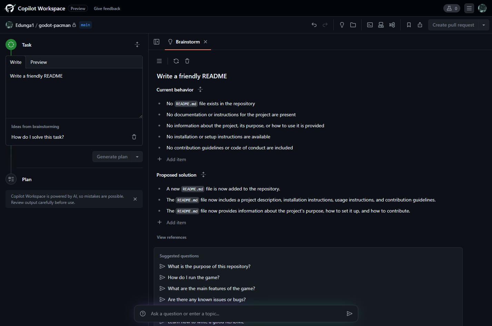
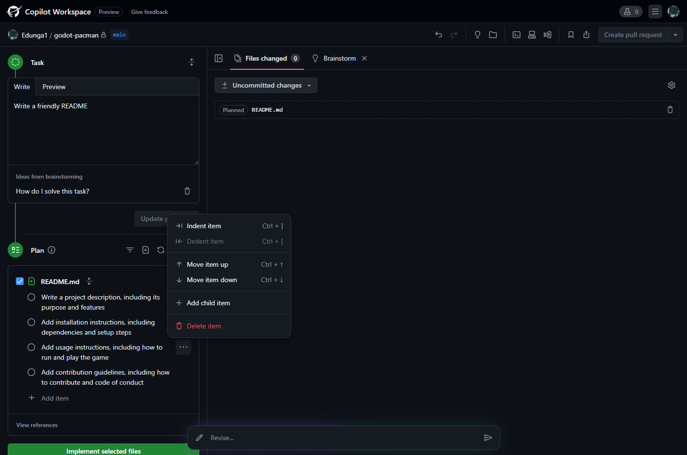
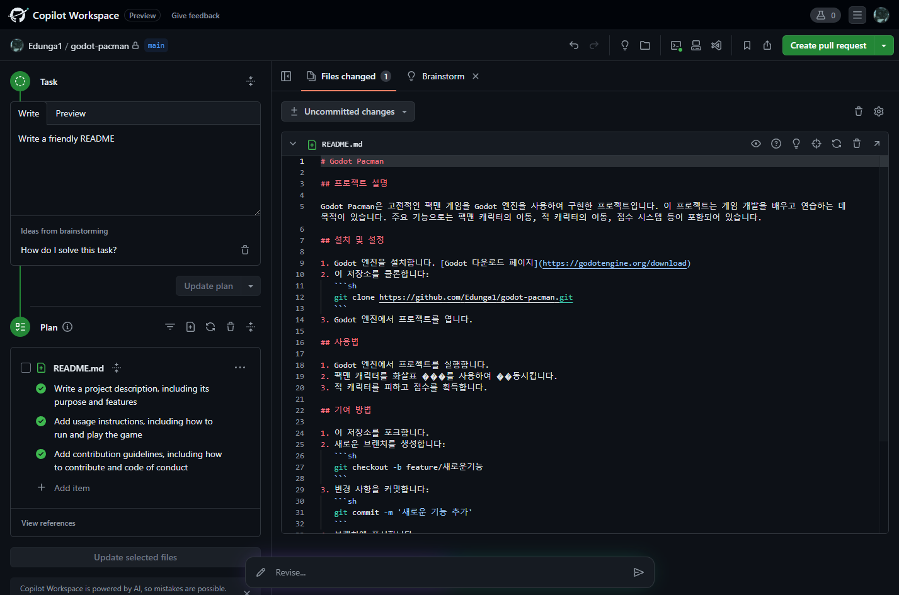
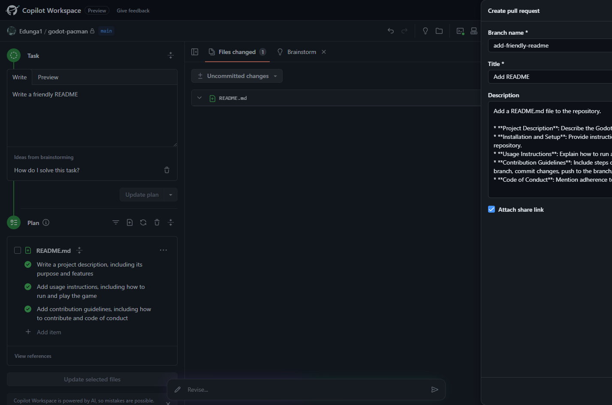
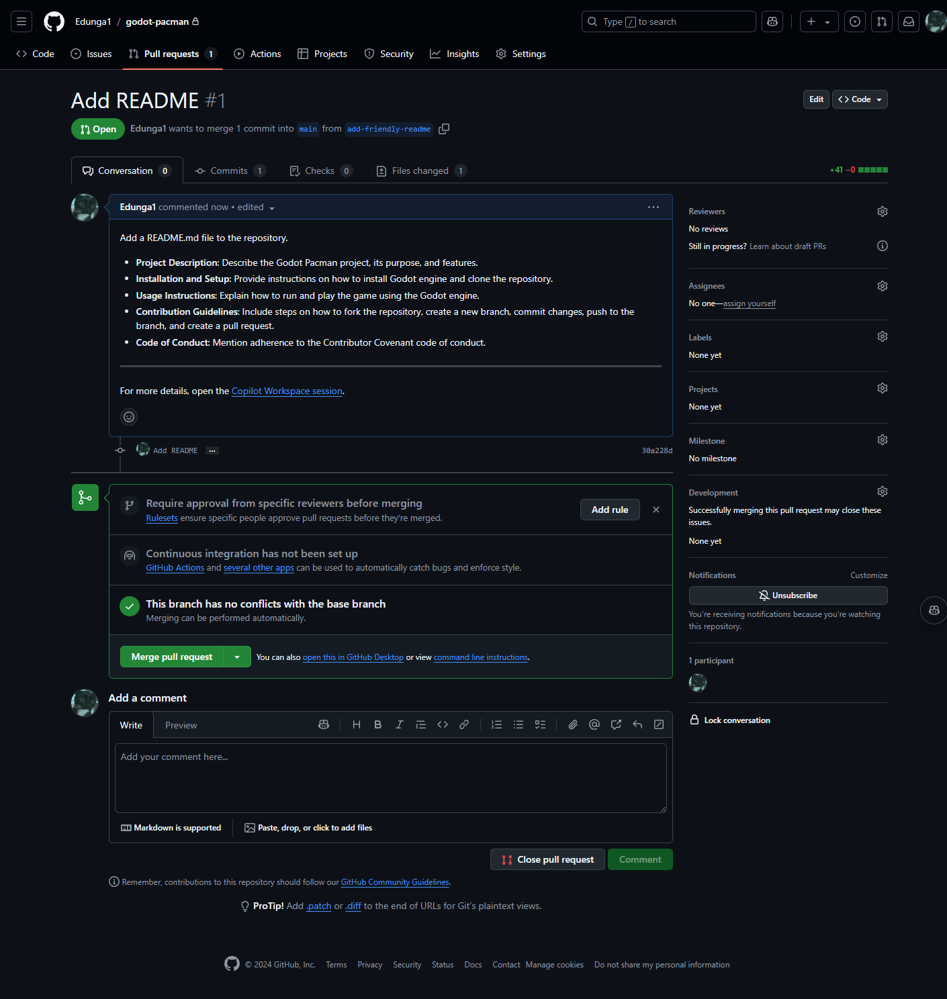

# GitHub

Git 저장소 호스팅 서비스.

## GitHub Copilot

코드 작성을 도와주는 AI 도구.

가장 만족하는 AI 도구이다. 코딩 생산성이 배가 된다.
나는 2021년 11월에 tech-preview로 시작할 떄부터 사용해왔고, 2022년 6월에 tech-preview의 종료 후 정식 출시하여 유료 구독을 하고 있다.
당시에는 AI 기반 코드 자동 완성 도구는 아마 GitHub Copilot가 유일했다.

비슷한 도구로는 Tabnine이 있었는데, 이것도 자주 사용했었다.
Copilot 보다 오래된 도구이고, AI 기반은 아니지만 스마트한 자동 완성 도구로써 반복 작업을 대거 줄여줬기 때문에 도움이 되었다.
회사 동료에게 추천했었는데, 다들 신기해했다. 간단한 케이스에만 자동 완성되었지만 말이다.

지원하는 모델은 [supported-models 페이지](https://docs.github.com/en/copilot/reference/ai-models/supported-models#supported-ai-models-in-copilot)에서 확인할 수 있다.
OpenAI, Claude, Gemini, xAI 모델을 지원하고, 최신 버전 반영이 빠른편.

vim, vscode, jetbrain 에디터 등 에디터의 플러그인 형태로 제공된다.

깃허브 저장소에서 copilot chat 기능으로 저장소를 분석할 수 있다.
내가 주로 사용하는 방식은 특정 로직을 처리하는 파일을 찾는다거나(maccy 저장소에서 fuzzy 알고리즘 사용하는 지점을 찾는 등) 내 프로젝트에서 오탈자를 찾아 달라고 요청하는 식이다. 여기서 더 나아간 형태가 copilot workspace가 되겠다.

요금제는 월간 제한이 있는 Copilot Free, 월 구독형 Copilot Pro가 대표적.
2025년 4월 4일에 [Copilot Pro+가 출시되었다](https://github.blog/changelog/2025-04-04-announcing-github-copilot-pro/).
월간 $10인 Pro의 약 4배 가격인 $39로 매우 비싸다. 기능은 Pro와 동일하지만, 고급 모델에 대한 접근을 제공한다.

### Copilot in the CLI

shell 명령어를 작성하는데 도움을 주는 도구.

https://githubnext.com/projects/copilot-completions-cli/ \
https://www.npmjs.com/package/@githubnext/github-copilot-cli

- 2023-03-29 대기자 명단에 등록해야 사용할 수 있었으나 정식 릴리즈 되어 이제 누구나 사용할 수 있다.
- 2024-03-21 정식 출시되었다. 이름은 `GitHub Copilot in the CLI`로 변경되었다.
    - 설치 방식 또한 github cli 플러그인 확장 형태로 통합되었다. 기존에는 npm, gh extension 모두 지원했다.
    - `??` 대신 `ghcs` `ghce` 명령어로 대체되었다.
- 2025-10-25 [Deprecated 되었다](https://github.com/github/gh-copilot).
    - copilot-cli로 [대체하라고 한다](https://docs.github.com/en/copilot/how-tos/use-copilot-for-common-tasks/use-copilot-in-the-cli).
    - `gh copilot` 확장 형태는 유지되지만, copilot cli와 동일한 기능이다.

#### 사용 방법(deprecated)

더 이상 지원하지 않는 방식. 기록 차원에서 남긴다.

```bash
❯ ?? listening port 5000

 ──────────────────── Command ────────────────────

lsof -i :5000

 ────────────────── Explanation ──────────────────

○ lsof is used to list open files.
  ◆ -i specifies that we want to list network connections.
  ◆ :5000 specifies that we want to list connections to port 5000.

🕕  Hold on, executing commmand...
COMMAND   PID  USER   FD   TYPE            DEVICE SIZE/OFF NODE NAME
ControlCe 493 alleb   21u  IPv4 0x13aa2e8d9dde83f      0t0  TCP *:commplex-main (LISTEN)
ControlCe 493 alleb   22u  IPv6 0x13aa2f274270ba7      0t0  TCP *:commplex-main (LISTEN)
```

`??`와 프롬프트를 입력하면 명령어를 추천해주고, 실행할 것인지 여부를 묻는다.
copilot 만큼의 성능은 나오지 않는 거 같다. 프롬프트를 추가해도 같은 명령어를 추천하는 경우가 많다.

한글도 잘 먹었는데, 간단한 것만 시도해서 그럴지도 모르겠다.

`awk` 같이 규칙이 있어서 사용할 때 마다 헷갈리는 명령어를 사용하는데 특히 도움이 된다.
`4번째 열 출력하는데, $로 구분되어 있다`와 같은 프롬프트를 잘 해석한다.

비슷한 프로그램으로는 [tldr](https://github.com/tldr-pages/tldr)이 있다.
다만 이건 메뉴얼을 좀 더 보기쉽게 커뮤니티 차원에서 치트시트를 만드는 것이다보니
내 문맥에 따른 명령어를 추천해주는 것은 아니다.

---

다른 방식으로는 GitHub Cli의 플러그인이다. 따라서 `gh` 명령어를 통해서 사용한다.

https://docs.github.com/en/copilot/github-copilot-in-the-cli/using-github-copilot-in-the-cli

2개 기능을 제공하는데 명령어 설명하는 `explain`과 명령어를 추천해주는 `suggest`이다.

다음은 `explain`의 사용법.

```bash
$ gh copilot explain "wget -q0- http://ollama:11434/api/health"

Welcome to GitHub Copilot in the CLI!
version 0.5.3-beta (2023-11-09)

I'm powered by AI, so surprises and mistakes are possible. Make sure to verify any generated code or suggestions, and share feedback so that we can learn and improve.

Explanation:

  • wget is used to download files from the web.
    • -q0- specifies that we want a quiet output and the downloaded content should be printed to the terminal.
    • http://ollama:11434/api/health is the URL from which we want to download the content.
```

`suggest`는 명령어를 추천해준다.

```bash
$ gh copilot suggest "Download a png file from a URL."

Welcome to GitHub Copilot in the CLI!
version 0.5.3-beta (2023-11-09)

I'm powered by AI, so surprises and mistakes are possible. Make sure to verify any generated code or suggestions, and share feedback so that we can learn and improve.

? What kind of command can I help you with?
> generic shell command

Suggestion:

  curl -O <URL>

? Select an option  [Use arrows to move, type to filter]
  Copy command to clipboard
  Explain command
  Revise command
  Rate response
> Exit
```

명령어 유형과 명령어를 어떻게 할 것인지 총 2번의 인터랙션으로 사용성은 별로.

### Copilot CLI

코딩 [에이전트](/docs/wiki/google-gemini.md#gemini-cli) 도구.

https://github.com/github/copilot-cli

`npm install -g @github/copilot`로 설치한다.
명령어는 `copilot`이다.

[GitHub CLI](/docs/wiki/github.md#github-cli)를 사용한다면 인증 절차가 생략되고 함께 사용한다.

매 요청은 Premium requests 토큰을 소모한다.
[settings/copilot/features](https://github.com/settings/copilot/features)에서 토큰 잔여량을 확인할 수 있다.
Pro 기준 월간 300 토큰이 제공된다.
토큰의 소모량은 모델마다 달라진다.
이는 [model-multipliers 문서](https://docs.github.com/en/copilot/reference/ai-models/supported-models#model-multipliers)에서 설명한다.
또는 copilot 대화창에서 `/model` 명령어로 확인할 수 있다. 소모량은 무료, 3x, 1, 0.33x 등 다양하다.

```bash
 Select Model

 Choose the AI model to use for Copilot CLI. The selected model will be persisted and used for future sessions.

 ❯ 1. Claude Sonnet 4.5 (1x) (default)
   2. Claude Haiku 4.5 (0.33x)
   3. Claude Opus 4.5 (Preview) (3x)
   4. Claude Sonnet 4 (1x)
   5. GPT-5.1-Codex-Max (Preview) (1x)
   6. GPT-5.1-Codex (1x)
   7. GPT-5.2 (Preview) (1x) (current)
   8. GPT-5.1 (1x)
   9. GPT-5 (1x)
   10. GPT-5.1-Codex-Mini (0.33x)
   11. GPT-5 mini (0x)
   12. GPT-4.1 (0x)
   13. Gemini 3 Pro (Preview) (1x)
   14. Cancel (Esc)

 Confirm with number keys or ↑↓ keys and Enter, Cancel with Esc
```

세션은 자동 저장된다.
이전 세션을 불러와서 이어서 작업하기 위해서는 `copilot --resume`을 사용하자.
세션 선택 화면이 우선 나온다.
옵션을 생략하면 항상 새로운 세션이 시작되므로, 대화 종료 후 다시 이어서 작업하려면 `--resume` 옵션을 사용해야 한다.

#### non-interactive mode

대화형이 아닌 형태로도 사용할 수 있다.
`-p` 옵션으로 프롬프트를 전달한다.
`--allow-all-tools` 옵션을 주면 일일이 승인하지 않아도 된다.

```bash
copilot -p "문서 10개 정도만 오타를 찾아서 수정해줘. 커밋은 하지마." --allow-all-tools
```

아래는 오타를 찾아서 수정해달라는 프롬프트인데, 모델은 GPT-5를 사용했다.
프로젝트 구조를 인식하고 있어서 `.db` 파일을 제외하고 오타를 찾는다.
또 자주 틀리는 오타 리스트로 검색하는 등 똑똑하게 처리한다.

```bash
❯ copilot -p "오타 10개 문서에서 하나씩만 찾아서 수정해. 커밋은 하지마." --allow-all-tools
✓ Check repo status and list files
   $ git --no-pager status && git --no-pager ls-files && git --no-pager log -1 --oneline
   ↪ 239 lines...
✓ List directory ~/workspace/cat-logic
   ↪ 15 items...
Search for common typos
   $ git --no-pager grep -nE "\b(recieve|recieve|definately|seperate|occured|adress|envrion|teh|becu
   ase|wich|thier|udpate|coudl|cant|dont|wont|neccessary|necesary|acommodate|accomodate|occured|occu
   rrence|occurrance|intial|inital|overriden|adress|wierd|untill|wich|unecessary|priviledge|pubic
   |lenght|implict|paramter|arguement|arguem.*|behaviour|colou?r|optmization|optimizatoin|performenc
   e|perfromance|occured|seperat|commited|intialize|intialization|lable|Lable|statment|statemet|stat
   ment|syncron|synchorn|packege|pakage|pakcage)\b" -- ':!embeddings/output_embeddings.db' || true

   ↪ 60 lines...
Search for many common typos
   $ git --no-pager grep -nE "\b(defualt|defult|langauge|laguage|udpate|updte|updaet|exmaple|exmple|
   adress|addres|envrion|environent|environmnet|funtion|fuction|paramter|paramater|paramters|argueme
   nts|arguement|arguemnt|arguem.*|retreive|retrive|managable|acheive|acheivement|accesable|accident
   ly|accidentially|accross|agian|alot|anual|aprox|aproximate|aproximately|arbitary|assosciate|async
   hronous|becuase|becomeing|begining|beteen|bluetoth|boudnary|calender|cancelled|catagory|changable
   |charachter|charactor|clarif.*|collosal|comming|comit|compatabl|completly|concensus|concurrency|c
   onfiguation|configuartion|contol|controll|convertion|coprocesss|defination|definiton|dependancy|d
   ependancies|depricated|desciption|descripton|designes|developement|differenciate|diplay|directoty
   |dirction|distrib.*|docum.*|dveloper|easilly|effeciency|efficent|eletronic|embeded|embarass|empha
   siz.*|encription|encyrption|enought|enteries|entires|equialent|equivalant|ethier|explict|explitci
   t|exponant|exprience|faciliate|favou?rite|feautre|finaly|finnaly|flase|foriegn|formater|formating
   |foreced|foreach|framwork|frequecy|frequncy|fullfil|funciton|funtional|gloabl|grahpic|grahpics|gu
   age|guidlines|handfull|heirarchy|helpfull|hierachy|hierarc.*|howver|htlm|identifer|implemen.*|imp
   rovment|imput|incase|increament|independant|inital|init.*?aliz|intrustion|itsefl|javasript|javscr
   ipt|judgement|knowlege|lenght|libary|liasion|ligth|lisense|litte|looses|loosing|maintainance|mana
   gable|medieum|mesage|messege|millise.*|millise.*|minumum|minimun|minmum|miscel.*|mispell.*|mising
   |modulue|modul.*e$|mutial|mutiple|nessecary|neces|noticable|occured|occuring|occurance|occurr.*|o
   pertion|optm.*|organise|orgin|orgini.*|orginal|orig.*|ouput|overide|overriden|pacakge|packge|pakc
   age|paralell|paral.*|param.*|partion|passw|patt?ern|permisson|permiss.*|permenant|perm.*|personal
   iz.*|posible|possiblity|preceed|preempt.*|preload.*|presance|pres.*nce|proccess.*|programing|prog
   amming|programatic|propgate|propogate|prox.*|pubic\b|queing|que.*ing|randomn|recieve|recieving|re
   command|recommand.*|recommend.*|refered|refering|relevent|replacable|reprsent.*|request.*|resouce
   |resou.*|respons.*|restarant|resta.*|retr.*eive|retun|rstrip|saftey|schedu.*e|seach|searchh|seper
   ate|shoudl|sigin|similarily|similiar|simliar|simpil.*|sml|softward|specif.*y|speficy|spefic|statm
   ent|statem.*|streng.*|struc.*e|sturct.*|substract|succes.*|suc.*ess|syncron.*|synchorn.*|targette
   d|teh|tempro.*|templat.*e|therfore|thier|toghether|tomm?orrow|tran.*fer.*|triger|ture|udp.*|uodat
   e|useage|utili.*e|valud|vara.*|varaint|varient|verion|vertice.*|viceversa|virtualy|wierd|wihch|wi
   lle|withing|wont|writ.*en|yestarday)\b" -- ':!embeddings/output_embeddings.db' || true

   ↪ 76 lines...
Search for specific common typos
   $ git --no-pager grep -nE "similiar|occured|recieve|teh|adress|udpate|lable|definately|seperate|l
   enght|paramter|arguement|envrion|intial|inital|overriden|wierd|untill|unecessary|priviledge|accom
   odate|performence|perfromance|intialize|statment|syncron|packege|pakcage|libary|permisson|behavio
   ur\b|colour\b|acommodate|accross|exmaple|proccess|untill|identifer|oppurtunit|ouput|seach|stateme
   t|statment|formater|spefic|speficy|verion|withing|wont\b|cant\b|dont\b|shouldnt\b|wouldnt\b|could
   nt\b|im\b|doesnt\b|isnt\b|wasnt\b|werent\b" -- ':!embeddings/output_embeddings.db' || true
   ↪ 103 lines...
```

#### MCP 설정하기

`copilot` 환경 내에서 `/mcp add`를 입력하면 MCP 설정을 위한 입력 화면이 나온다.
여기서 처음 TUI를 통한 입력 창 구현을 보았다.

또는 설정 파일을 직접 수정할 수 있다.
`~/.copilot/mcp-config.json`에 저장한다.

```json
{
  "mcpServers": {
    "godot": {
      "type": "local",
      "command": "node",
      "tools": [
        "*"
      ],
      "args": [
        "/home/user/godot-mcp/build/index.js"
      ],
      "env": {
        "GODOT_PATH": "/mnt/c/Users/user/AppData/Local/Microsoft/WinGet/Links/godot.exe"
      }
    }
  }
}
```

### Copilot Chat

https://docs.github.com/en/copilot/github-copilot-chat/using-github-copilot-chat-in-your-ide

JetBrains AI Assistant 처럼 채팅 기반 코딩 도우미.
Copilot 구독하고 있어야 한다.

현재 작업중인 파일에 대한 문맥을 가지고 있어 보이지만, 코드 편집 권한은 없어 보인다.\
그래서 기존 Copilot과 비교하면 접근성은 좀 떨어진다. ChatGPT를 플러그인으로 쓰는 정도.

품질 또한 좋은 편은 아니다. ChatGPT와는 달리 답변 문맥을 잘 이해하지 못한다.
`Html` vs `HTML` 중 두문자어 규칙으로 어느쪽이 옳은지 물어보면, 두문자어를 포함하나 하지 않으나 답변은 같다.

또, 프로그래밍 주제와 관련되어 있다고 생각해서 물어보더라도 주제가 벗어났다며 답변을 거부한다.
이 점은 매우 불편하다.

### Copilot Agent Mode

2025년 2월 6일에 소개된 Copilot의 Agent 모드.
기존 Copilot 자동 완성 기능, Copilot Chat + Edit의 파일 수정 기능(Cursor와 같은)에서 더 나아간 기능이다.

깃허브 블로그에서 소개했다:\
https://github.blog/news-insights/product-news/github-copilot-the-agent-awakens/

> To get started, you’ll need to download VS Code Insiders and then enable the agent mode setting for GitHub Copilot Chat
>
> ...
>
> Agent mode will change the way developers work in their editor; and as such, we will bring it to all IDEs that Copilot supports.

VSCode Insiders 버전에서 우선 만나볼 수 있다. 추후 다른 IDE에도 지원할 예정이라고.

[예제 영상](https://www.youtube.com/watch?v=of--3Fq1M3w)을 보면:
- 사용자가 Agent 모드 채팅으로 구현을 지시한다.
- 코드 작성해주는 것은 기존 Copilot Chat과 같다. Agent 모드는 코드 작성 후 유닛 테스트 실행을 제안한다.
- 사용자가 직접 테스트를 실행하고 터미널의 실패 메시지를 만난다. 그러면 Agent가 자동으로 동작하여 테스트를 수정하고 테스트 재실행을 제안한다.
- 성공적으로 유닛 테스트가 통과되면, Agent는 통합 테스트 실행을 제안한다.

Agent 모드는 이처럼 사용자의 목적을 완료하기까지 모든 과정에 참여한다.
사람이 소프트웨어 개발이라는 창의적인 작업에 집중하도록 도와준다고 한다.

### copilot.vim

vim에서 copilot을 사용할 수 있도록 해주는 플러그인.

https://github.com/github/copilot.vim

github에서 공식적으로 제공한다.
유명한 vim 플러그인 개발자가 개발하고 메인테이너로 있다.
다만 대부분 혼자서 개발하고 있다보니 기능 면에서는 부족한 점이 많다.
릴리즈 노트조차 제대로 작성되지 않고 있어서 어떤 변경사항이 있는지 추적할 수 없다.

vscode, jetbrain 에디터에서 제공하는 플러그인은 chat 기능이 포함되어 있지만, vim 플러그인은 chat 기능이 없다.
자동 완성 기능만 제공한다. 가장 지원이 잘 되는 쪽은 vscode인 듯.
copilot agent 등 vscode insider에 적극적으로 신규 기능을 지원하고 있다.

#### 커밋 메시지 작성 도움받기

나는 보통 `git commit -v`로 커밋 메시지를 작성한다.
`-v`는 verbose 옵션으로 변경된 파일의 diff를 보여준다.
vim으로 커밋 메시지를 작성하므로, copilot.vim이 동작한다.

copilot은 diff를 보고 커밋 메시지를 완성하려고 한다.
diff가 짧을수록 내가 의도한 문구가 나오고, 길면 제대로 추천하지 못한다.

여러 파일에 파편적으로 변경이 있을 때도 제대로 추천하지 못한다.
이는 사람이 리뷰한 것에 비유할 수 있을텐데, 내가 다른 사람을 코드 리뷰 할 때도 변경 사항이 파편적이면 제대로 리뷰하기 어렵다.
그래서 자동 완성되는 커밋 메시지는 내가 올바른 단위로 커밋을 나누었는지 참고하는 용도로 사용할 수 있다.

## GitHub CLI

`gh` 명령어로 GitHub 기능을 사용할 수 있다.

자동 완성을 위해서 `gh completion`을 설정한다:

```bash
# .zshrc
if command -v gh &> /dev/null; then
  eval "$(gh completion -s zsh)"
fi
```

shell에 맞는 `-s` 옵션을 사용하자.

### GitHub CLI Copilot

`gh` 명령어의 확장으로 GitHub Copilot을 사용할 수 있다.

[copilot-cli](https://githubnext.com/projects/copilot-cli/)와 비슷한 기능으로,
터미널에서 쿼리하는 방식으로 명령어 추천이나 설명을 요청하는 기능이다.

https://docs.github.com/en/copilot/github-copilot-in-the-cli/about-github-copilot-in-the-cli

설치하려면: `gh extension install github/gh-copilot`

`gh copilot explain`은 명령어 설명을 받는 기능이다.

```bash
$ gh copilot explain "sudo apt-get"

Welcome to GitHub Copilot in the CLI!
version 0.5.3-beta (2023-11-09)

I'm powered by AI, so surprises and mistakes are possible. Make sure to verify any generated code or suggestions, and share feedback so that we can learn and improve.

Explanation:

  • sudo is used to run a command with elevated rights, typically as a superuser or administrator.
  • apt-get is the command-line package management tool for Debian-based systems (like Ubuntu).
    • It is used to manage the installation, upgrade, and removal of software packages.
    • It interacts with the APT (Advanced Package Tool) package management system.
    • It requires administrative privileges (hence the use of sudo).
    • It can be followed by various sub-commands and options to perform specific tasks, such as installing, updating, and removing packages.
  • The specific command sudo apt-get without any additional sub-commands or options will not produce any meaningful result or action.
```

`gh copilot suggest`로 명령어 추천을 받을 수도 있다.

```bash
$ gh copilot suggest "Install git"

Welcome to GitHub Copilot in the CLI!
version 0.5.3-beta (2023-11-09)

I'm powered by AI, so surprises and mistakes are possible. Make sure to verify any generated code or suggestions, and share feedback so that we can learn and improve.

? What kind of command can I help you with?
> generic shell command

Suggestion:

  sudo apt-get install git

? Select an option
> Exit
```

명령어 유형을 선택하도록 하는데, 쿼리에 힌트를 주더라도 항상 선택한다.

24년 1월 기준, 2개 기능만 지원한다. 아직은 copilot-cli의 `??` 명령어를 주로 사용할 것 같다.

```bash
$ gh copilot

Available Commands:
  config      Configure options
  explain     Explain a command
  suggest     Suggest a command
```

GitHub copilot chat이 포함되기를 기대해 본다. GPT-4 기반이라던데.

`gh copilot`을 사용하기 위해선 extension을 설치해야 한다:

```bash
$ gh extension install github/gh-copilot
✓ Installed extension github/gh-copilot

# 설치된 extension 목록
$ gh extension list
NAME        REPO               VERSION
gh copilot  github/gh-copilot  v0.5.3-beta
```

제거하려면 `gh extension remove github/gh-copilot`.

## GitHub Copilot Workspace

Copilot과 함께 프로젝트의 문제 정의, 계획을 세우고, 구현을 도와주는 AI 개발 환경이다.

https://githubnext.com/projects/copilot-workspace/

2024년 10월 기준, [GitHub Next](https://githubnext.com/)의 실험적인 프로젝트이다.
나는 4월에 Waitlist에 등록해서 10월 24일에 초대를 받았다.

사용 방법은 별도 저장소로 문서화되어 있다: https://github.com/githubnext/copilot-workspace-user-manual

첫 사용 소감은, 개인 프로젝트의 진행이 막연할 때 사용하면 좋겠다.
잘 짜여진 흐름으로 작업을 진행할 수 있도록 가이드를 해주기 때문이다.

공개 프로젝트라면 잘 모르겠다. 아직 얼만큼 성능이 얼마나 좋은지 잘 몰라서 평가하기 어렵다.

Workspace는 저장소의 모든 파일을 분석한다.
저장소에 대해서 일일이 설명하지 않아도 어떤 프로젝트인지 알고 상황에 맞춰서 진행한다.

[2025년 5월 Tech Preview가 종료되었다](https://gh.io/copilot-workspace-sunset).
요즘은 에이전트를 통해서 [Spec-Driven Development](/docs/wiki/large-language-model.md#github-spec-kit)이나 비슷한 흐름으로 개발할 수 있을 정도로 성능이 좋아져서 정식 서비스로 출시하지 않은 것으로 보인다.

### 사용법

Workspace로 작업할 저장소를 선택하는 것으로부터 시작한다.
선택하기 위해서 GitHub의 연동(권한)이 필요하다. Copilot Workspace는 별도 앱으로 동작하기 때문이다.

아이디어 구상 -> 작업 계획 -> 구현 순서로 진행된다.
모든 것은 자연어로 입력으로 이루어진다.



Task 단계에서는 어떤 작업을 할 것인지 고민하는 단계다.
상단을 보면 `Brainstorm`이라고 되어 있다.

내가 입력한 것은 `Write a friendly README` 일 뿐이다.
그랬더니 현재 저장소의 상황을 브리핑했다.
`Current Behavior`이 그 부분이다.
README.md 파일이 없고, 프로젝트에 대한 문서, 정보, 목적, 설치 방법, 협업 방법 등이 없다고 한다.

그리고 해결 방법을 제안한다.
`Proposed Solution` 지점이다.
README.md 파일을 생성할 것이고, 부족한 부분을 채울거란다.

친절하게도 `Suggested Questions`을 제시한다.
부족한 부분을 질문을 통해서 채워보라는 것이다.
물론 직접 내가 작성할 수도 있도록 되어있다.
GitHub의 세심한 배려가 느껴진다.

`Generate Plan` 버튼을 누르면 Plan 단계로 넘어간다.

---



Plan 단계는 Workspace가 제안한 작업을 내가 검토하는 단계다.

왼쪽 지면에 TODO 목록을 만들어 놓았다.
우선 순위가 중요한지, 아이템의 위치를 변경할 수 있고, 직접 추가, 삭제가 가능하다.

가운데는 어떤 파일을 작업할 것인지 보여준다.

`Implement selected files` 버튼을 누르는 것으로 Workspace가 작업을 시작한다.

---



README 추가 정도는 간단한지 작업은 빠르게 진행되었다.

Plan 단계에서 한글로 작성하자고 했는데, 정말로 한글로 작성했다.
프로젝트 설명은 틀린 부분이 있다.
`적 캐릭터의 이동` 기능은 없다. 그냥 적 캐릭터가 없다.
그 외에는 맞다.

여기서도 Workspace의 결과를 내가 검토하고 수정할 수 있다.
모든 단계는 사용자의 피드백으로 마무리한다.

오른쪽 상단의 `Create pull request` 버튼을 눌러서 다음으로 진행한다.

구현에 문제가 있다면, `Revise` 창에 수정할 내용을 입력하면 다시 구현한다.

---



사용자가 명령만 하면 모든 것은 Workspace가 처리한다는 기조인가?

브랜치 이름부터 PR 제목, 설명까지 모두 작성해줬다.
시작은 비어있는데, 내용을 생성하는 버튼이 있다.



PR까지 생성한 모습이다.
이로써 코드 반영만 내가 하면 된다.

아이디어 구상부터 구현까지 Workspace가 모두 처리했다.
떠밀리듯 구현한 느낌이다.

## GitHub API로 Release 된 파일 다운받기

[GitHub API를 사용하기 위한 토큰 발급, 권한 설정 및 인증 방법은 생략](https://developer.github.com/v3/)

Release 관련 API는 [https://developer.github.com/v3/repos/releases/](https://developer.github.com/v3/repos/releases/)
 여기서 볼 수 있다.

---

Release 목록 API

```
GET https://api.github.com/repos/:owner/:repo/releases
```

Release 목록(또는 Latest라면 정보 하나)을 가져오면 success(200)와 함께 이런 형태로 전송된다.

```json
{
  "url": "https://api.github.com/repos/octocat/Hello-World/releases/1",
  "html_url": "https://github.com/octocat/Hello-World/releases/v1.0.0",
  "assets_url": "https://api.github.com/repos/octocat/Hello-World/releases/1/assets",
  "upload_url": "https://uploads.github.com/repos/octocat/Hello-World/releases/1/assets{?name,label}",
  "tarball_url": "https://api.github.com/repos/octocat/Hello-World/tarball/v1.0.0",
  "zipball_url": "https://api.github.com/repos/octocat/Hello-World/zipball/v1.0.0",
  "id": 1,
  "tag_name": "v1.0.0",
  "target_commitish": "master",
  "name": "v1.0.0",
  "body": "Description of the release",
  "draft": false,
  "prerelease": false,
  "created_at": "2013-02-27T19:35:32Z",
  "published_at": "2013-02-27T19:35:32Z",
  "author": {
    "login": "octocat",
    "id": 1,
    "avatar_url": "https://github.com/images/error/octocat_happy.gif",
    "gravatar_id": "",
    "url": "https://api.github.com/users/octocat",
    "html_url": "https://github.com/octocat",
    "followers_url": "https://api.github.com/users/octocat/followers",
    "following_url": "https://api.github.com/users/octocat/following{/other_user}",
    "gists_url": "https://api.github.com/users/octocat/gists{/gist_id}",
    "starred_url": "https://api.github.com/users/octocat/starred{/owner}{/repo}",
    "subscriptions_url": "https://api.github.com/users/octocat/subscriptions",
    "organizations_url": "https://api.github.com/users/octocat/orgs",
    "repos_url": "https://api.github.com/users/octocat/repos",
    "events_url": "https://api.github.com/users/octocat/events{/privacy}",
    "received_events_url": "https://api.github.com/users/octocat/received_events",
    "type": "User",
    "site_admin": false
  },
  "assets": [
    {
      "url": "https://api.github.com/repos/octocat/Hello-World/releases/assets/1",
      "browser_download_url": "https://github.com/octocat/Hello-World/releases/download/v1.0.0/example.zip",
      "id": 1,
      "name": "example.zip",
      "label": "short description",
      "state": "uploaded",
      "content_type": "application/zip",
      "size": 1024,
      "download_count": 42,
      "created_at": "2013-02-27T19:35:32Z",
      "updated_at": "2013-02-27T19:35:32Z",
      "uploader": {
        "login": "octocat",
        "id": 1,
        "avatar_url": "https://github.com/images/error/octocat_happy.gif",
        "gravatar_id": "",
        "url": "https://api.github.com/users/octocat",
        "html_url": "https://github.com/octocat",
        "followers_url": "https://api.github.com/users/octocat/followers",
        "following_url": "https://api.github.com/users/octocat/following{/other_user}",
        "gists_url": "https://api.github.com/users/octocat/gists{/gist_id}",
        "starred_url": "https://api.github.com/users/octocat/starred{/owner}{/repo}",
        "subscriptions_url": "https://api.github.com/users/octocat/subscriptions",
        "organizations_url": "https://api.github.com/users/octocat/orgs",
        "repos_url": "https://api.github.com/users/octocat/repos",
        "events_url": "https://api.github.com/users/octocat/events{/privacy}",
        "received_events_url": "https://api.github.com/users/octocat/received_events",
        "type": "User",
        "site_admin": false
      }
    }
  ]
}
```

업로드한 파일 URL을 얻기 위해서는 `assets` 정보에 접근해야 한다.
`assets` 또한 많은 정보를 가지고 있다.
여러 개의 asset을 가지고 있을 수 있기 때문에 적당한 것을 찾는 것이 선행되어야 할 것이다.

여기서 **두 가지** URL을 사용할 수 있는데, `assets[].browser_download_url`와 `assets[].url`이다.

---

`browser_download_url`은 실제 파일에 대한 링크를 가지고 있어서 **권한만 있다면** 쉽게 이용할 수 있다.
문제는 private repository인 경우 not found(404)만 반환한다.

사용자가 클라이언트에서 깃허브에 로그인 세션을 가지고 있다면 404가 아닌 파일을 받을 수 있겠지만..

---

private repository는 `url`을 이용해야 한다.
`url`은 **GitHub API** 주소이기 때문에 `url`로 http **GET** 요청을 해야 한다.

```
GET https://api.github.com/repos/octocat/Hello-World/releases/assets/1
```
```json
{
  "url": "https://api.github.com/repos/octocat/Hello-World/releases/assets/1",
  "browser_download_url": "https://github.com/octocat/Hello-World/releases/download/v1.0.0/example.zip",
  "id": 1,
  "name": "example.zip",
  "label": "short description",
  "state": "uploaded",
  "content_type": "application/zip",
  "size": 1024,
  "download_count": 42,
  "created_at": "2013-02-27T19:35:32Z",
  "updated_at": "2013-02-27T19:35:32Z",
  "uploader": {
    "login": "octocat",
    "id": 1,
    "avatar_url": "https://github.com/images/error/octocat_happy.gif",
    "gravatar_id": "",
    "url": "https://api.github.com/users/octocat",
    "html_url": "https://github.com/octocat",
    "followers_url": "https://api.github.com/users/octocat/followers",
    "following_url": "https://api.github.com/users/octocat/following{/other_user}",
    "gists_url": "https://api.github.com/users/octocat/gists{/gist_id}",
    "starred_url": "https://api.github.com/users/octocat/starred{/owner}{/repo}",
    "subscriptions_url": "https://api.github.com/users/octocat/subscriptions",
    "organizations_url": "https://api.github.com/users/octocat/orgs",
    "repos_url": "https://api.github.com/users/octocat/repos",
    "events_url": "https://api.github.com/users/octocat/events{/privacy}",
    "received_events_url": "https://api.github.com/users/octocat/received_events",
    "type": "User",
    "site_admin": false
  }
}
```

하지만 추가 작업을 하지 않은 이상 다시 **asset** 정보를 반환한다.

제대로 된 바이너리 파일 정보를 받기 위해선 헤더에 `Accept: application/octet-stream`를 추가해야 한다.

제대로 했다면 success(200)와 함께 response로 바이너리 정보가 문자열로 들어온다.
바이너리로 파일 생성 작업이 필요할 것이다.
