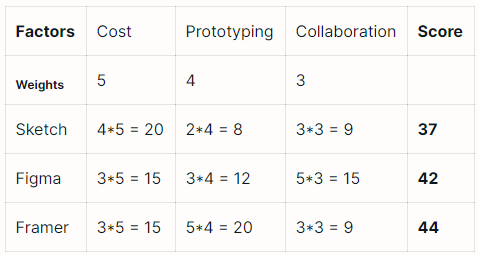
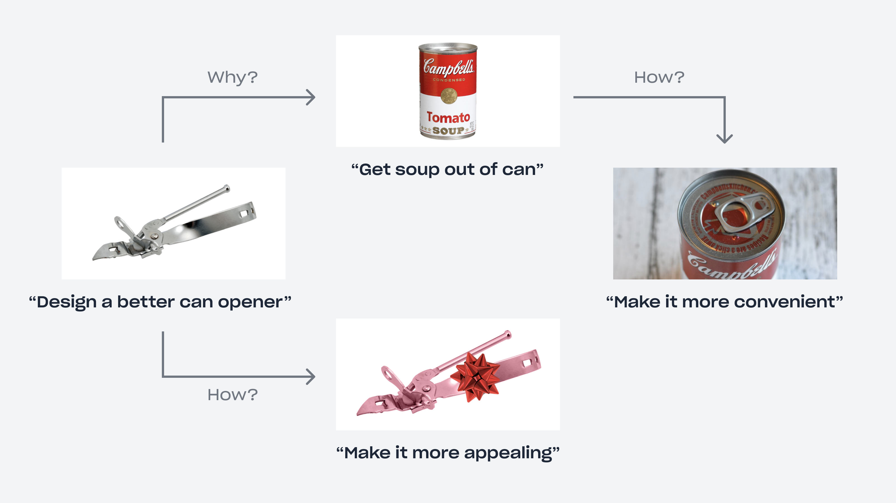

# 아이디어 방법론

## Untool. 문제 해결, 더 나은 사고를 도와주는 도구

https://untools.co/

> Tools for better thinking
>
> Collection of thinking tools and frameworks to help you solve problems, make decisions and understand systems.

메인 화면에 상황에 따라서 사용할 수 있는 도구들이 나열되어 있다.

### Decision Matrix

https://untools.co/decision-matrix

몇 가지 후보 중에서 최적의 선택을 하기 위해 사용하는 도구.

그림은 프로토타이밍 도구인 Sketch, Figma, Framer 중 하나를 선택하는데 비교하는 예시다.

도구를 각 요소(Factor)에 대해서 비교하되, 요소마다 가중치를 정한다.
각 도구의 요소에 점수를 매겨서 가장 높은 점수를 받은 도구를 선택한다.

표의 `Weights`가 가중치인데 비용(Cost), 프로토타이핑(Prototyping), 협업(Collaboration) 측면에서 바라본다.
비용을 가장 중요하게 생각해서 가중치를 높게 주었다.

그리고 각 도구의 요소에 점수를 주고 가중치를 곱한다. 가중치를 곱한 점수를 모두 더해서 가장 높은 점수를 받은 도구를 선택한다.

### Abstracting Laddering

https://untools.co/abstraction-laddering

기발하다고 생각하는 방법. 문제를 더 능숙하게 구성하는 방법이다.
해결해야 하는 문제를 구체적으로 정의하여 다음 단계로 나아간다.

그림은 더 좋은 디자인을 가진 통조림 따개를 만들기에 대한 예시다.

통조림 따개를 2가지 측면인 왜, 어떻게 개선할 지 믈어본다.

"어떻게?"라는 처음 질문에는 단순히 이쁘게 만들자는 것에 도달한다.
하지만 다시 "왜?"라는 물음에 "수프를 꺼내고 싶다"에 도달하고,
이어지는 "어떻게?"라는 물음으로 "더 편리하게 만들자라는" 새로운 문제로 나아간다.
따개가 붙어있는 캔음료 형태로 만드는 것으로 해결한다.
