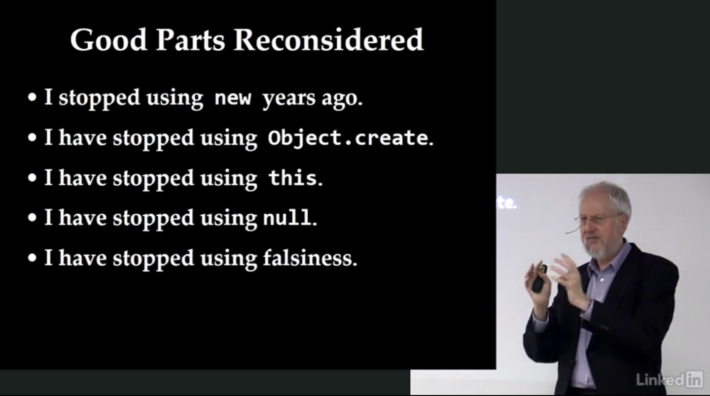
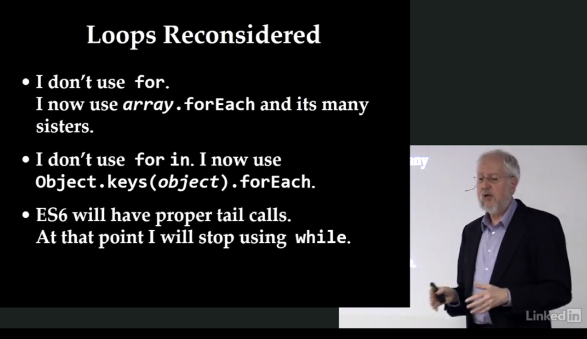
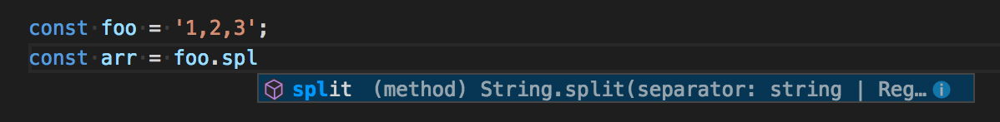
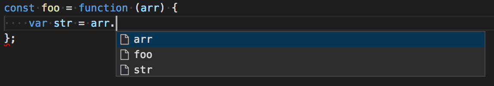
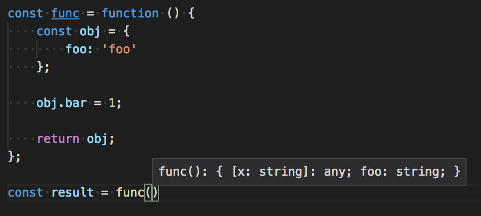
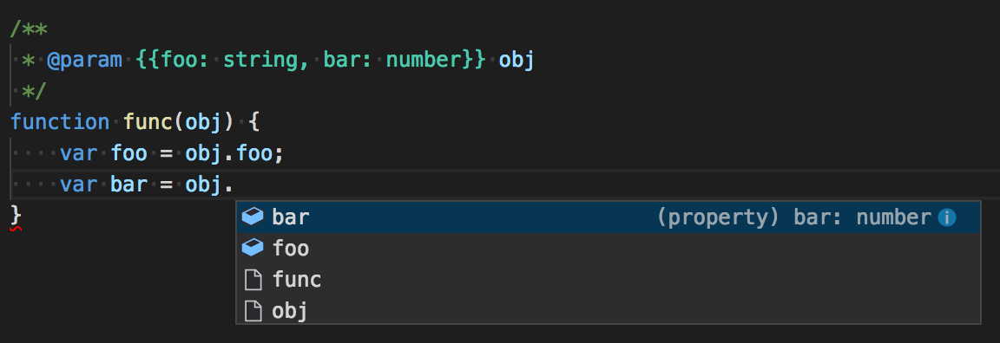
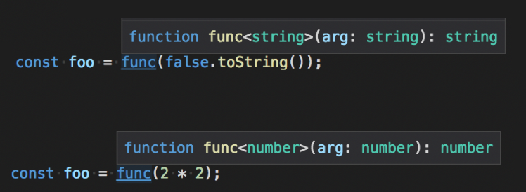

# Javascript & Typescript Programming Language

## 자바스크립트와 이벤트 루프

http://meetup.toast.com/posts/89
자바스크립트가 어떻게 싱글 스레드에서 UI, 비동기 처리를 하는지에 대해 설명하는 글.

https://vimeo.com/96425312
이벤트 루프에 대해서 설명하는 동영상.

## Douglas Crockford's Javascript The Good Parts - 권장하지 않는 것.

### Good Parts Reconsidered



- I stopped using **new** years ago.
- I have stopped using **Object.create**
- I have stopped using **this**
- I have stopped using **null**
- I have stopped using falsiness

#### No prototypal pattern에 대한 이야기

더글라스 크락포드는 이전에 **new** 대신 **Object.create** 사용을 권장했었다.
그런데 **Object.create**도 사용하지 않기를 권장한다. 그 이유는 **this** 키워드를 사용을 권장하지 않기 때문.

보안적인 코드를 작성하기 위해서
페이스북의 FBJS, 구글의 Caja project, 마소의 Web Sandbox, 크락포드의 ADSafe와 같은 도구들이 있었다.
공통적으로 **this**의 단점(*해석이 잘 안되는데, this는 글로벌 오브젝트를 가르키는데 글로벌 오브젝트를 찾기 위해서 느려진다는 거 같다.*)을 꼽았다.
**this**를 배제함으로써 더 쉬워졌고, prototypal pattern가 쓸모 없어지면서 functional pattern에 집중하게 되었다.

#### null, falsiness에 대한 이야기

자바스크립트에는 두 가지 [Bottom Type](https://en.wikipedia.org/wiki/Bottom_type)(값이 없는 타입)이 있다. **null**과 **undefined**.
둘 중 **undefined** 하나만 사용하기로 했다. 더 많이 입력해야 하지만 문제없다. (ㅋ)

falsiness는 `false`를 나타내는 값들인데 대표적으로 빈 문자열 `''`, `0`, `NaN`, `undefined` 등이 있다. \
falsiness는 좋은 아이디어지만 크락포드는 논리식에서 falsiness에 의존하지 않기로 했다. 가능한 명시적으로 비교해야 한다.

### Loops Reconsidered



- I don't use `for`
- I don't use `for in`
- ES6 will have proper tail calls.

### 요약

**new**, **Object.create**, **this**, prototyping 모두 사용하지 않는 것을 권장한다.
함수형 패러다임을 사용하는 것을 추천한다.

**null** 대신 **undefined** 사용하는 것을 권장하고, `''` 같은 falsy value를 사용하지 말고 명시적으로 비교문을 작성하자.

반복문은 `for` 구문보다 `Array.protoype.forEach`와 같은 배열 메서드를 이용하거나, 꼬리 재귀 함수를 사용하자.
오브젝트를 순회하고 싶다면 `Object.keys(obj)`로 키를 배열화하여 사용한다.


## var foo = (bar = 1, bar + 1);

```javascript
var foo = (bar = 1, bar + 1);
console.log(bar); // 1
console.log(foo); // 2
```

`bar = 1` 이후 `bar + 1`의 반환.

`Array.prototype.reduce` 같은 메서드에서 유용하다.


## AngularJS

Angular가 아닌 AngularJS에 대한 이야기.
이제는 사용하지 않지만 [스타일가이드](https://github.com/johnpapa/angular-styleguide/)의 철학은 한 번 읽어볼만 하다.

[AngularJS 문서](./angularjs.md) 참고.

## Visual Studio Code에서 타입 힌팅 사용하기

[정적 타입](https://ko.wikipedia.org/wiki/%EC%9E%90%EB%A3%8C%ED%98%95_%EC%B2%B4%EA%B3%84) 언어의 IDE가 제공하는 타입 힌트 도움 처럼 js 또한 jsdoc을 작성하면 제공받을 수 있다.

Visual Studio Code(또는 [LSP](./language-server-protocol.md)를 사용하는 에디터라면)에서
**JSDoc** 활용하면 에디터에서 타입 힌트를 제공받을 수 있다.

### 기본 지원

VSCode는 기본적인 타입 추론 기능을 제공한다:



변수 `foo`가 문자열 타입인 것을 알 수 있기 때문에 `split()` 메서드가 자동 완성 목록에 나타난다.

하지만 매개변수라면?



**Object** 또한 힌트를 제대로 받을 수 없다.



### JSDoc을 이용하여 타입 추론

JSDoc은 자바스크립트의 문서화하기 위한 주석 포맷이다.

ref. http://usejsdoc.org/about-getting-started.html

#### 오브젝트와 매개변수 힌팅

타입이 `Object` 인 매개변수의 힌트를 얻어 본다.
```javascript
{
    foo: 'foo',
    bar: 95
}
```

```javascript
/**
 * @param {{foo: string, bar: number}} obj
 */
function func(obj) {
    var foo = obj.foo;
    var bar = obj.bar;
}
```



`foo`, `bar` 모두 타입을 알 수 있다.

함수의 반환값이라면 `@return`을 사용하면 된다:

```javascript
/**
 * @return {{foo: string, bar: number}}
 */
function func() {
    const obj = {};
    obj.foo = 'foo';
    obj.bar = 95;

    return obj;
}

func(). // foo, bar 타입 힌트를 확인할 수 있다.
```

#### Generic Type

매개변수를 그대로 반환하는 간단한 함수가 있다고 하면:

```javascript
/**
 * @template T
 */

/**
 * @param {T} arg
 * @return {T}
 */
function func(arg) {
    return arg;
}
```

매개변수와 리턴 타입이 똑같이 출력 된다:



##### Promise

Promise 또한 Generic을 사용함으로 다음과 같이 표현할 수 있다:

```javascript
/**
 * @return {Promise<string>}
 */
function func() {
    // ... 구현 부분 생략 ...
    // 문자열을 넘겨주는 Promise
    return promise;
}

func().then(function (result) {
    result. // result가 문자열인 것을 알 수 있다.
});
```

## JSDoc 파라미터 상수 정의하기 + VSCode Rename Symbol!

상수(또는 predefined parameter)를 인자로 받도록 JSDoc 정의하자.

```javascript
/**
 * @property {'new'|'associate'|'regular'|'sc'|'vip'} memberGrade
 */
function something(memberGrade) {/* ... */}
```

VSCode Intellisense가 함수 인자 추천해 줄 때 상수 목록도 보여줘서 유용하다.

심지어 VSCode의 **Rename Symbol** 기능도 잘 동작한다.

JSDoc의 type에 커서를 두고 Rename Symbol(`F2`)으로 변경해도 되고,

```javascript
something('regular');
```

함수 호출 코드에서 값에 커서를 두고 Rename Symbol해도 JSDoc과 참조하는 모든 코드를 변경한다.

## null vs undefined

[Microsoft 코딩 가이드라인](https://github.com/Microsoft/TypeScript/wiki/Coding-guidelines#null-and-undefined)에는 `null`을 사용하지 말고, `undefined`를 사용하라고 나와있다.

## Jupyter Notebook + Javascript 도커라이징 기록

Jupyter Notebook이 너무 유용한 거 같아서 [Javascript](./javascript.md)도 쓰고 싶어졌다.

찾아보니 기존 Jupyter 환경에 npm `ijavascript`라는 cli를 설치하면 기존 Python에 NodeJS 노트까지 추가할 수 있었다.

python, nodejs 도구를 모두 설치하면 너무 복잡해서 도커 이미지로 만들어서 사용하기로 했다.

누군가 만들어 놓은 Python, Go, NodeJs 모두 가능한 도커 이미지를 찾았다:
https://github.com/dting/docker-jupyter-go-js\

하지만 오래된 이미지다 보니 node 버전도 낮고, pip 버전도 낮아서
사용하려는 라이브러리 [fbprophet](https://facebook.github.io/prophet/docs/quick_start.html) 모듈이 설치가 불가능했다.
그래서 Dockerfile을 수정하려고 했으나, 지금은 사라진 `jupyter/notebook`이라는 이미지를 base로 하고 있어서 애로사항이 많았다.

좀 더 찾아보니 https://hub.docker.com/r/mfellner/javascript-notebook 이미지를 찾았다.
오래 되었지만, 지금도 관리되고 있는 `jupyter/minimal-notebook`를 기반으로 하고 있어서, 참고하여 Dockerfile을 다시 작성하기로 했다.

`mfellner/javascript-notebook` Dockerfile을 수정해서 nodejs 버전을 올리고 `6.0.0` -> `10.15.3` 빌드했다.

실행은 잘 되나, 최초 연결 시 비밀번호/토큰을 입력해야 했다.
로컬 사용이 목적이라 비활성화 하려고,
jupyter notebook 옵션인 `--NotebookApp.token=''`을 시작 스크립트 `start-notebook.sh`에 추가했다.
하지만 `mfellner/javascript-notebook`에서 원본 스크립트를 `ijavascript` 실행 명령어로 덮어 씌우고 있어서,
비활성화 할 수 없었다.

그래서 덮어 씌우는 부분을 Dockerfile에서 제거해 보았지만, 언어 목록에서 nodejs가 사라졌다.

```json
{
  "argv": [
    "node",
    "/usr/local/lib/node_modules/ijavascript/lib/kernel.js",
    "{connection_file}",
    "--protocol=5.0"
  ],
  "display_name": "Javascript (Node.js)",
  "language": "javascript"
}
```

커널 정보를 위와같은 포맷으로, Jupyter Notebook의 특정 위치에 두어야 언어 목록에서 출력되는 구조였다.

`ijavascript`는 `ijsinstall`이라는 명령어에 `json` 파일을 추가하는 프로세스가 포함되어 있었다:
https://github.com/n-riesco/ijavascript/blob/d459956f76a22f9ec89937e02645ee7555f92d2b/bin/rc.js#L525

결론은 원본 `start-notebook.sh`는 수정할 필요 없이 `RUN ijsinstall` 만 추가하면 해결되는 문제였다.

### Jupyter Docker Stacks

Jupyter Notebook의 도커 버전은 상당히 많은 시리즈로 되어 있다.
도커 허브엔 설명이 부족하고 GitHub 저장소 https://github.com/jupyter/docker-stacks 에 메뉴얼이 잘 작성되어 있다.

Dockerfile 관계 트리를 보면 멋있다:\
http://interactive.blockdiag.com/?compression=deflate&src=eJyFzTEPgjAQhuHdX9Gws5sQjGzujsaYKxzmQrlr2msMGv-71K0srO_3XGud9NNA8DSfgzESCFlBSdi0xkvQAKTNugw4QnL6GIU10hvX-Zh7Z24OLLq2SjaxpvP10lX35vCf6pOxELFmUbQiUz4oQhYzMc3gCrRt2cWe_FKosmSjyFHC6OS1AwdQWCtyj7sfh523_BI9hKlQ25YdOFdv5fcH0kiEMA

커스터마이징하려면 `jupyter/notebook-minimal`을 기반으로 하면 될 거 같다.

https://jupyter-docker-stacks.readthedocs.io/en/latest/using/selecting.html#jupyter-base-notebook
여기에 데이터과학, 머신러닝 등 각 분야에 자주 사용하는 모듈을 미리 설치한 이미지들 정보가 나와있다.

### 여담

Jupyter Notebook NodeJS 도커라이징한 것은 GitHub 저장소에 업로드 했다:\
https://github.com/Edunga1/jupyter-notebook-nodejs

Dockerfile 작성하면서 `MAINTAINER`가 deprecated, `LABEL`을 사용해야 하는 것을 알았다: https://stackoverflow.com/questions/38899977/how-do-i-declare-multiple-maintainers-in-my-dockerfile

## The Coding Train

[The Coding Train](https://www.youtube.com/@TheCodingTrain)은 Daniel Shiffman이 운영하는 유튜브 채널이다.
주로 자바스크립트 라이브러리인 p5.js를 사용하여 알고리즘의 시각화를 다룬다.

라이브 코딩을 하면서 시간 내에 목표를 구현한다. 화이트보드로 구현 방향을 설명하기도 하고, 오류가 발생하면 왜 발생했는지 추정하기도 한다. 오류를 확인하고 수정하는 과정을 모두 볼 수 있다.
