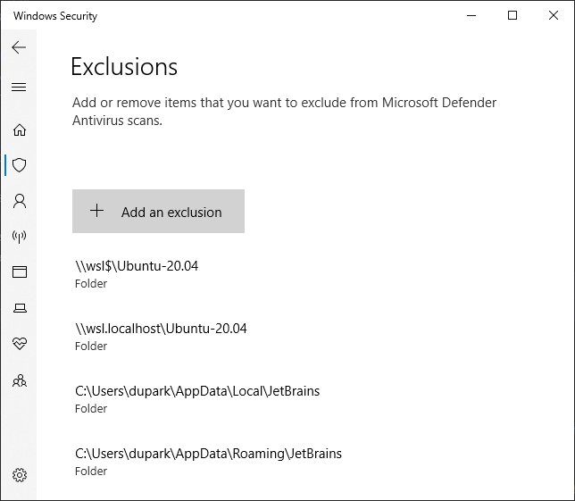

# JetBrains

JetBrains사 제품에 대한 이야기.

# IntelliJ

## WSL2에서 Freezing 현상

TL;DR: JetBrains Tool 경로를 Windows Defender의 검사 예외로 추가한다.

* `\\wsl$\Ubuntu`
* `\\wsl.localhost\Ubuntu`
* `C:\Program Files\JetBrains`
* `%LOCALAPPDATA%\JetBrains`
* `%APPDATA%\JetBrains`

---

`scanning files to index` 단계에서 멈추는 증상.

프로그램 자체가 먹통이 되기도 한다.
몇시간 기다려 보았는데, scanning이 너무 오래 걸려서 포기했다.

https://youtrack.jetbrains.com/issue/IDEA-293604/IntelliJ-is-slow-hanging-when-working-with-WSL-filesystem

덧글 중 Windows Security -> Virus & threat protection -> Virus & threat protection settings -> **Real-time protection**

실시간 보호를 끄면 해결된다고 한다.

물론, 임시방편이고 TL;DR의 IntelliJ 관련 폴더를 검사 예외로 추가하면 해결된다.

