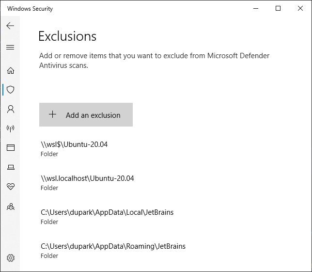

# JetBrains

JetBrains사 제품에 대한 이야기.

## IntelliJ

### WSL2에서 Freezing 현상

TL;DR: JetBrains Tool 경로를 Windows Defender의 검사 예외로 추가한다.

* `\\wsl$\Ubuntu`
* `\\wsl.localhost\Ubuntu`
* `C:\Program Files\JetBrains`
* `%LOCALAPPDATA%\JetBrains`
* `%APPDATA%\JetBrains`

---

`scanning files to index` 단계에서 멈추는 증상.

프로그램 자체가 먹통이 되기도 한다.
몇시간 기다려 보았는데, scanning이 너무 오래 걸려서 포기했다.

https://youtrack.jetbrains.com/issue/IDEA-293604/IntelliJ-is-slow-hanging-when-working-with-WSL-filesystem

덧글 중 Windows Security -> Virus & threat protection -> Virus & threat protection settings -> **Real-time protection**

실시간 보호를 끄면 해결된다고 한다.

물론, 임시방편이고 TL;DR의 IntelliJ 관련 폴더를 검사 예외로 추가하면 해결된다.



### WSL2에서 annotation processor로 생성된 파일을 인식하지 못하는 현상

https://youtrack.jetbrains.com/issue/IDEA-264036

querydsl q-class를 생성하는데, 생성된 파일을 인식하지 못하는 현상.
테스트나 실행도 잘 되지만, 에디터에서는 에러로 표시되어 불편하다.

```kotlin
sourceSets.main.get().java.srcDirs(
    "build/generated",
    "build/generated/sources/annotationProcessor",
)
```

`build.gradle.kts`에 위와 같이 설정하면 IntelliJ가 인식은 하지만, macOS 또는 WSL가 아닌 환경에서는 추가 설정없이 잘 인식했었다.

### .http 파일 사용하기

https://www.jetbrains.com/help/idea/exploring-http-syntax.html

`.http` 확장자 파일을 열면 에디터 내에서 http 요청을 보낼 수 있다.
또한 헤더 정보나 curl 파싱 등 편리한 기능이나 응답 결과를 전역 변수로 저장하고,
전역 변수를 다른 요청의 파라미터로 전달도 가능하다(api chaining)

버전마다 기능 제공이 조금씩 달라지는 듯 하다. 여기 내용은 2021.1.3 버전에 대한 내용임.

#### 전역 변수로 API간 Chaining 하기

다음은 토큰 생성 API로 토큰을 저장하고, 다른 API에 사용하는 예시다.

응답 구조는 다음과 같다고 가정한다:
```json
{
  "token": "AA86811JjjaCD43"
}
```

`.http` file:

```
### 토큰 생성 API
POST http://localhost:5000/generate-token

> 

### 상품 조회 API
GET http://localhost:5000/my-products
X-APP-TOKEN: {{mtoken}}
```

`` 구문으로 호출 후에 대한 javascript 코드를 작성하고,
`{{VARIABLE}}` 구문으로 전역 변수에 접근한다.

스크립트 구문을 http 요청 전에 두면 호출 전에 대한 처리도 가능하다.

### Scratches

프로젝트 생성 없이 간단하게 코드를 실행할 수 있는 파일을 scratch라 한다.
위 단락의 `.http` 파일도 scratch로 생성해서 관리하면 어느 프로젝트에서나 실행할 수 있어서 접근에 용이하다.
간단한 예제 코드 조각을 테스트하고 필요할 때마다 찾아보기 좋다.

구글 드라이브나 드랍박스 등 클라우드에 연동해서, 집에서나 회사에서나 접근 가능한 나만의 코드 snippet 저장소로 가꾸는 방법도 좋다.

`command + shift + n`으로 생성할 수 있고, Project View의 가장 하단에 `Show Scratch Files` -> `Scratches`에서 생성한 파일을 확인할 수 있다.
Package View에서는 `Scratches`가 보이지 않는다.

`Show Scratch Files` 기능으로 새 창에서 파일 목록을 볼 수 있고, 파일 내용 검색도 가능하다.
나는 Scratch 파일을 자주 사용하고 많이 관리하고 있어서, `option + s`로 단축키를 지정해서 사용하고 있다.

## DataGrip

### keymap

| name                                     | shortcut | note                                                                   |
|------------------------------------------|----------|------------------------------------------------------------------------|
| Database Tools and SQL -> Attach Session | opt + o  | staging, prod, local 등 자주 전환하는 경우 유용하다.                   |
| Database Tools and SQL -> Transpose      | opt + t  | 열과 행 반전. 컬럼이 많은 경우 보기 편리                               |
| Other -> Pin Active Tab                  | opt + p  | 탭 고정. 탭 여러개를 비교를 자주할 때 유용                             |
| Main Menu -> Navigate -> File Structure  | opt + l  | (쿼리 결과에서) 컬럼 목록 및 이동. 컬럼이 많은 경우 검색으로 이동 가능 |

```xml
<keymap version="1" name="macOS copy" parent="Mac OS X 10.5+">
  <action id="Console.Jdbc.ChooseSession">
    <keyboard-shortcut first-keystroke="alt o" />
  </action>
  <action id="Console.TableResult.Transpose">
    <keyboard-shortcut first-keystroke="alt t" />
  </action>
  <action id="FileStructurePopup">
    <keyboard-shortcut first-keystroke="meta f12" />
    <keyboard-shortcut first-keystroke="alt l" />
  </action>
  <action id="PinActiveEditorTab" />
  <action id="PinActiveTabToggle">
    <keyboard-shortcut first-keystroke="alt p" />
  </action>
  <action id="PinToolwindowTab" />
</keymap>
```

위 설정을 `~/Library/Application\ Support/JetBrains/DataGrip{version}/keymaps`에 두면 keymap 목록에 등록된다.
