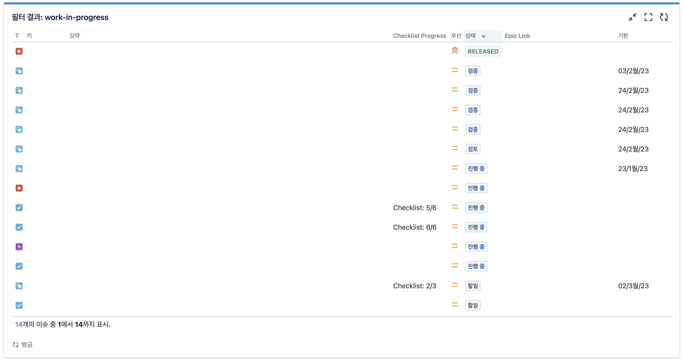

# Jira

Issue & Project Tracking Software

## 작업중 필터

회사에서 개발 지라 이슈 상태를 다음과 같이 사용하고 있다:
1. Backlog
1. To Do
1. In Progress - 진행중
1. Review - 코드 리뷰
1. Staging - 스테이징
1. Done - 개발 완료
1. RELEASED - 배포 완료

대시보드를 통해서 작업중인 이슈를 한눈에 볼 수 있다:



나의 `Work In Progress` 필터는 다음과 같다.

```jql
assignee = currentUser() AND (status not in (Backlog, Done, RELEASED) OR (status in (Done, RELEASED) AND updated > -1w)) ORDER BY status DESC, due ASC, created DESC
```

쿼리 의도:
* `assignee = currentUser()` : 나에게 할당된 이슈
* `status not in (Backlog, Done, RELEASED)` : Backlog, Done, RELEASED 상태가 아닌 이슈
  * `Backlog`는 진행 계획이 없기 때문에 관심에 분리한다.
* `status in (Done, RELEASED) AND updated > -1w` : Done, RELEASED 상태이면서 1주일 이내에 업데이트된 이슈
  * `Done`과 `RELEASED`는 작업이 완료된 이슈이기 때문에 종료하고 일주일 동안만 관심있다. 완료하고도 덧글을 통해서 관련 내용을 공유하더라.
* `ORDER BY status DESC, due ASC, created DESC` : 상태 내림차순, 마감일 오름차순, 생성일 내림차순
  * 상태`status`로 우선 정렬해야 보기 편하다. 따라서 가장 중요하다. 순서는 위에서 언급한 상태 순서와 동일하다.
  * 마감일`due`은 진행중일 때 특히 중요한데, 마감일이 가까운 순서대로 정렬해서 강조한다.
  * 생성일`created`은 최근에 생성된 것이 더 중요하다고 생각한다.
