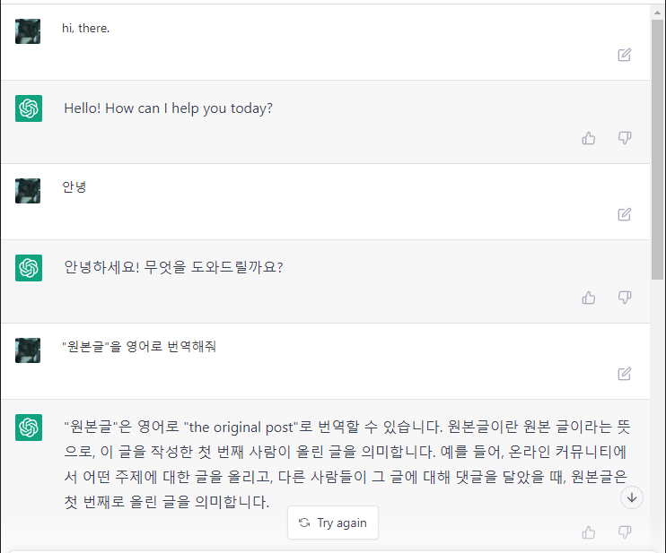
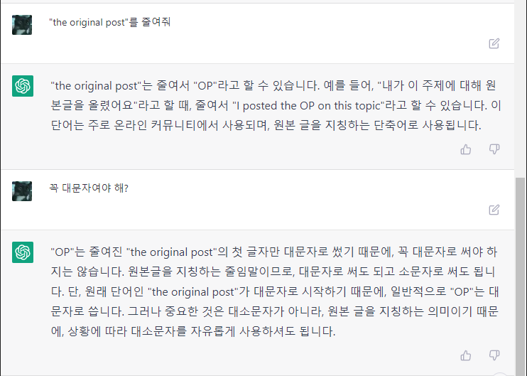
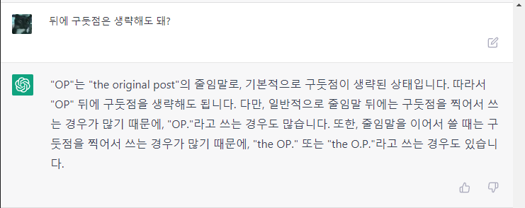

<!--toc:start-->
- [개요](#개요)
- [ChatGPT](#chatgpt)
  - [Try ChatGPT!](#try-chatgpt)
  - [ChatGPT를 Virtual Machine으로 만들기](#chatgpt를-virtual-machine으로-만들기)
- [Stable Diffusion](#stable-diffusion)
  - [promptbook](#promptbook)
    - [책갈피](#책갈피)
  - [따라하기](#따라하기)
    - [Colab Notebook](#colab-notebook)
    - [stable-diffusion-webui](#stable-diffusion-webui)
      - [Trouble Shooting](#trouble-shooting)
<!--toc:end-->

# 개요

[페이스북 그룹 덧글 중에서](https://www.facebook.com/groups/255834461424286/?multi_permalinks=1929705450703837):
> Sung Kim: 학생이나 교수나 누구나 이런 ai를 사용해서 본인의 performance를 올리는 사람이 승자가 될것이라 생각합니다. 마치 계산기가 나온 초기 시절 그래도 주판이나 암산이 편하고 빠르다고 한 사람들이 있었었죠. 앞으로 이런 글쓰기와 추론등도 계산기를 사용하듯 일반화된 인간의 tool로 보편화 되어 사용될것 같습니다.

만들지는 못하더라도 적극적으로 사용해 보자. 이 바람을 피할 수는 없다.

# ChatGPT

https://openai.com/blog/chatgpt/

ChatGPT는 대화에 최적화된 언어 모델이다.

https://chat.openai.com/
여기서 심험해 볼 수 있다.

## Try ChatGPT!

2022-12-05 현재 Preview 단계라 무료로 체험해 볼 수 있다.
구글 로그인으로 간단하게 로그인하면 채팅창이 보인다.


이제 자유롭게 입력하면 된다. 어떠한 주제나 방식이어도 관계 없다. 너무나 자연스럽게 동작한다.
한글로 간단한 대화를 시작해 보았다.








## ChatGPT를 Virtual Machine으로 만들기

https://news.hada.io/topic?id=7953
OP: https://www.engraved.blog/building-a-virtual-machine-inside/

매우 흥미로운 시도인데, 결과도 매우 놀랍다.

흥미로운 점:
* Linux Terminal 처럼 행동해 달라는 요청과 함께 `pwd` 명령을 주었다. 응답은 `/`.
* root directory에서 시작하고, `ls ~`의 응답 `bin Desktop Music Pictures` 이 그럴듯 하다.
* `jokes.txt` 파일을 생성하고 농담 몇 개를 넣어달란 요청에..
  `touch jokes.txt` `echo "..." >> jokes.txt`
  그럴듯한 농담을 정말로 만들어 넣는다.
* 그 외에 명령어와 python code를 실행하는 명령어도 잘 동작한다.

추가로 ChatGPT로 IQ 테스트를 했다는 글: https://twitter.com/SergeyI49013776/status/1598430479878856737

# Stable Diffusion

text-to-image 모델.

## promptbook

프롬프트를 설명하는 ebook:
https://openart.ai/promptbook

### 책갈피

SD는 [LAION-5B](https://laion.ai/blog/laion-5b/) 데이터 세트의 이미지로 트레이닝 했다.

## 따라하기

### Colab Notebook

Colab Notebook으로 공유되어 있어서 따라하기 쉽다:
https://colab.research.google.com/github/huggingface/notebooks/blob/main/diffusers/stable_diffusion.ipynb

Hugging Face에서 모델을 다운로드 받기 위해 로그인을 필요로 한다. 웹 연동이 되므로 쉽게 가능.

### stable-diffusion-webui

Web UI로 제공하는 버전:
https://github.com/AUTOMATIC1111/stable-diffusion-webui

코드 작성할 필요 없이 웹페이지에서 모든 작업을 처리할 수 있다.

#### Trouble Shooting

WSL2 Ubuntu에서 환경 구축을 하는데 이슈가 좀 있었다.

environment:
* python 3.10.8
* pyenv + virtual env

**실행 시 `ModuleNotFoundError: No module named '_bz2'` 에러**

`sudo apt-get install libbz2-dev` 후 파이썬(pyenv) 재설치. 파이썬 설치 시점에 제공해야 한다.

**실행 시 `ModuleNotFoundError: No module named '_lzma'` 에러**

`brew install xz` 설치하고, 파이썬 설치 시 패키지 위치를 전달해야 한다:
```bash
CFLAGS="-I$(brew --prefix xz)/include" LDFLAGS="-L$(brew --prefix xz)/lib" pyenv install 3.10.8
```

파이썬 설치 후 경고 메시지가 출력되고 있었다: `WARNING: The Python lzma extension was not compiled. Missing the lzma lib?`
