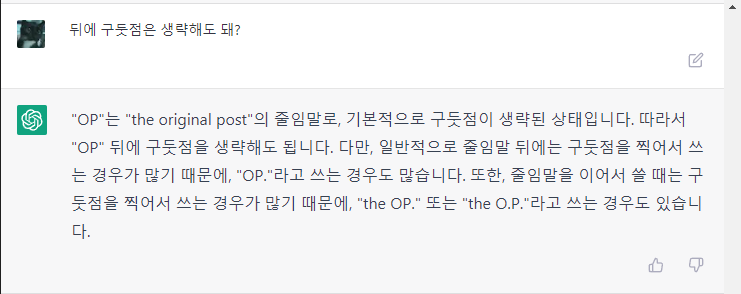

# Machine Learning

[페이스북 그룹 덧글 중에서](https://www.facebook.com/groups/255834461424286/?multi_permalinks=1929705450703837):
> Sung Kim: 학생이나 교수나 누구나 이런 ai를 사용해서 본인의 performance를 올리는 사람이 승자가 될것이라 생각합니다. 마치 계산기가 나온 초기 시절 그래도 주판이나 암산이 편하고 빠르다고 한 사람들이 있었었죠. 앞으로 이런 글쓰기와 추론등도 계산기를 사용하듯 일반화된 인간의 tool로 보편화 되어 사용될것 같습니다.

만들지는 못하더라도 적극적으로 사용해 보자. 이 바람을 피할 수는 없다.

# ChatGPT

https://openai.com/blog/chatgpt/

ChatGPT는 대화에 최적화된 언어 모델이다.

https://chat.openai.com/
여기서 시험해 볼 수 있다.

## Try ChatGPT!

2022-12-05 현재 Preview 단계라 무료로 체험해 볼 수 있다.
구글 로그인으로 간단하게 로그인하면 채팅창이 보인다.


이제 자유롭게 입력하면 된다. 어떠한 주제나 방식이어도 관계 없다. 너무나 자연스럽게 동작한다.
한글로 간단한 대화를 시작해 보았다.




## ChatGPT를 Virtual Machine으로 만들기

https://news.hada.io/topic?id=7953
OP: https://www.engraved.blog/building-a-virtual-machine-inside/

매우 흥미로운 시도인데, 결과도 매우 놀랍다.

흥미로운 점:
* Linux Terminal 처럼 행동해 달라는 요청과 함께 `pwd` 명령을 주었다. 응답은 `/`.
* root directory에서 시작하고, `ls ~`의 응답 `bin Desktop Music Pictures` 이 그럴듯 하다.
* `jokes.txt` 파일을 생성하고 농담 몇 개를 넣어달란 요청에..
  `touch jokes.txt` `echo "..." >> jokes.txt`
  그럴듯한 농담을 정말로 만들어 넣는다.
* 그 외에 명령어와 python code를 실행하는 명령어도 잘 동작한다.

추가로 ChatGPT로 IQ 테스트를 했다는 글: https://twitter.com/SergeyI49013776/status/1598430479878856737

## 번역 및 문법확인 요청하기

Git 커밋 메시지를 주로 영어로 작성하는데, ChatGTP에 주로 확인을 맡긴다. (Grammarly는 너무 많은 것을 수집한다.)

예를들면:

Q: `Update architecture.md to add "Entity Component System"`\
ChatGPT: `위 문장의 문법은 전반적으로 정상적입니다. 그러나 좀 더 일반적인 언어로 표현하면 "Update the architecture.md document to include information about the 'Entity Component System'"가 될 수 있습니다. 제가 제시한 구절은 좀 더 상세한 정보를 제공합니다.`

번역과 함께 나은 표현을 알려주기도 하고, 추가적으로 왜 그런 표현을 사용하는 지에 대해서 물어보면 상황별로 적절한 단어를 알려준다.

# Stable Diffusion

text-to-image 모델.

## promptbook

프롬프트를 설명하는 ebook:
https://openart.ai/promptbook

* SD는 [LAION-5B](https://laion.ai/blog/laion-5b/) 데이터 세트의 이미지로 트레이닝 했다.

## 따라하기

### Colab Notebook

Colab Notebook으로 공유되어 있어서 따라하기 쉽다:
https://colab.research.google.com/github/huggingface/notebooks/blob/main/diffusers/stable_diffusion.ipynb

Hugging Face에서 모델을 다운로드 받기 위해 로그인을 필요로 한다. 웹 연동이 되므로 쉽게 가능.

### stable-diffusion-webui

Web UI로 제공하는 버전:
https://github.com/AUTOMATIC1111/stable-diffusion-webui

코드 작성할 필요 없이 웹페이지에서 모든 작업을 처리할 수 있다.

#### Trouble Shooting

WSL2 Ubuntu에서 환경 구축을 하는데 이슈가 좀 있었다.

environment:
* python 3.10.8
* pyenv + virtual env

**실행 시 `ModuleNotFoundError: No module named '_bz2'` 에러**

`sudo apt-get install libbz2-dev` 후 파이썬(pyenv) 재설치. 파이썬 설치 시점에 제공해야 한다.

**실행 시 `ModuleNotFoundError: No module named '_lzma'` 에러**

`brew install xz` 설치하고, 파이썬 설치 시 패키지 위치를 전달해야 한다:
```bash
CFLAGS="-I$(brew --prefix xz)/include" LDFLAGS="-L$(brew --prefix xz)/lib" pyenv install 3.10.8
```

파이썬 설치 후 경고 메시지가 출력되고 있었다: `WARNING: The Python lzma extension was not compiled. Missing the lzma lib?`

# Open API

텍스트 완성, 이미지 생성, 코드 완성 등 다양한 모델을 제공한다.
그 중 quickstart의 텍스트에 대한 내용(아마도 GTP-3 인 듯)에 대한 개념을 조금 읽었다.

quickstart: https://beta.openai.com/docs/quickstart

**temprature**

모델 설정 중 하나다. 0~1 값을 가진다.
**0에 가까울수록 랜덤성이 감소하고 1에 가까울수록 증가한다.**
0이면 항상 같은 토큰이 추천되고, 1에 가까울수록 다양한 토큰이 추천된다.

매 요청마다 temprature가 0이면 확률(probability)이 가장 높은 것 하나만 추천되므로 안정적이다.
1이면 확률이 낮은 것이라도 추천되며, 매 요청마다 다양한 토큰을 제시한다.

**token**

토큰은 단어, 단어 뭉치, 문자 하나가 될 수 있으며 추천 단위가 토큰이다.
예를들어 `Horses are my favorite` 문장을 입력하면 `animal`, `animals`, `\n`, `!` 등을 다음에 올 토큰으로 추천하는 식이다.

# Github Copilot

## Copilot CLI

https://githubnext.com/projects/copilot-cli/

shell 명령어를 작성하는데 도움을 주는 도구.

2023-03-29 기준waitlit에 등록하면 사용할 수 있다.

사용 예시:

```bash
❯ ?? listening port 5000

 ──────────────────── Command ────────────────────

lsof -i :5000

 ────────────────── Explanation ──────────────────

○ lsof is used to list open files.
  ◆ -i specifies that we want to list network connections.
  ◆ :5000 specifies that we want to list connections to port 5000.

🕕  Hold on, executing commmand...
COMMAND   PID  USER   FD   TYPE            DEVICE SIZE/OFF NODE NAME
ControlCe 493 alleb   21u  IPv4 0x13aa2e8d9dde83f      0t0  TCP *:commplex-main (LISTEN)
ControlCe 493 alleb   22u  IPv6 0x13aa2f274270ba7      0t0  TCP *:commplex-main (LISTEN)
```

`??`와 프롬프트를 입력하면 명령어를 추천해주고, 실행할 것인지 여부를 묻는다.
copilot 만큼의 성능은 나오지 않는 거 같다. 프롬프트를 추가해도 같은 명령어를 추천하는 경우가 많다.

한글도 잘 먹었는데, 간단한 것만 시도해서 그럴지도 모르겠다.

`awk` 같이 규칙이 있어서 사용할 때 마다 헷갈리는 명령어를 사용하는데 특히 도움이 된다.
`4번째 열 출력하는데, $로 구분되어 있다`와 같은 프롬프트를 잘 해석한다.
