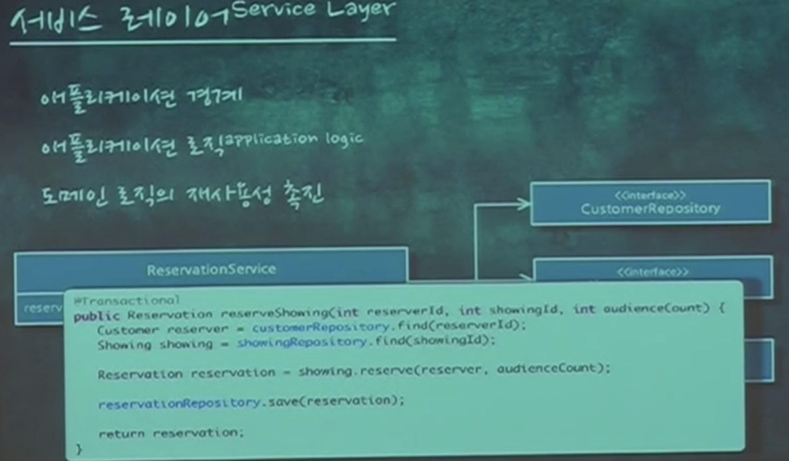
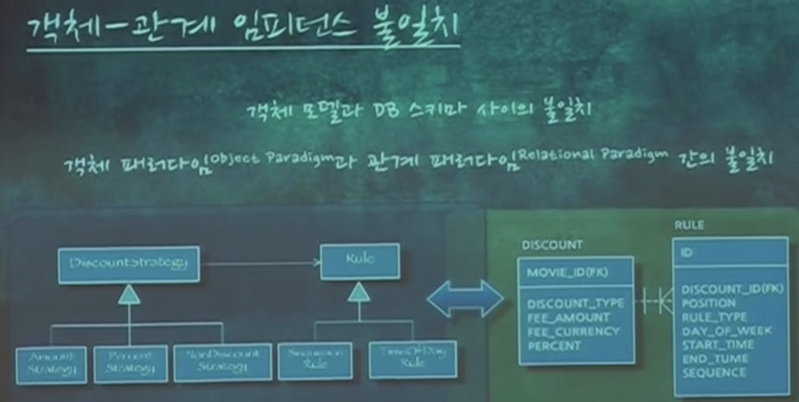
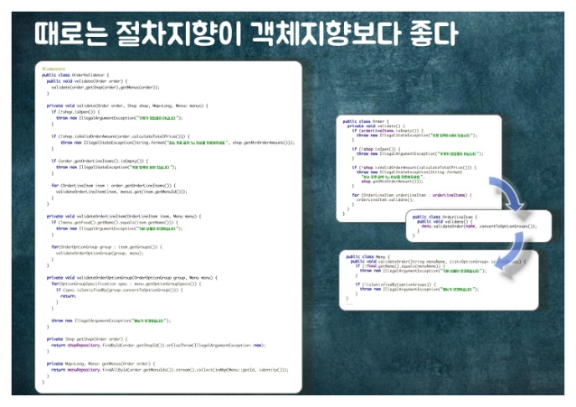
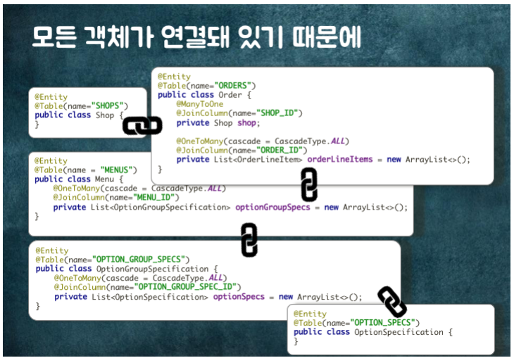
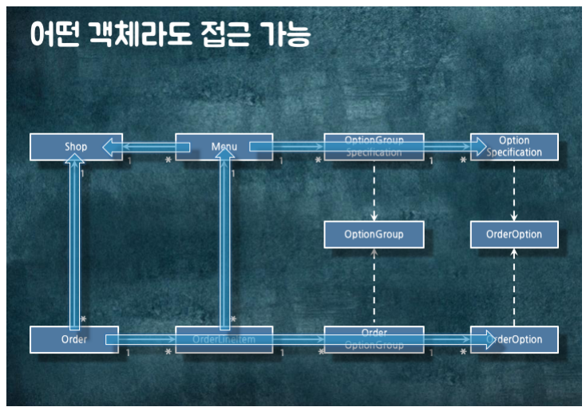
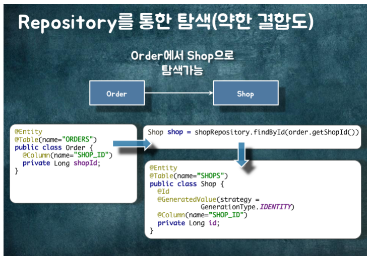
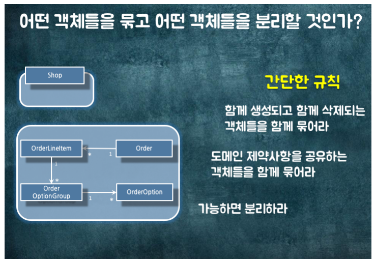
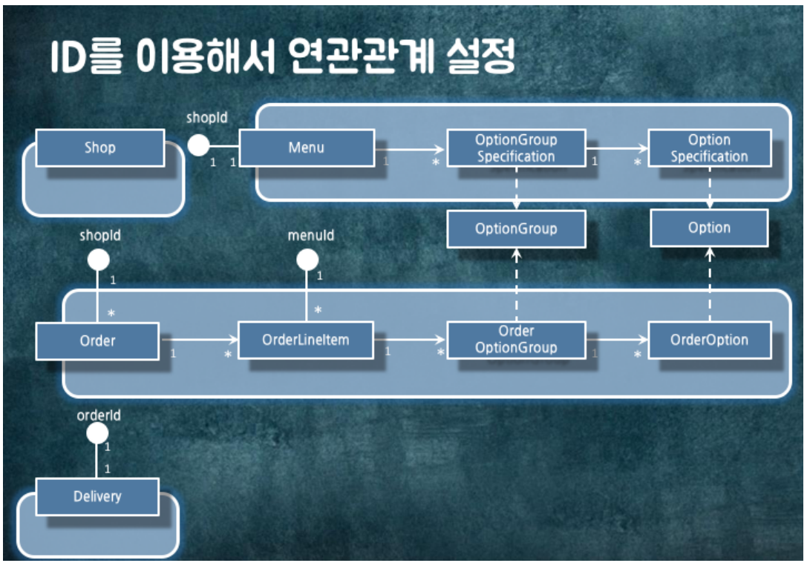
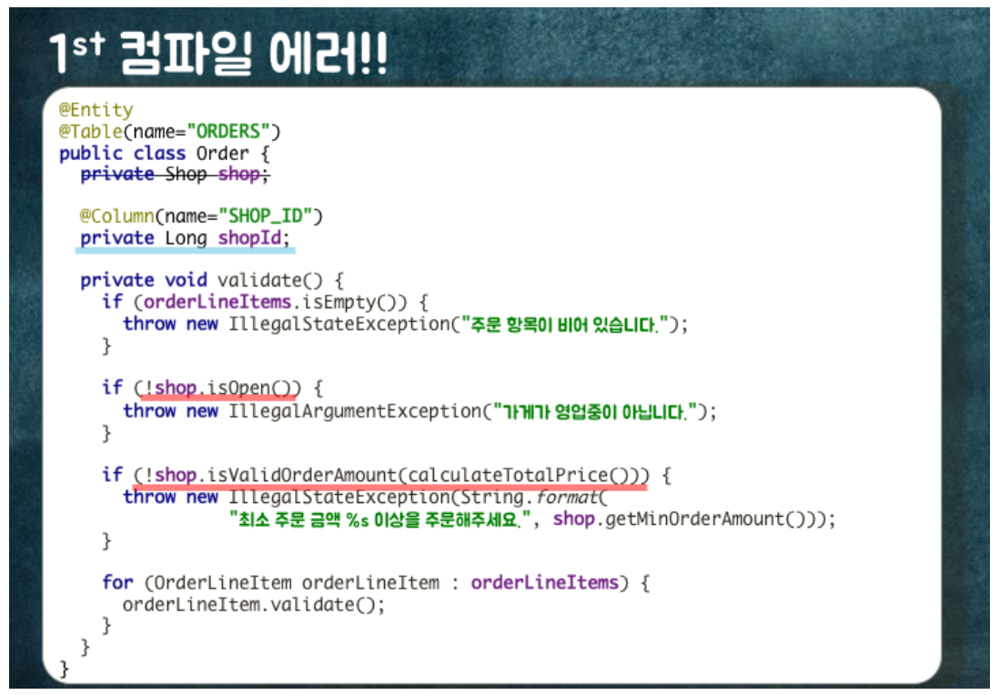
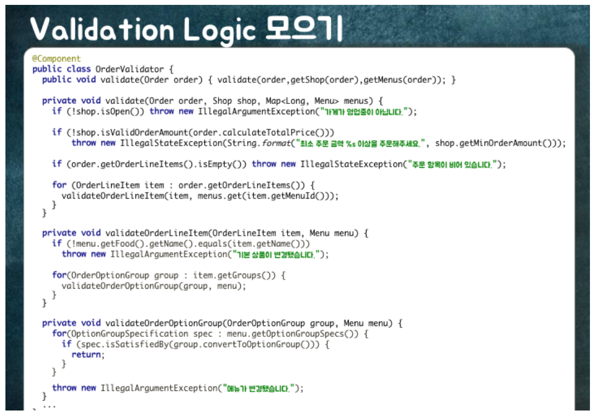

# Object Oriented Programming

## Robert C. Martin: Principles of Component Design.

https://amara.org/ko/videos/XJGyts0sfDVQ/info/robert-c-martin-principles-of-component-design/

너무 고마우신 분께서 한글자막까지 달아주셨다.

* Object Oriented의 장점은 현실 세계와 매핑하기 쉬운 것이 아니다.
* 가장 큰 혜택은 다형성이다.
* 순환 참조는 생산성을 떨어 뜨린다.
* 여러개의 DLL을 만들면 변경한 DLL만 다시 컴파일하는 장점이 있다. (속도)
* 지금은 성능이 좋아져서 하나로 모두 합쳐도 상관은 없다.
* 순환 참조는 관계있는 컴포넌트까지 다시 컴파일해야 한다.
* Dependency Inversion으로 순환 참조를 깰 수 있다. (다형성!)
* 안정적인 컴포넌트를 참조하고 추상화 하자.
* 불안정한 컴포넌트(구체적인)는 추상화 할 필요가 없다.
* 불안정한 컴포넌트의 변경은 내 컴포넌트도 변경의 위험에 있다.
* 데이터베이스는 상세하며, 구체적이므로 불안정하다. 그러나 변경이 잦다.
* 뷰(GUI)도 불안정하다. 쉽게 변경될 수 있어야 하므로 다른 컴포넌트가 뷰를 참조해선 안된다.
* 따라서 뷰를 테스트하는 것은 테스트 코드를 자주 수정케 한다.

OOP 장점이 현실 세계를 잘 비춘다고 적었었다. 그런데 Robert C. Martin은 아니라고 한다.

38:59를 보면 이야기가 시작된다. 객체 지향은 무엇인지? 왜 사람들이 객체 지향을 좋아하는지.

> (청중) 현실 세계를 모델링 할 수 있습니다.

> (Robert C. Martin) 현실 세계를 모델링 할 수 있다. 감사합니다.
내가 이렇게 답하라고 저 사람을 여러분 사이에 심어놨습니다.
내가 저사람의 답변을 발기 발기 찢어버리려고요.아닙니다. 아주 터무니없는 이야기에요. ...

> (Robert C. Martin) 객체지향에 특별할 것은 없습니다.
하지만 객체지향으로 인해 가능해진 게 하나 있긴 합니다.
예전에는 위험해서 잘 안 썼지요.
다형성입니다. 아주 사용하기 쉬운 다형성이지요. ...

## KSUG Seminar - Growing Application - 2nd. 애플리케이션 아키텍처와 객체지향

https://www.youtube.com/watch?v=26S4VFUWlJM

애플리케이션 로직과 도메인 로직을 분리하고, 어떻게 객체에 초점을 둔 로직을 작성하는지 알려주는 영상.
절차지향 코드와 객체지향 코드 예시를 통해 비교한다.

---

https://youtu.be/26S4VFUWlJM?t=46m57s
* 이 코드 가지고만 실제 어플리케이션을 짤 수는 없음. 데이터는 DB에 있기 때문에
* 800원 할인이라는 정보는 클래스가 아니라 디비에 있다.
* 어플리케이션 로직
  * 어플리케이션의 플로우
  * 도메인 로직의 전 후에 존재
  * 순수한 객체(도메인 객체)에 넣지 않음
  * 넣으면 디비나 네트워크에 의존이 생김
  * 도메인과 무관한 기술적인 내용들을 의미함
  * 도메인 로직을 캡슐화 해준다
  * 서비스

* 어플리케이션의 경계
* 서비스 시작과 끝은 트랜잭션의 시작 끝을 의미한다
* 데이터를 준비하고, 도메인 로직에 위임한다.

* 절치 지향이 되면 fat 서비스가 된다. 좋은 서비스는 thin 서비스

https://youtu.be/26S4VFUWlJM?t=55m37s

* impedance mismatch
* 도메인 위주로 작성하고 데이터베이스를 구현 하면 어렵다는 단점이 있다.
* 위처럼 클래스와 테이블이 일치하지 않는 현상도 발생한다.
* "객체 지향적으로 갈수록 갭은 멀어진다. 이를 임피던스 미스매치라 한다"

https://youtu.be/26S4VFUWlJM?t=56m36s
* 테이블을 클래스로 매핑하는 데이터 매퍼 작성이 어려워 지기 때문에 ORM과 같은 기술을 쓴다.
* "클래스와 테이블의 간격이 멀어서 매핑하기가 너무 어려워서 JPA(ROM)을 쓰는 것이다."

https://youtu.be/26S4VFUWlJM?t=1h6m57s
* 트랜잭션 스크립트를 수정 할 때 최대 단점은 도메인이 코드에 암묵적으로 녹아 있다.
* 코드에 "중복할인"이라는 말은 없다. 그냥 N개의 할인이라는 코드가 있을 뿐
* (하나만 할인 => 중복 할인 허용 시)
* "우린 중복 할인 허용해" 라고 하지만 코드가 어떻게 돌아가는지 봐야만 알 수 있다.

## 우아한 객체지향 - 우아한 테크 세미나

slide: https://www.slideshare.net/baejjae93/ss-151545329
video: https://youtu.be/dJ5C4qRqAgA

어떻게 객체지향 코드를 작성할 수 있는지 설명하는 글.
코드를 단계별로 개선해나가는 방식으로 설명해서 이해하기 쉽다.

### 때로는 절차지향이 객체지향보다 좋다.

[1:20:25](https://youtu.be/dJ5C4qRqAgA?t=4825)

두 가지 이유:
1. 객체지향 코드는 설계적으로 이뻐 보이지만, 주문 검증하는 로직이 분산되어 있어서 탐색하기 어렵다.
2. 주문 모델에 검증 로직이 있으면서 응집도가 떨어진다. 모델에 주문 처리와 검증 로직 모두 있다. 변경 주기가 다른 코드가 한 곳에 모여있는건 좋지 않다.

절차적 코드와 객체지향 코드의 trade-off를 잘 고려해서 사용한다.

### 객체 참조 끊기

[1:04:27](https://youtu.be/dJ5C4qRqAgA?t=3867)

ORM을 통한 객체 참조는 가장 강한 결합도를 가진다.

객체 대신 ID를 사용하면 결합도를 약하게 만들 수 있다.

결합도를 낮추고, 관련있는 객체끼리 packaging 한다.

같은 도메인(패키지)는 객체 참조, 경계 밖에 있는 도메인은 ID로 연관 관계 가지는 것도 좋다.

### 참조를 끊고, 로직 옮기기 (컴파일 에러!)

[1:18:35](https://youtu.be/dJ5C4qRqAgA?t=4715)

모델 내에서 객체 참조로 구현했던 로직은 더 이상 사용할 수 없다.

각각 다른 도메인의 객체를 조합해서 비즈니스 로직을 작성할 새로운 객체가 필요하다.

각 객체를 조합해서 검증 로직을 담당하는 새로운 객체를 만든다.

이런 절차지향 코드는 한 눈에 볼 수 있고, 검증 로직을 변경하기 위해서만 수정하기 때문에 응집도가 높다.

## OOP와 관련된 글

**OOP (객체 지향 프로그래밍) 프로그래밍 실습용 좋은 책 추천 부탁드립니다** \
https://kldp.org/node/123799

헤드퍼스트 책, 자바 swing을 이용한 GUI 프로그래밍.
Smalltalk를 직접 사용해 보는 것이 눈에 띈다.

**책 - 객체지향적으로 생각하라** \
http://book.daum.net/detail/book.do?bookid=KOR9788956744612

**책 - 개발자가 반드시 정복해야 할 객체 지향과 디자인 패턴** \
http://www.yes24.com/24/goods/9179120 - 책\
http://epicdevs.com/14 - 후기

**한국 스몰토크 사용자그룹** \
http://smalltalk.kr/wiki/doku.php

최초의 순수한 OOP 언어 스몰토크를 배울 수 있는 곳

**초보 개발자에게 권장하는 객체지향 모델링 공부 방법** \
http://okky.kr/article/358197

덧글에 자세하게 예시를 들어주셨다.

**Anti-OOP: if를 피하는 법** \
http://meetup.toast.com/posts/94

함수형 프로그래밍도 객체지향 프로그래밍도 분기문을 지양한다.
추적하기가 힘들어지기 때문이다.

디자인 패턴의 모범 사례를 보여준다.

**캡슐화(encapsulation)를 위한 getter, setter는 정말 필요한 걸까요?**\
http://qna.iamprogrammer.io/t/encapsulation-getter-setter/193

validation, lazy loading, 접근 권한 등을 이유로 반드시 필요하다는 의견과
getter, setter 남용에 대한 이야기 등.

**객체 지향 프로그래밍 연습하기 좋은 방법은?**\
https://slipp.net/questions/475

여기서 객체지향 생활체조가 눈에 와 닿았다.

**객체지향 생활 체조 총정리**\
https://developerfarm.wordpress.com/2012/02/03/object_calisthenics_summary/

9가지 규칙(체조)을 통해 객체지향을 실천하자는 내용이다.
이론적인 내용이 아니라 실철하도록 상세히 작성되었다.
어떻게 보면 극단적으로 제약하고 있어, 실제로 해보면 고통스럽기도..

**스칼라 강좌 (11) - getter 와 setter** \
http://okky.kr/article/342405

이 글은 OOP에서의 getter, setter 위치에 대해서 설명하고
스칼라에서 getter, setter는 어떻게 표현되는지 보여준다.

## 고민하는 내용

적당히 구현하더라도 문제는 없지만, Best Practice를 지키고 싶다.

### 언제 sub class를 만들어야 할까?

https://www.youtube.com/watch?v=4F72VULWFvc

- 언제 서브 클래스를 만들어야 할까?
- 부모 클래스인 `Animal` 파생 클래스 `Cat` 가 있다. 파생 클래스를 만들지 말고 부모 클래스의 생성자에 `Cat`에 대한 정보를 넘겨서 같은 동작을 하도록 하면 어떨까?
- 파생 클래스가 많다면 여러개의 서브 클래스로 어떻게 매핑 시켜야 할까? 일일이 if else 구문으로 처리해야 할까?

[Inheritance with EF Code First: Part 1 - Table per Hierarchy (TPH)](https://weblogs.asp.net/manavi/inheritance-mapping-strategies-with-entity-framework-code-first-ctp5-part-1-table-per-hierarchy-tph)

[Heuristics on when should one subclass and when not](https://softwareengineering.stackexchange.com/q/270869)

### Enum vs Inheritance

[Inheritance vs enum properties in the domain model](https://stackoverflow.com/questions/4254182/inheritance-vs-enum-properties-in-the-domain-model)
