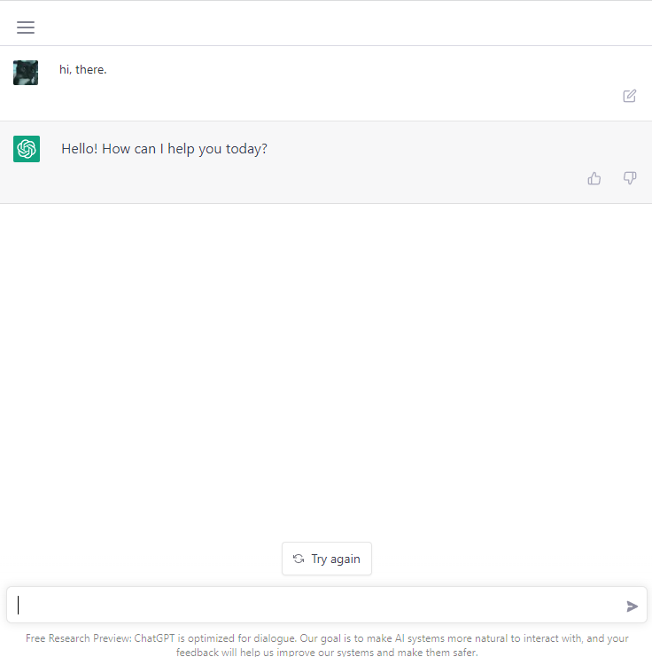
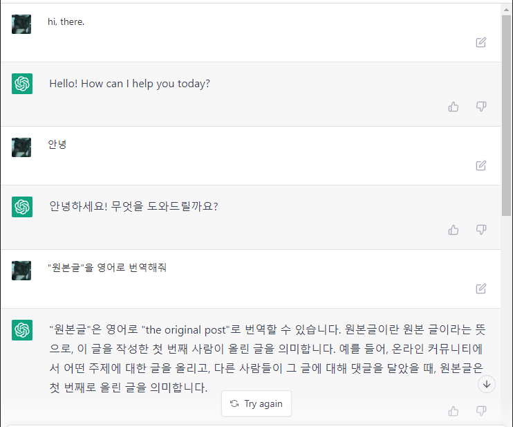
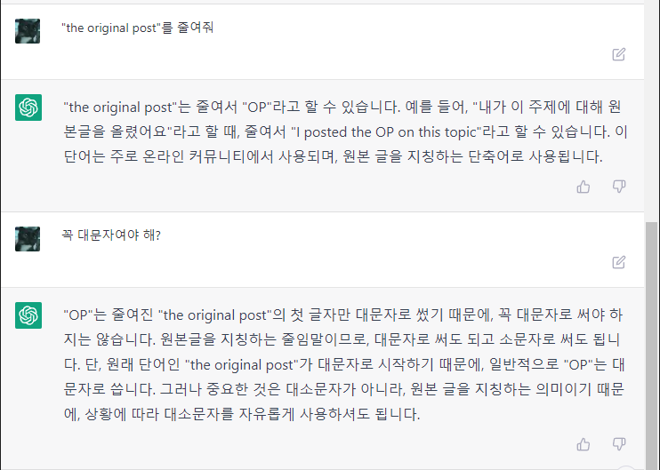
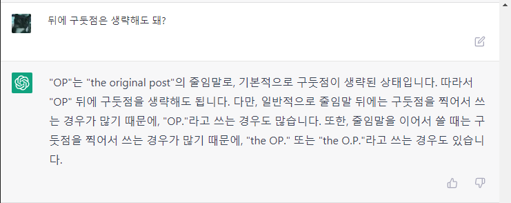

# OpenAI

AI 연구 및 개발하는 비영리 단체.

## ChatGPT

https://openai.com/blog/chatgpt/

ChatGPT는 대화에 최적화된 언어 모델이다.

https://chat.openai.com/
여기서 시험해 볼 수 있다.

### Try ChatGPT!

2022-12-05 현재 Preview 단계라 무료로 체험해 볼 수 있다.
구글 로그인으로 간단하게 로그인하면 채팅창이 보인다.

이제 자유롭게 입력하면 된다. 어떠한 주제나 방식이어도 관계 없다. 너무나 자연스럽게 동작한다.
한글로 간단한 대화를 시작해 보았다.

### ChatGPT를 Virtual Machine으로 만들기

https://news.hada.io/topic?id=7953 \
OP: https://www.engraved.blog/building-a-virtual-machine-inside/

매우 흥미로운 시도인데, 결과도 매우 놀랍다.

흥미로운 점:
* Linux Terminal 처럼 행동해 달라는 요청과 함께 `pwd` 명령을 주었다. 응답은 `/`.
* root directory에서 시작하고, `ls ~`의 응답 `bin Desktop Music Pictures` 이 그럴듯 하다.
* `jokes.txt` 파일을 생성하고 농담 몇 개를 넣어달란 요청에..
  `touch jokes.txt` `echo "..." >> jokes.txt`
  그럴듯한 농담을 정말로 만들어 넣는다.
* 그 외에 명령어와 python code를 실행하는 명령어도 잘 동작한다.

추가로 ChatGPT로 IQ 테스트를 했다는 글: https://twitter.com/SergeyI49013776/status/1598430479878856737

### 번역 및 문법확인 요청하기

Git 커밋 메시지를 주로 영어로 작성하는데, ChatGTP에 주로 확인을 맡긴다. (Grammarly는 너무 많은 것을 수집한다.)

예를들면:

Q: `Update architecture.md to add "Entity Component System"`\
ChatGPT: `위 문장의 문법은 전반적으로 정상적입니다. 그러나 좀 더 일반적인 언어로 표현하면 "Update the architecture.md document to include information about the 'Entity Component System'"가 될 수 있습니다. 제가 제시한 구절은 좀 더 상세한 정보를 제공합니다.`

번역과 함께 나은 표현을 알려주기도 하고, 추가적으로 왜 그런 표현을 사용하는 지에 대해서 물어보면 상황별로 적절한 단어를 알려준다.

### ChatGPT Desktop

Desktop 앱 버전으로 나온 ChatGPT. 2024년 6월 25일 전체 공개되었다.
이전에도 Desktop 버전이 있었지만, 일부 공개였다. 다만 아직 Mac OS만 지원한다.

[공식 사이트](https://openai.com/chatgpt/mac/)에서 다운로드 할 수 있다.

편리한 기능이 많다.

- option + space로 Spotlight 검색처럼 검색바가 나와서 ChatGPT 질의할 수 있다.
- 현재 화면을 첨부하여 질문할 수 있다.
- 드래그 앤 드롭으로 파일을 첨부할 수 있다.

기존 웹 버전에서 편의성이 개선된 정도지만 ChatGPT-4o 공개 당시에 음성으로 현재 화면에 대해서 즉시 질문할 수 있었는데,
이러한 기능들이 앞으로 추가될 수 있을지도.

### ChatGPT-4o

한국 시간으로 2024년 5월 14일 새벽 2시에 공개된 OpenAI의 새로운 플래그쉽 모델.

https://openai.com/index/hello-gpt-4o/

[발표 영상](https://www.youtube.com/live/DQacCB9tDaw)에 따르면, 모델과 실시간으로 이야기할 수 있으며, 인터럽트가 가능하다.
또한 답변에 감정을 실어서 더 사람과 대화하는 것처럼 만들어졌다.

Gemini의 소개 영상처럼 실시간으로 대화하거나, 수학 문제를 종이에 적어서 풀거나, 파이썬 코딩을 화면을 통해 함께 하고 차트를 분석하기도 한다.

발표 이후부터, 무료로 사용할 수 있다. 다만 quota는 매우 적은편. 찾아보면 3시간에 몇 개의 대화를 할 수 있는 정도라 한다.
하지만 음성과 비디오를 통한 대화는 비활성화 되어있다.

2024년 07월 18일, [gpt-4o mini가 공개](https://openai.com/index/gpt-4o-mini-advancing-cost-efficient-intelligence/)되었다.
gpt-3.5 turbo 보다 성능이 좋고, [LMSYS 리더보드에서 채팅 부분에서 gpt-4를 능가](https://x.com/lmsysorg/status/1813999088758673875)했다고 한다.
비용 효울적인 작은 모델이라고 하니 기대된다. 무료 사용자에게 제공할 예정이라고 한다.

2024년 9월 25일, 영상에서 인상을 주었던 [고급 보이스 모드(Advanced Voice Mode)가 플러스 사용자에게 공개](https://openai.com/index/chatgpt-can-now-see-hear-and-speak/)되었다.
이전에는 제한된 사용자에게만 베타 버전으로 제공되었었다.
[특이점이 온다 갤러리](https://gall.dcinside.com/thesingularity) 유저들의 후기를 보면, 하루 1시간 제한이 있다고 한다.
성능은 높지 않는 듯. [GPT-3](https://gall.dcinside.com/thesingularity/532515) 수준이라는 글이 있다.

[갤러리의 통역 사용 예시 글](https://gall.dcinside.com/thesingularity/532471)을 보면 응답 속도와 말 끊기 기능으로 인해 사람과 이야기하는 듯한 자연스러움에서 좋았다고 한다.
물론 동사무소를 우체국으로 번역하는 등 성능 문제는 아쉬워 보인다.

[갤러리의 목소리 성격을 바꾸는 후기](https://gall.dcinside.com/thesingularity/532449)는 정말 신기하다.
사용자가 요청하는 형태로 목소리와 분위기를 바꿔준다.

[Voice mode FAQ](https://help.openai.com/en/articles/8400625-voice-mode-faq)에서 제한량에 대해 명확하게 설명하지 않고, 15분 남으면 알림을 준다는 정도로 설명하지 않는 것을 보면
제한량을 변동적으로 조절하는 것이 아닌가 추정.

### OpenAI o1

2024년 9월 12일 공개된 OpenAI의 새로운 모델. o1.

https://openai.com/o1/

> We've developed a new series of AI models designed to spend more time thinking before they respond

더 많은 생각하고 답변하는 모델이라고 소개한다.

공개된 시점에는 유료 플랜인 Plus/Team 사용자에게 o1-preview, o1-mini 제공한다.

성능은 작지만 더 빠르고 저렴한 버전인 o1-mini는 무료 사용자에게도 제공될 예정이다.

---

성능은 ChatGPT-4o와 비교해서 우월한 수준인데,
[벤치마크](https://openai.com/index/learning-to-reason-with-llms/#evals)에 따르면.

> A score of 13.9 places it among the top 500 students nationally and above the cutoff for the USA Mathematical Olympiad.

미국 고등학생 수학 경시대회인 AIME에서 상위 500명에 드는 수준의 성과를 냈다고 한다.

> GPT-4o only solved on average 12% (1.8/15) of problems. o1 averaged 74% (11.1/15) with a single sample per problem, 83% (12.5/15) with consensus among 64 samples, and 93% (13.9/15) when re-ranking 1000 samples with a learned scoring function.

o1은 15점 중 13.9점을 받았고, GPT-4o는 1.8점을 받았다.

### GPT-5

2025년 8월 5일 공개된 OpenAI의 새로운 모델. GPT-5.

https://openai.com/index/introducing-gpt-5/

> GPT‑5 is significantly less likely to hallucinate than our previous models.

이전 모델에서 만연했던 환각 문제를 크게 개선했다고 한다.

사용자 평은 썩 좋지 않은데, 모델 라우팅 이슈가 있었다고 하니 좀 더 지켜봐야 할 듯.

### "나를 그려줘" 챌린지

2024년 10월 즈음에 시작된 챌린지로 보이는, ChatGPT-4o를 이용한 챌린지.

ChatGPT와 대화하다보면 "Memory Updated"라는 메시지가 출력되는데,
이는 계정 레벨에서 사용자의 정보를 저장하는 것을 의미한다.
다음 대화에서 ChatGPT는 이 정보를 바탕으로 대화를 진행한다.

이 정보를 이용하여 ChatGPT가 생각하는 내 모습을 그리도록 요청하는 것이 이 챌린지의 방식이다.

[레딧 글](https://www.reddit.com/r/ChatGPT/comments/1gne6m6/comment/lwafuc9/)에 사람들이 공유한 그림들이 있다.
고양이를 키우는 사람들은 고양이가 포함되고, 취미에 대해서 많이 기록하는지 암벽등반부터 등산까지 다양하다.

[OpenAI의 CPO도 여기에 참여](https://www.linkedin.com/posts/kevinweil_want-to-try-something-fun-with-chatgpt-with-activity-7264370818149691392-auDd) 했다.

나는 취미 보다는 개발에 대해서 주로 질문해서인지, 단순한 그림이 나왔다.
Vim과 Kotllin 단어가 들어간 그림이다.

## gpt-oss

2025년 8월 5일에 공개된 OpenAI의 오픈 소스 모델. [문서](/docs/wiki/large-language-model.md#gpt-oss) 참조.
