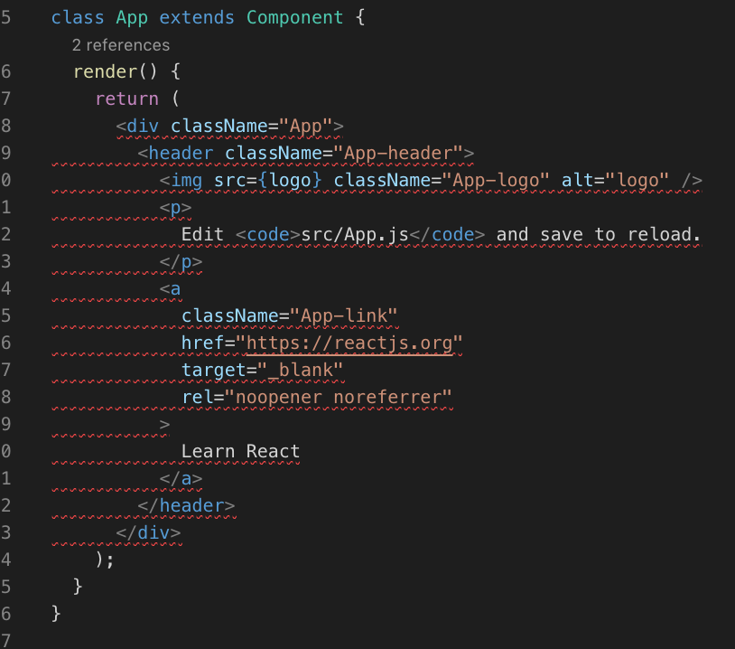

# React JS

React는 실무에서 사용해보지 않았다. 개인 프로젝트에서만 사용해본 정도.

## React 개발환경 구성하기

### Create React App 이용하기

필요한 의존 모듈을 일일이 설치할 수 있지만, Create React App을 이용하면 설치도 간편할뿐더러
Create React App이 각종 의존 모듈의 버전을 관리해주고, 이슈들을 해결해주기 때문에 지속적으로 케어를 받을 수 있다.

Create React App은 명령어 도구라서 처음 프로젝트 생성에만 필요하기 때문에 설치하지 않아도 된다:

`npx create-react-app my-app`

### ESLint 구성

Create React App으로 설치하면 eslint가 이미 존재하기 때문에 별도로 설치할 필요가 없다.
심지어 React 환경에 맞는 eslint 플러그인도 설치되어 있다.
하지만 [아주 관대한 규칙](https://www.npmjs.com/package/eslint-config-react-app)만 사용하기 때문에,
다른 Rule을 따를 필요가 있다. 가장 유명한 것으로 [eslint-config-airbnb](https://www.npmjs.com/package/eslint-config-airbnb)가 있다.

`npm install -D eslint-config-airbnb`

설치 후 `package.json`의 `eslintConfig`를 제거하고,

```json
// package.json
  "eslintConfig": {
    "extends": "airbnb"
  },
```

프로젝트 루트에 `.eslintrc`을 생성한다:

```json
// .eslintrc
{
  "extends": "airbnb",
  "rules": {
      "react/prefer-stateless-function": 0,
      "react/jsx-filename-extension": 0,
      "react/jsx-one-expression-per-line": 0
  },
  "env": {
      "browser": true
  },
  "parser": "babel-eslint"
}
```

여기까지 적용하고, 아무 소스코드나 열어서 (예를 들면 `App.js`) 빈 라인을 몇 줄 추가해서 linter가 제대로 잡으면 된다.


그리고 기존 airbnb 규칙에 3가지 규칙을 추가했는데, 그대로 사용하면 너무 불편하기 때문이다.

**react/prefer-stateless-function**


Class 형식의 리액트 컴포넌트 대신 함수형 방식을 사용하도록 하는 옵션인데, 클래스가 편한 입장에서 Off 하였다.

**react/jsx-filename-extension**



JSX 문법을 사용하기 위해서 `.jsx` 확장자만 허용하도록 하는 옵션인데, 마찬가지로 불편한 이유로 Off 했다.

**react/jsx-one-expression-per-line**


한 라인에 여러 표현식을 금지하는 것인데, 마찬가지로 불편하다.

### `prop-types` 사용하기

여러 개의 컴포넌트를 작성하다가 props로 데이터를 넘기다 보면 eslint로 인해 결국 자연스럽게 설치하게 된다.

컴포넌트에서 props의 속성에 접근하려고 하면 미리 정의되지 않았다고 linter가 잡아낸다.

```javascript
MyComponent.propTypes = {
  myProp: PropTypes.bool
};
```

이런 식으로 props로 받는 데이터는 미리 타입을 정의해야 한다. 그러면 코딩 단계에서 여러 가지 도움을 얻을 수 있고,
잘못된 타입을 건네주면 런타임 때 잡아 내준다.

자세한 사용 방식은 [https://www.npmjs.com/package/prop-types](https://www.npmjs.com/package/prop-types) 에서 얻을 수 있다.

## React 뒤로가기 시 비동기로 가져온 데이터 유지하기

예제: https://github.com/Edunga1/react-history-back-example

핵심은 비동기로 **데이터를 가져오고 상태를 업데이트 할 때마다 적당한 곳에도 데이터를 저장**하는 것이다.
그리고 `componentDidMount()`에서 적당한 곳에 **저장한 데이터가 있는지 보고, 있으면 가져온다**.

```javascript
import React, { Component } from 'react';
import ReactRouterPropTypes from 'react-router-prop-types';
import storage from './storage/storage';

export default class List extends Component {
  state = {
    index: 0,
    items: [],
  }

  componentDidMount() {
    const { history, location } = this.props;
    if (!location.state) {
      this.update();
    } else {
      this.setState({ ...location.state });
      history.replace(undefined, undefined);
    }
  }


  update() {
    const { index, items } = this.state;
    const { history } = this.props;

    storage(index).then((res) => {
      this.setState({
        index: res.next,
        items: items.concat(res.pokemons),
      }, () => {
        history.replace(undefined, { ...this.state });
      });
    });
  }

  render() {
    const { items } = this.state;
    return (
      <div>
        <input
          type="button"
          style={{ position: 'fixed', right: '10%', top: '25%' }}
          onClick={() => this.update()}
          value="Fetch!!!!!!!!"
        />
        {
          items.map(x => (
            <a key={x} href={`./what?q=${x}`}>
              <div>
                {x}
              </div>
            </a>
          ))
        }
      </div>
    );
  }
}

List.propTypes = {
  history: ReactRouterPropTypes.history.isRequired,
  location: ReactRouterPropTypes.location.isRequired,
};
```

적당한 곳이라면 History, Storage(Local, Session), Redux가 있다.
Storage는 Local이라면 다른 탭과 공유되기도 하고, Session이라도 데이터를 serialize 하여 저장하기 때문에 번거롭고, Redux라면 다른 도메인으로 이동한 뒤 돌아오면 유지되지 않을거라 예상된다.
그래서 History를 이용. 더 정석적인 방법이라 생각된다.

위 코드는 `react-router`의 history를 사용한 것이라 브라우저의 history를 사용하려면
`window.history.replaceState()`와 같은 것을 사용해야 할 거 같다.

31번 라인에서 `history.replace(undefined, undefined)` 상태를 초기화하였는데,
초기화하지 않으면 새로고침해도 상태가 유지된다.
초기화 하려면 탭을 닫고 다시 로드하는 수 밖에 없다.
앱 특성에 따라 유지해도 괜찮겠다.
