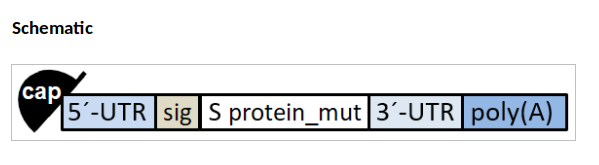

# Reverse Engineering

## 화이자 백신의 소스 코드 뜯어보기

원문: https://berthub.eu/articles/posts/reverse-engineering-source-code-of-the-biontech-pfizer-vaccine/
번역: https://www.notion.so/BioNTech-Pfizer-dc94f9a45e634bd5a136c7c94ad434d1

- 화이자는 mRNA라는 기반으로 만들어진 백신이다.
- 기존 백신 개발 방식은 운과 시간에 따른 아날로그적인 방식이었다.

https://korean.cdc.gov/coronavirus/2019-ncov/vaccines/different-vaccines/mrna.html

> (mRNA COVID-19는) 미국에서 사용을 승인한 최초의 COVID-19 백신 중 일부가 mRNA 백신이라고도 하는 메신저 RNA 백신입니다.
>
> mRNA 백신은 전염병에 대한 보호 기능을 제공하는 새로운 유형의 백신입니다.

- DNA는 A,C,G,U/T로 이루어진 염기로 정보를 표현한다.

[핵염기 - Wikipedia](https://ko.wikipedia.org/wiki/%ED%95%B5%EC%97%BC%EA%B8%B0)

> 아데닌(A), 구아닌(G), 사이토신(C), 티민(T), 유라실(U)의 5가지 핵염기를 주요 염기라고 한다.

- 3개의 염기 = 1코돈, 코돈이 처리 단위가 된다.
- 1염기 = 2비트 = 2^2 = 4개의 정보를 나타낼 수 있다.
- 즉, 코돈은 3염기 = 6비트 = 2^6 = 64가지의 정보를 나타낼 수 있다.
- RNA는 일종의 램으로써 소스 코드를 가지고 있다.

- cap은 쉘 스크립트의 `#!` 와 같은 역할을 한다. 화이자 백신에서는 `GA` 값을 가지고 있다.
- 5'(5-프라임)은 리보솜이 자리잡도록 하는 개시점이며, 메타데이터도 가진다. 리보솜이 언제, 얼마나 번역해야 하는지를 가진다.
- 리보솜은 단백질용 3D 프린터 같은 것이다. RNA을 받아들여서, 아미노산 사슬을 내놓는다. 이 사슬을 접으면 단백질이 된다.

- 아래 검은색 띠가 RNA, 녹색 부분에서 점점 길어지는 검은색 띠가 단백질. 들락거리는 것이 RNA에 부합하는 어댑터. 어댑터가 단백질에 쓰일 아미노산을 가져온다.
