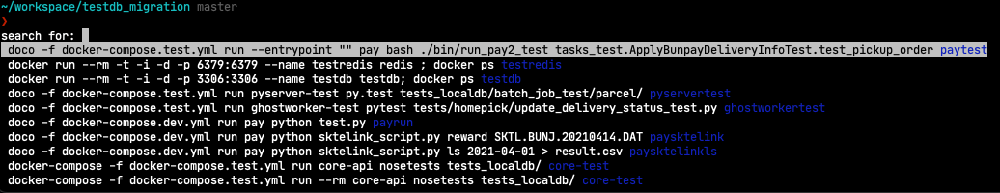

# Shell 명령어

Shell 명령어 도구 모음

## man - 매뉴얼 페이지

어떤 명령이든 `man COMMAND`로 메뉴얼을 확인하자. 내장 명령어라면 대부분 제공한다.

Bash에 대한 내용도 `man bash`로 알 수 있다. `if [ -e file ]`에서 `-e`를 모르겠다면 메뉴얼에서 확인할 수 있다.

### `COMMAND(1)`에서 숫자의 의미?

`man ls`의 경우에는 다음과 같이 명령어와 괄호안에 숫자가 함께 표기된다:

```bash
$ man ls
LS(1)           General Commands Manual           LS(1)

NAME
     ls – list directory contents
```

이는 section을 의미한다. 이에 대한 정보는 `man` 명령어의 메뉴얼에서 확인할 수 있다!

```bash
$ man man

The man utility finds and displays online manual documentation pages.  If mansect is provided, man restricts the search to the specific section of the manual.

The sections of the manual are:
     1.   General Commands Manual
     2.   System Calls Manual
     3.   Library Functions Manual
     4.   Kernel Interfaces Manual
     5.   File Formats Manual
     6.   Games Manual
     7.   Miscellaneous Information Manual
     8.   System Manager's Manual
     9.   Kernel Developer's Manual
```

즉, `LS(1)`는 일반 명령어 메뉴얼을 의미한다.

`intro`는 각종 명령어와 도구, shell 등에 대한 소개(introduction)를 담당하고 여러 섹션의 메뉴얼이 있는데,
`man 1 intro`, `man 3 intro`, `man 9 intro` 등으로 각 section을 확인할 수 있다.

### tldr - 명령어 예제 도구

[tldr](https://github.com/tldr-pages/tldr)은 사용자들이 만드는 명령줄 도구 사용 사례를 모아놓은 저장소다.
얼마나 활발한지는 저장소의 커밋을 보면 된다.

이 저장소를 탐색하기 위한 별도 명령어 도구를 제공하는데, 대표적인 클라이언트가 `tldr`이다.
다른 클라이언트는 [위키 페이지](https://github.com/tldr-pages/tldr/wiki/Clients#console-clients)에 정리되어 있다.

공식 도구인 [tldr-pages/tldr-c-client](https://github.com/tldr-pages/tldr-c-client)는 `brew install tldr`로 설치할 수 있었지만,
Deprecation 되어 2025-10-24에 Homebrew에서 비활성화된다. 더 이상 지원하지 않는다고.

Rust로 작성된 비공식인 [tealdeer-rs/tealdeer](https://github.com/tealdeer-rs/tealdeer)가 인기 있는 듯.

다음은 예시. `curl` 명령어에 대한 사용 법을 보고싶다면:

```bash
$ tldr curl

  curl

  Transfers data from or to a server.
  Supports most protocols, including HTTP, FTP, and POP3.
  More information: https://curl.se/docs/manpage.html.

  - Download the contents of a URL to a file:
    curl http://example.com --output path/to/file

  - Download a file, saving the output under the filename indicated by the URL:
    curl --remote-name http://example.com/filename

  - Download a file, following location redirects, and automatically continuing (resuming) a previous file transfer and return an error on server error:
    curl --fail --remote-name --location --continue-at - http://example.com/filename

  - Send form-encoded data (POST request of type application/x-www-form-urlencoded). Use --data @file_name or --data @'-' to read from STDIN:
    curl --data 'name=bob' http://example.com/form

  - Send a request with an extra header, using a custom HTTP method:
    curl --header 'X-My-Header: 123' --request PUT http://example.com
```

## `set -ex`

도커파일이나 스크립트를 보면 `set -ex` 구문이 많이 보인다.

* `-e`: 각 라인의 명령어가 실행될 때 리턴값이 실패를 의미하면 종료한다.
* `-x`: 실행하는 명령어를 출력한다.

디버깅용으로 유용하다 함.

## .bash**rc** rc의 의미?

Run Commands.

https://superuser.com/questions/173165/what-does-the-rc-in-bashrc-etc-mean<br>
https://en.wikipedia.org/wiki/RUNCOM

`.bashrc`, `.npmrc` 등 자주 보여서 찾아봤다.

## parameter fallback (default value)

```
echo ${VARIABLE:-word}
```

`$VARIABLE`이 null 또는 unset 상태면 `word`를 반환한다.

oh-my-zsh의 사용 예시:

```bash
git clone https://github.com/zsh-users/zsh-syntax-highlighting.git ${ZSH_CUSTOM:-$HOME/.oh-my-zsh/custom}/plugins/zsh-syntax-highlighting
```

`$ZSH_CUSTOM`이 없으면 `~/.oh-my-zsh/custom`을 사용한다는 의미.

ref. https://www.gnu.org/software/bash/manual/html_node/Shell-Parameter-Expansion.html

## Redirections

https://www.gnu.org/software/bash/manual/html_node/Redirections.html

링크에 나오는 내용. 다음 2개는 결과가 다르다.
순서에 따라 다른 동작을 하므로 주의할 필요가 있다.

```bash
# 1
ls > dirlist 2>&1
```

```bash
# 2
ls 2>&1 > dirlist
```

\#1은 stdout을 *dirlist*로 리다이렉트하고, stderr를 stdout으로 리다이렉트하는데,
stdout은 이미 *dirlist*로 리다이렉트되었으므로 stderr도 *dirlist*로 리다이렉트된다.
결론은 stdout과 stderr 모두 *dirlist*로 리다이렉트된다.

반면에 \#2는 stderr을 stdout으로 리다이렉트하고, stdout을 *dirlist*로 리다이렉트한다.
결론은 각각 *dirlist*와 stdout으로 리다이렉트된다.

## Built-in Commands

### time - 명령어 실행시간 측정

```bash
$ /usr/bin/time git fetch
        2.28 real         0.03 user         0.02 sys
```

* real: 총 소요시간
* user: user mode에서 소요된 CPU time
* sys: kernel mode에서 소요된 CPU time

`-h` 옵션으로 익숙한 시간 단위로 표기할 수 있다.

```bash
$ type -a time
time is a reserved word
time is /usr/bin/time
```

`time`은 셸 예약어로 되어있는데, 실행파일은 `/usr/bin/time`에 있다.
예약어를 사용하면 `time g fetch`와 같이 alias를 사용할 수 있고, 직접 실행파일을 사용하면 alias를 사용할 수 없다.

ref. https://linuxize.com/post/linux-time-command/

### readlink - 심볼릭 링크 경로 확인

```bash
$ readlink -f `which node`
/home/linuxbrew/.linuxbrew/Cellar/node/19.9.0/bin/node
```

심볼릭 링크를 따라가서 실제 경로를 알 수 있다.

### sed - 파일 특정 라인만 읽기

https://unix.stackexchange.com/questions/288521/with-the-linux-cat-command-how-do-i-show-only-certain-lines-by-number

`cat`은 전체라인만 읽지만 `sed -n -e 1,3p -e 10p`은 1~3, 10 라인 읽을 수 있다.

sed, grep, awk 를 이용한 특정 라인 범위 내에서 특정 단어를 포함한 라인으로 좁히고 특정 형태로 출력하도록 조합할 수 있다:

```bash
sed -n -e 1,5446p data.txt | grep false | awk '{print $1}'
```

보통 `sed`는 파일 내용을 수정하고 백업을 만드는데 사용했는데..

`-n`: 입력된 행을 표준 출력으로 보낸다.<br>
`-e`: 여러개의 범위를 지정하려면 `-e`로 구분한다. `sed -n 1,3p data.txt` 이렇게 하나의 범위라면 `-e`는 생략해도 된다.

### nohup - 멈추지 않고 명령어 실행하기

`nohup`은 no hangup의 줄임말. 터미널을 종료해도 중지 시그널을 무시하고 진행한다.

---

`nohup` 명령어로 스크립트를 실행하면,
세션이 끊어져도 스크립트가 진행된다는 것만 알았지,
실제로 사용해 본적이 없어서 간단한 예제로 정리.

사용하기 전에 가졌던 의문 3가지

1. 로그를 실시간으로 확인할 수 있는가?
1. 터미널을 꺼도 동작하고 있는가?
1. `nohup`으로 실행한 프로세스를 어떻게 찾아서 끌 수 있는가?

사용방법:

```bash
$ nohup COMMAND
```

*COMMAND* 에 환경변수를 전달하려면:

```bash
$ FOO='foo' nohup COMMAND
```

#### stdout은 `nohup.out`에 저장된다.

stdout은 `nohup.out`에 저장된다.
명령어가 실행중이라면 `tail -F nohup.out`으로 실시간으로 확인할 수 있다.

#### Background Job으로 실행하자.

그냥 `&` 없이 실행하면 foreground로 돈다. `nohup`만 사용한다고해서 background로 전환되지 않는다.
이 상태에서 `ctrl + c`로 빠져나오면 **스크립트가 종료**된다.

`nohup COMMAND &`로 백그라운드 잡으로 실행하자.

ref. https://www.cyberciti.biz/tips/nohup-execute-commands-after-you-exit-from-a-shell-prompt.html

#### `nohup`으로 실행한 프로세스를 종료하는 방법

**`ps aux`로 찾아보자**

*X.* `ps aux | grep nohup` 결과는 없다.

*O.* `ps aux | grep COMMAND` 결과는 있다!

예를 들어 `nohup ./tick.sh`로 실행한 경우 `ps aux | grep tick` 검색하면:

```bash
bash alleb 33723 0.0 0.0 4283996 1252 ?? S 11:16AM 0:00.29 /bin/bash ./tick.sh
```

PID를 알 수 있으므로 `kill -9 33723`으로 종료할 수 있다.

**background로 실행하면 좀 더 알기 쉽다.**

```bash
~/workspace/nohup-test
❯ nohup ./tick.sh &
[1] 10809
appending output to nohup.out

~/workspace/nohup-test
❯ kill -9 10809
[1]  + 10809 killed     nohup ./tick.sh
```

Background Job으로 실행하면 PID가 바로 출력되어 알 수 있다.

**stdout을 파일로 저장해 두는 방법**

백그라운드로 전환 시 출력되는 PID를 파일로 저장하자.

```bash
nohup my_command > my.log 2>&1 &
echo $! > save_pid.txt
```

`$!`은 background로 돌린 PID를 저장하고 있다.\
터미널이 종료되어 PID를 찾을 수 없어도 파일로 남아있으니 안심이다.

파일의 PID를 읽어들여 종료할 수 있다:
```bash
kill -9 `cat save_pid.txt`
```

ref. https://stackoverflow.com/questions/17385794/how-to-get-the-process-id-to-kill-a-nohup-process/17389526

## Tools

### marker - the terminal command palette



https://github.com/pindexis/marker

CTRL + SPACE 입력하면 저장한 명령어나 히스토리를 선택할 수 있다.
자주 사용하지만 너무 긴 명령어를 기록하는데 사용한다.
자주 히스토리에서 찾아서 입력하는 명령을 등록해서 사용하면 유용하다.

* `marker mark` - 명령어를 북마크한다.
* `marker remove` - 북마크를 삭제한다.

### fzf

https://github.com/junegunn/fzf

A command-line fuzzy-finder.


linuxbrew or homebrew로 설치하려면: `brew install fzf`

터미널 도구의 기본 동작은 텍스트 출력으로 이루어지는데,
사람 입장에서는 눈으로 이 출력을 읽고 필요한 정보를 찾아내기 어렵다.
fzf는 이 출력에 대한 상호작용을 제공한다.
예를 들어, 파일 목록을 출력하고 fzf에 넘기면 방향키로 선택하거나 fuzzy 검색할 수 있다.

Fuzzy search는 문자열이 일부만 일치해도 검색하는 알고리즘이다.
fzf는 이 알고리즘을 사용하여 검색을 제공한다.
예를 들어 `foo bar baz`는 `fbb`로 검색될 수 있다.
fuzzy search를 이용한 도구에는 [MacOS](/docs/wiki/mac-os.md)의 클립보드 관리 도구인 [maccy](https://github.com/p0deje/Maccy)가 있다.

**명령어 내역 검색 개선**

셸에서 `ctrl + r`는 reverse-i-search 이름의 기능으로 명령어 내역을 검색할 수 있는데,
`ctrl + r`을 다시 누르는 것으로 하나씩 탐색한다.

```bash
$ apt list --installed | grep locales
bck-i-search: grep_
```

fzf는 이 기능을 확장하여 Fuzzy 검색을 제공하며, 방향키로 선택할 수 있다.

```bash
  1599    apt list --installed | grep locales
  1688    brew ls | grep win
  1710    brew ls | grep z
▌ 1780    brew ls | grep fzf
> grep
```

**preview window scrolling**

`--preview` 옵션을 사용하면 미리보기 윈도우를 사용할 수 있는데(이미지의 오른쪽 코드 영역), 여기서 스크롤할 수 있다.
`shift` + `up/down` 또는 마우스 휠로 할 수 있다.

**현재 디렉토리 내에서 파일 검색**

`CTRL-T`를 누르면 파일 대화식으로 파일을 검색한다. 선택하면 파일 경로가 입력창에 입력된다.
예를 들어 `cat `까지 입력하고 `CTRL-T`로 파일을 찾아 선택하면 `cat /path/to/file` 경로가 완성된다.

fzf가 없으면 보통, tab 두 번 눌러서 모든 파일을 확인할텐데, `CTRL-T`를 사용하는 편이 더 편리하다.

#### fzf + git

**브랜치 목록 및 작업 내용**

```bash
lsb = !git branch \
  | fzf --preview 'echo {} | cut -c3- | xargs git show --color=always' --height 90% \
  | cut -c3-
```

`.gitconfig`에 `lsb`로 alias 등록하였다.

```bash
~/dotfiles main 7s                                                         15:43:03
❯ g lsb
                     ╭─────────────────────────────────────────────────────────────╮
                     │ commit cb9064a2c2b8292df2b039366263e4261ed72161        1/20││
                     │ Author: edunga1 <goonr21@gmail.com>                        ││
                     │ Date:   Thu Jun 15 14:30:47 2023 +0900                     ││
                     │                                                            ││
                     │     Remove pylint from python toolchain                    ││
                     │                                                            ││
                     │     ruff is preferred                                      ││
                     │                                                            ││
                     │ diff --git a/vim/lua/lsp/python.lua b/vim/lua/lsp/python.lu││
                     │ index eb8a1cc..1de0888 100644                              ││
                     │ --- a/vim/lua/lsp/python.lua                               ││
                     │ +++ b/vim/lua/lsp/python.lua                               ││
                     │ @@ -9,7 +9,6 @@ return function(ns, lspconfig)              │
    wip              │    ns.register(ns.builtins.formatting.autopep8)             │
> * main             │    ns.register(ns.builtins.formatting.isort)                │
  2/2 ────────────── │    ns.register(ns.builtins.formatting.ruff)                 │
>                    ╰─────────────────────────────────────────────────────────────╯
```

브랜치 목록 `git branch`와 함께 가장 위 커밋의 diff `git diff`를 보여준다.

### ping

```bash
ping 123.123.123.123
ping www.google.com
```

네트워크 진단 도구. [포트 번호를 받지 않는다. ICMP 메시지를 이용한다.](./network.md)

호스트 전송 실패 예시:
```bash
❯ ping 123.123.123.123
PING 123.123.123.123 (123.123.123.123): 56 data bytes
Request timeout for icmp_seq 0
Request timeout for icmp_seq 1
Request timeout for icmp_seq 2
Request timeout for icmp_seq 3
```

호스트 응답 성공 예시:
```bash
❯ ping www.google.com
PING www.google.com (142.250.199.100): 56 data bytes
64 bytes from 142.250.199.100: icmp_seq=0 ttl=112 time=61.641 ms
64 bytes from 142.250.199.100: icmp_seq=1 ttl=112 time=68.523 ms
64 bytes from 142.250.199.100: icmp_seq=2 ttl=112 time=70.667 ms
64 bytes from 142.250.199.100: icmp_seq=3 ttl=112 time=67.562 ms
```

### gpg

암호화 및 서명 도구. mac/linux는 `brew install gpg`로 설치하자.

#### 키 백업 및 복원

생성된 키를 백업하여 파일로 저장하고, 다른 기기에서 복원한다.

다음 명령어로 이메일 사용자의 키를 `private.gpg` 파일로 백업한다.

```bash
$ gpg -o private.gpg --export-options backup --export-secret-keys *******@gmail.com
```

passphrase를 입력하는 과정이 있다.

다음 명령어로 `private.gpg` 파일로부터 복구한다.

```bash
$ gpg --import-options restore --import private.gpg
gpg: directory '/Users/john/.gnupg' created
gpg: key BB7672EBC4E11744: public key "******* (github) <*******@gmail.com>" imported
gpg: key BB7672EBC4E11744: secret key imported
gpg: Total number processed: 1
gpg:               imported: 1
gpg:       secret keys read: 1
gpg:   secret keys imported: 1
```

마찬가지로 생성 시에 사용한 passphrase를 입력하는 과정이 있다.

### act - Run GitHub Actions locally

로컬에서 GitHub Actions를 실행해 볼 수 있는 도구.

`brew install act`로 설치한다.

Docker를 사용하므로 Docker가 실행되고 있어야 한다.

잘못된 구성인 경우 Docker가 실행되지 않았더라도 미리 확인할 수 있었다.

```bash
$ docker ps
Cannot connect to the Docker daemon at unix:///var/run/docker.sock. Is the docker daemon running?

~/workspace/gatsby-transformer-gitinfo main*
$ act
INFO[0000] Using docker host 'unix:///var/run/docker.sock', and daemon socket 'unix:///var/run/docker.sock'
Error: Invalid run/uses syntax for job:Test step:Install dependencies
```

WSL에서 제대로 실행하지 못했는데.

```bash
$ act
INFO[0000] Using docker host 'unix:///var/run/docker.sock', and daemon socket 'unix:///var/run/docker.sock'
[Test/Test] 🚀  Start image=node:16-buster-slim
[Test/Test]   🐳  docker pull image=node:16-buster-slim platform= username= forcePull=true
[Test/Test]   🐳  docker create image=node:16-buster-slim platform= entrypoint=["tail" "-f" "/dev/null"] cmd=[] network="host"
[Test/Test]   🐳  docker run image=node:16-buster-slim platform= entrypoint=["tail" "-f" "/dev/null"] cmd=[] network="host"
Error: failed to copy content to container: Error response from daemon: mount /mnt/wsl/rancher-desktop/run/docker-mounts/b3b14dc5-4a5e-4ab0-81ba-6782e5a1f73b:/var/lib/docker/overlay2/b61781f329077fa54f2cd457f74312c7a36f23d336e1d81402b48ce9b4de2117/merged/run/docker.sock, flags: 0x5000: not a directory
```

[~/.actrc에 설정을 추가하면](https://github.com/nektos/act/issues/2239#issuecomment-1979819940) 해결된다고 해서, 넣었더니 잘 된다:

```
--container-daemon-socket -
```

Docker 소켓을 job 컨테이너에 마운트하지 않도록 비활성화한다고.

### jq

Lightweight and flexible command-line JSON processor.

`brew install jq`로 설치하자.

jsonpath와 같이 JSON 데이터를 필터링 등 처리하는데 사용한다.

옵션 없이 사용하여 pretty print 용도로 사용할 수 있다.

```bash
$ echo '{"glossary":{"title":"example glossary","GlossDiv":{"title":"S","GlossList":{"GlossEntry":{"ID":"SGML","SortAs":"SGML","GlossTerm":"Standard Generalized Markup Language","Acronym":"SGML","Abbrev":"ISO 8879:1986","GlossDef":{"para":"A meta-markup language, used to create markup languages such as DocBook.","GlossSeeAlso":["GML","XML"]},"GlossSee":"markup"}}}}}' | jq

{
  "glossary": {
    "title": "example glossary",
    "GlossDiv": {
      "title": "S",
      "GlossList": {
        "GlossEntry": {
          "ID": "SGML",
          "SortAs": "SGML",
          "GlossTerm": "Standard Generalized Markup Language",
          "Acronym": "SGML",
          "Abbrev": "ISO 8879:1986",
          "GlossDef": {
            "para": "A meta-markup language, used to create markup languages such as DocBook.",
            "GlossSeeAlso": [
              "GML",
              "XML"
            ]
          },
          "GlossSee": "markup"
        }
      }
    }
  }
}
```

출력의 syntax highlighting 지원해서 보기 편리한 것이 장점.

---

jq는 특정 필드를 제외할 수 있다.

`jq 'del(.. | .title?) | del(.glossary.GlossDiv.GlossList.GlossEntry.ID)'` 이 명령어는 모든 `title` 이름을 가진 필드를 제거하고, `glssary.GlossDiv.GlossList.GlossEntry.ID` 필드를 제거한다.

```bash
$ echo '{"glossary":{"title":"example glossary","GlossDiv":{"title":"S","GlossList":{"GlossEntry":{"ID":"SGML","SortAs":"SGML","GlossTerm":"Standard Generalized Markup Language","Acronym":"SGML","Abbrev":"ISO 8879:1986","GlossDef":{"para":"A meta-markup language, used to create markup languages such as DocBook.","GlossSeeAlso":["GML","XML"]},"GlossSee":"markup"}}}}}' | jq 'del(.. | .title?) | del(.glossary.GlossDiv.GlossList.GlossEntry.ID)'
{
  "glossary": {
    "GlossDiv": {
      "GlossList": {
        "GlossEntry": {
          "SortAs": "SGML",
          "GlossTerm": "Standard Generalized Markup Language",
          "Acronym": "SGML",
          "Abbrev": "ISO 8879:1986",
          "GlossDef": {
            "para": "A meta-markup language, used to create markup languages such as DocBook.",
            "GlossSeeAlso": [
              "GML",
              "XML"
            ]
          },
          "GlossSee": "markup"
        }
      }
    }
  }
}
```

### zoxide

> A smarter cd command.

`z <keyword>`와 같이 입력하면, 자주 방문하는 디렉토리를 자동으로 찾아 이동한다.

https://github.com/ajeetdsouza/zoxide

지금은 개발이 중단된 [fasd](https://github.com/clvv/fasd)의 대체재.

`brew install zoxide`로 설치하자. \
설치한 후 `eval "$(zoxide init zsh)"`를 `.zshrc`에 추가한다:

```bash
# zoxide 명령어가 있는 경우에만 init 실행
if command -v zoxide  &> /dev/null; then
  eval "$(zoxide init zsh)"
fi
```

설치 후에 `cd`를 사용해야 데이터가 수집된다.

`z <keyword>`로 이동하면 되는데, 폴더 이름의 일부분만 입력해도 찾아서 이동한다.
예를 들어 `cd bran-new-project`를 사용한 내역이 있다면, `z new`나 `z bran`으로 이동할 수 있다.

키워드가 겹치는 경우가 있으면 우선 순위에 따라 결정된다.
우선 순위를 확인하고 싶다면 `z <keyword> ` 입력한 후 <tab>키를 입력하면 목록이 출력된다.
키워드 다음에 스페이스가 있어야 한다.

`zoxide` 명령어를 제공한다. 디렉토리 정보를 관리하는 데이터베이스를 관리하는 용도다.

키워드가 겹쳐서 원하는 디렉토리가 아닌 곳으로 이동한다면, `zoxide edit`으로 데이터베이스를 수정할 수 있다.
데이터베이스 목록이 출력되고, 키를 입력하여 스코어를 낮추거나 높여서 우선순위를 조정한다.

```bash
$ zoxide edit
┌───────────────────────────  zoxide-edit  ─────────────────────────┐
│                                                                   │
│ >   < 31/31 ────────────────────────────────────────────────────  │
│   ctrl-r:reload    ctrl-d:delete                                  │
│   ctrl-w:increment ctrl-s:decrement                               │
│                                                                   │
│    SCORE PATH                                                     │
│ ▌  364.0 /home/user/workspace/cat-logic                         │ │
│    340.0 /home/user/workspace/cat-logic/sites                   │ │
│     72.0 /home/user/dotfiles                                    │ │
│     60.0 /home/user/workspace/godot-pacman                      │ │
│     12.5 /home/user/workspace                                   │ │
│      5.0 /home/user/workspace/cat-logic/embeddings              │ │
│      4.8 /home/user/workspace/project-grass                       │
```

### p10k

Powerlevel10k는 Zsh 프롬프트 테마이다.

https://github.com/romkatv/powerlevel10k

다음과 같이 프롬프트에 vcs 정보, 실행 시간, 현재 시각 등을 입맛에 맞게 추가하는 도구다.

```bash
~/workspace/cat-logic main* 11s                  16:20:24
❯
```

원하는 정보를 추가할 수 있다. *segment*라고 부른다.
`~/.p10k.zsh`에서 `POWERLEVEL9K_LEFT_PROMPT_ELEMENTS` 등 변수에 `prompt_` 접두어를 가진 함수를 추가한다.

```
() {
  function prompt_jira_summary() {
    local data="$(jiras 2>/dev/null)"
    if [[ -z "$data" ]]; then
      return
    fi
    p10k segment -t "$data" -f grey
  }

  typeset -g POWERLEVEL9K_LEFT_PROMPT_ELEMENTS=(
    context
    dir
    vcs
    jira_summary  # 추가
    command_execution_time
  )
}
```

위 예제는 `jiras`라는 [JIRA](/docs/wiki/jira.md) 이슈 이름을 가져오는 명령어를 사용해서 브랜치 이름 다음에 이슈 이름을 출력하는 예제다.
문제는 캐시 정책을 사용하지 않았기 때문에 명령어 입력할 때마다 API를 호출하는 것으로 보인다.
개선하기 위해서는 p10k의 캐시 정책이 있는지 확인하거나 git hook으로 체크아웃 할 때 마다 이슈 이름을 저장하고 프롬프트에서 사용하는 방법이 있을 듯.

### lychee

Lychee는 문서에서 동작하지 않는 링크를 찾는 도구이다.
마크다운, HTML 등 문서에서 웹 URL, 로컬 파일, 이메일 링크를 검사한다.

https://github.com/lycheeverse/lychee

`brew install lychee`로 설치할 수 있다.

`lychee` 명령어를 제공, `lychee ./docs/wiki/**/*.md`와 같이 사용한다.

```bash
$ lychee ./docs/wiki
[403] https://openai.com/index/hello-gpt-4o/ | Network error: Forbidden
[200] https://docs.python.org/3/library/unittest.mock.html
[200] https://pypi.org/project/django-composite-foreignkey/
```

`[link](/docs/wiki/foo.md)` 와 같이 로컬 파일에 대한 링크는 실패할 수 있다.

```bash
[WARN ] Error creating request: InvalidPathToUri("/docs/wiki/foo.md")
```

이 경우는 `-root-dir <PATH>` 옵션을 전달하여 파일의 경로 기준을 전달하면 해결된다. \
예시: `lychee ./docs/wiki/**/*.md -root-dir $(pwd)`

## python shell tools

몇몇 파이썬 모듈은 CLI로 실행할 수 있는 기능을 제공한다.
라이브러리 기능을 명령줄 도구로로 사용할 수 있어 유용하다.

### `python -m json.tool`으로 JSON beautify

```bash
$ echo '{"foo":"bar"}' | python -m json.tool
{
    "foo": "bar"
}
```

API 마이그레이션 중 응답 diff를 보기 위해서 formatting 일관성을 맞춘다거나,
위 예제처럼 whitespace를 제거해서 보기 어려운 형태를 바꾸는 등 용도로 유용하다.

그러나 한글은 unicode로 출력되어 알아볼 수 없는 문제가 있다.

```bash
$ echo '{"foo":"얍"}' | python -m json.tool
{
    "foo": "\uc58d"
}
```

이 문제는 직접 import해서 사용하면 해결할 수 있다.

```bash
$ echo '{"foo":"얍"}' | python -c 'import json, sys; print(json.dumps(json.load(sys.stdin), ensure_ascii=False, indent=4))'
{
    "foo": "얍"
}
```

여기에 추가로 property를 정렬할 수도 있다.

```bash
$ echo '{"foo":"얍", "bar":"바"}' | python -c 'import json, sys; print(json.dumps(json.load(sys.stdin), ensure_ascii=False, indent=4, sort_keys=True))'
{
    "bar": "바",
    "foo": "얍"
}
```

이렇게 정렬하는 것은 diff를 보기 좋게 만들 때 유용하다.

---

어떻게 stdout으로 출력하는지 코드를 좀 살펴봤다.

```python
import argparse

parser = argparse.ArgumentParser()
options = parser.parse_args()
outfile = options.outfile

with outfile:
  json.dump(obj, outfile, sort_keys=sort_keys, indent=4)
  outfile.write('\n')
```

`json.dump` 또는 `json.load`가 받는 인자는 [File object](https://docs.python.org/3/glossary.html#term-file-like-object)로 추상화되어 있다.
stdout 또한 File object로 쓰기 `write()` 할 수 있어서 함께 처리가능한 것 같다.

### `python -m http.server`로 간단한 웹서버 실행

```bash
$ python -m http.server
$ python -m http.server 8080
```

현재 디렉토리를 호스팅한다. python 2에서는 `python -m SimpleHTTPServer`.

## zsh

### Oh My Zsh

zsh 설정을 도와주는 프레임워크.

다만 [Oh My Zsh는 불필요한 부하를 추가함](https://news.hada.io/topic?id=25725)라는 글이 있듯이 플러그인을 추가하면서 성능 저하가 발생할 수 있다.
