# 우주

무한한 공간을 떠도는 것을 꿈꾼다.

> 출처: https://imgur.com/gallery/4fPrpX8

이렇게 우주를 거닐고 싶다.

## SpaceX Starship

스타쉽은 우주 여객기로, 행성 간 이동이 목적인 우주선이다.

https://www.spacex.com/vehicles/starship/ \
공식 홈페이지에 가면 스타쉽의 제원을 볼 수 있다.

여객기인 만큼 상당히 크다. 총 높이만 무려 121m이다.
국내법에서 고층건물을 120m로 정의하니, 스타쉽은 고층 건물을 우주로 보내는 것과 같다.

총 3단으로 구성되어 있다.
2단부 "Starship"은 우주선 자체, 1단부 "Super Heavy"는 Booster로 궤도에 올리기 위한 부분이다. 분리되어 다시 지구로 돌아온다.

Super Heavy에 달린 엔진은 "Raptor"라는 이름으로, 33개가 있다.

> Starship is the fully reusable spacecraft and second stage of the Starship system
> 
> Super Heavy is the first stage, or booster, of the Starship launch system.
>
> The Raptor engine is a reusable methane-oxygen staged-combustion engine
> 
> ...
> 
> Super Heavy will be powered by 33 Raptor engines

### 스타쉽 3차 발사 시험

2024년 3월 14일 오후 9시 경. 스타쉽 3차 발사가 이루어졌다.

[조선비즈 - “화성으로 가자” 스페이스X의 초대형 우주선 스타십, 3차 발사 만에 지구궤도 올랐다](https://biz.chosun.com/science-chosun/technology/2024/03/14/JH6FGNK5YNC5FEBSKINGFFOR34/)

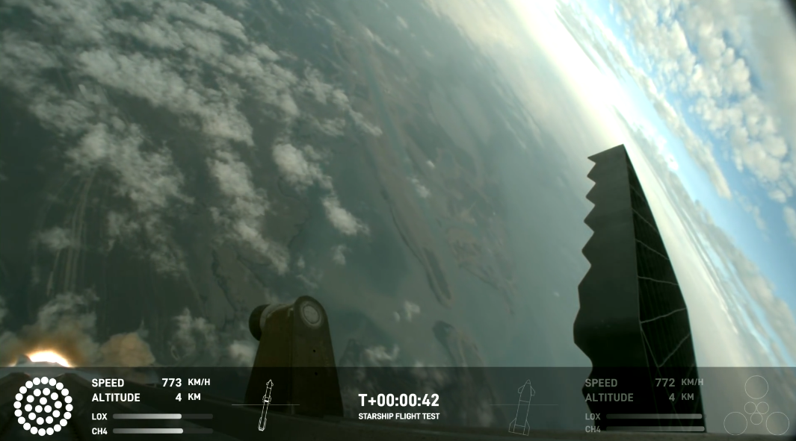

하단 패널에서 왼쪽 부분이 Super Heavy, 오른쪽 부분이 Starship의 정보를 보여준다.

양쪽에 동그라미로 표시된 것이 엔진이다.\
왼쪽은 Super Heavy에 달린 Raptor 엔진 33개이고, 오른쪽은 Starship에 달린 엔진 6개다.

33개의 랩터 엔진은 Starship을 우주로 올려 놓기 위한 추력을 제공한다.\
1차 발사에서는 33개 중 3개가 작동하지 않았고, 고도가 올라가면서 몇 개 더 꺼졌다.\
하지만 3차 발사에서는 Starship과 분리되기 직전까지 모든 엔진이 정상 작동했다.

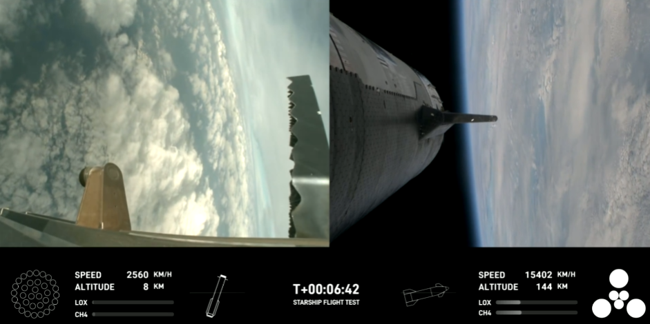

Starship이 분리되고 Super Heavy가 지구로 돌아가는 모습이다.

Super Heavy는 더 이상 엔진을 사용하지 않으므로 불이 모두 꺼졌다.\
반면에 Starship의 엔진 6개가 모두 점화된 모습이다.

아래 애니메이션은 Starship과 Super Heavy가 분리되는 모습이다!

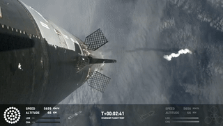

Raptor 엔진이 꺼지고 Starship 엔진이 점화되는 모습이 너무 멋져.

아쉽게도. 11시 즈음에 Starship의 연결이 끊어졌다.

### 스타쉽 4차 발사 시험

2024년 6월 6일 오후 9시 4차 시험이 진행되었다.

스페이스X의 트위터에서 4차 시험 영상을 볼 수 있다.\
https://x.com/SpaceX/status/1798689697184764071

[유튜브 안될과학](https://www.youtube.com/watch?v=K2kLVm_QOIg)에서 4차 시험에 대한 리뷰를 했다.
아쉽게도 나는 생방송을 보지 못했다.

- Raptor 엔진 33개 중 1개가 발사 직후에 꺼졌다.
- 분리된 Raptor 엔진은 정상적으로 바다에 착수했다.
- Super Heavy에 장착된 핫 스테이징 어댑터를 분리했다. 이전 시험에서는 분리하지 않았다. 안될과학에서는 이 무게만 10톤이라고 한다.
- Starship은 인도양으로 재진입하는 과정에서, 꼬리 날개가 열과 압력으로 인해 뼈대가 드러나는 모습이 보였다. 하지만 떨어지지 않았다.
- 꼬리 날개의 영향으로 재진입 각도가 제대로 조절되지 않았다. 안될과학에서는 이런 상황에서도 자세를 조절하는 프로그램이 세팅되어 있다고 한다.
- 스페이스X는 Starship을 하루에 한 대씩 생산하는 것이 목표라고 한다.

---

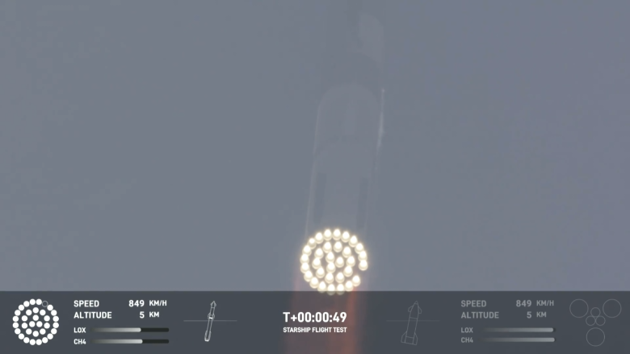

발사 직후 Raptor 엔진이 하나 꺼진 모습. 아래 그래픽과 영상에서 모두 확인할 수 있다.

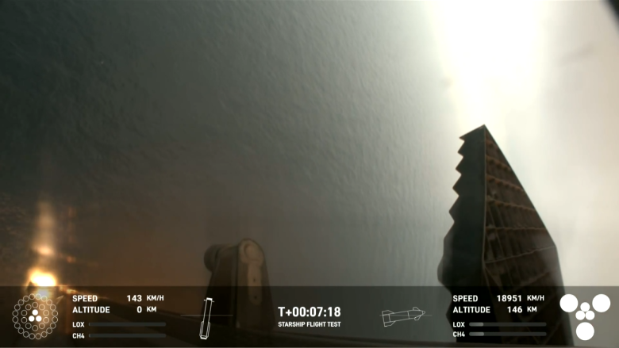

착수하는 Raptor engine 모습. 3개의 엔진을 점화하여 Landing Burn을 통해 역 추력을 사용한다.

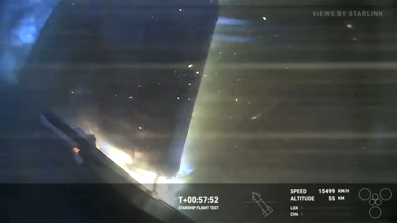

재진입 중에 꼬리 날개가 불타는 모습. 뼈대가 드러났다.
영상에서는 사람들이 탄식하는 소리가 들린다 ㅎ

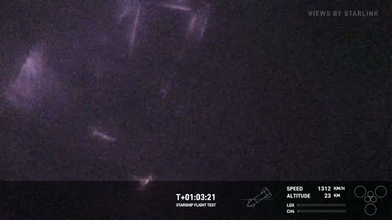

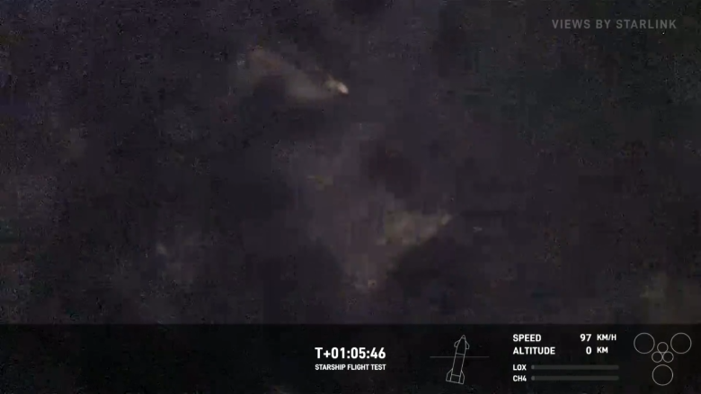

지구에 착수하기 위해 각도를 변경하는 모습. 고도가 높을 때는 수평이지만, 0km 지점에 가까워지면서 수직으로 변한다.

### 스타쉽 5차 발사 시험

2024년 10월 13일 오후 9시, 5차 시험이 진행되었다.

전체 영상은 [스페이스X 트위터](https://x.com/i/broadcasts/1RDGlyognOgJL)에서 볼 수 있다.

이번 시험에서 성공한 임무는 1단 Super Heavy를 발사대인 Chopsticks에 착륙시킨 것이다.

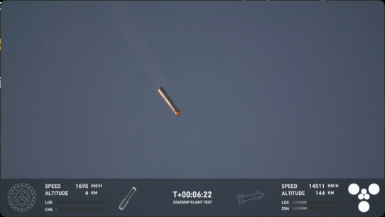

Super Heavy가 Chopsticks을 향해 착륙하는 모습이다.
어떻게 단순 원통처럼 생긴 것이 원하는 지점으로 세밀하게 움직일 수 있는지 신기하다.

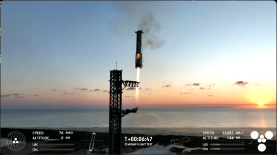

Chopsticks와 결합되는 모습.

아주 멀어서 크기가 실감나지 않는데, Super Heavy의 높이만 71m이다.
20층 아파트 한 채가 부유하는 것과 같다.

다음은 랜딩 애니메이션 버전.

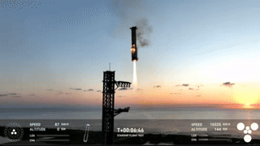

결합되는 지점에서 더 내려가지 않는다. 마지막 순간에 결합된 것이다.

### 스타쉽 6차 발사 시험

2024년 11월 20일 오전 7시 6차 시험이 진행되었다. 7시에 일어나서 시청하지 못했다.

생방송은 [스페이스X 트위터](https://x.com/i/broadcasts/1RDGlydZAeOJL)에서 볼 수 있다.

[일론 머스크의 트위터](https://x.com/elonmusk/status/1858867695233425734)에 따르면 6차 발사 시험의 목표는 4가지라고 한다.

1. 진공 상태에서 랩터 엔진의 재시작
2. 스타쉽의 주간 착륙
3. 더 높은 최대 가열 상태에서 재진입
4. 더 빠른 부스터 잡기

그리고 수천 개의 작은 설계 변화도 테스트한다고.

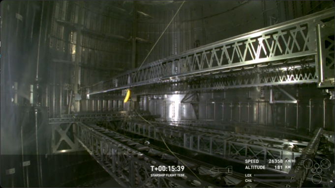

이번 시험의 재밌는 점은 스타쉽 내부에 바나나가 들어있는 점이다.
외부에도 바나나 캐릭터 그림이 그려져 있다.

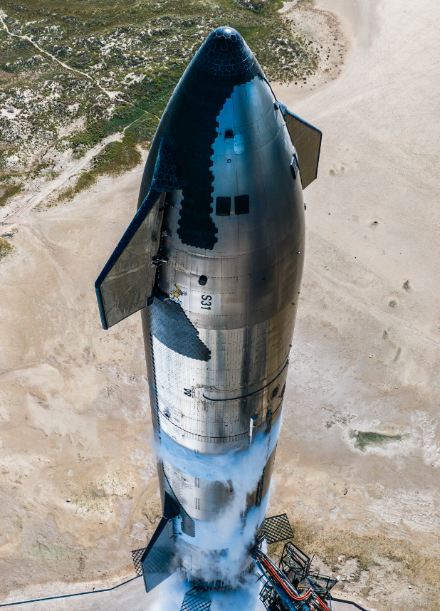

이는 [트위터 글](https://x.com/SpaceX/status/1858241453824287192)에서 고화질로 학인할 수 있다.

아쉽게도 부스터의 Chopsticks 착륙은 이번 시험에서 제외되었다.
Chopsticks에 문제가 있었다는 듯.

따라서 부스터는 바다에 착수했고, 일부러 폭발시켰다.
아쉽게도 생방송 영상에서는 보이지 않는다.

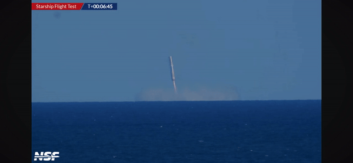

바다에 착륙하면 재사용할 수 없다고 한다.
그래서 폭발을 시켜도 무방하다고.

2단부 스타쉽 또한 바다에 착수했다.

[안될과학에서 6차 시험을 생방송하고, 요약 리뷰를 했다.](https://www.youtube.com/watch?v=iku23rilj5g)

## 다른 민간 우주 기업

아마존의 [블루 오리진](https://www.blueorigin.com/)이 있다.
하지만 별다른 뉴스가 들려오지 않아서 잘 모르겠다.
