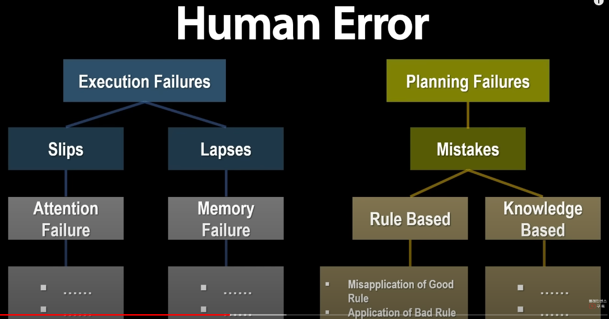

# 시스템 장애

시스템 장애에 대한 복구와 예방을 위한 방법을 정리한다.

## 하네다 JAL 516편 충돌 사고의 불편한 진실 - 휴먼 에러

[하네다 JAL 516편 충돌사고](https://www.yna.co.kr/view/AKR20240102147454073)는 2024년 1월 2일 17시 47분경에 발생한,
여객기인 516편과 해상보안청의 항공기 MA722편이 활주로에서 지상 충돌한 사고이다.

유튜브 *Plane Sense* 채널에서 [하네다 JAL 516편 충돌 사고의 불편한 진실](https://youtu.be/-OrkSFn5wv0)이라는 영상을 올렸다.
인상 깊은 점이 많았는데, 특히 실패 피드백에 대한 이야기이다. 채널은 이 사건이 Human Error라고 진단했다.

항공기의 역사가 1903년 라이트 형제의 첫 비행에서 시작된다고 치더라도, 이제 겨우 120년 정도 지났다.
반면에 [컴퓨터 과학](https://ko.wikipedia.org/wiki/%EC%BB%B4%ED%93%A8%ED%84%B0_%EA%B3%BC%ED%95%99)의 역사는 1946년 ENIAC의 출시로 보더라도 겨우 75년 정도 지났다.
역사가 더 길기도하고, 항공기는 안전에 대한 직접적인 영향이 있기 때문인지 실패에 대해 더 체계적으로 다루는 것 같다.

다음은 영상의 내용을 정리한 것이다.

이 사건의 액터는 총 셋이다. 여객기 JAL 516편, 해상보안청 항공기 MA722편, 그리고 하네다 공항의 관제사이다.

이 사건의 무대인 도쿄 하네다 공항은 초저녁이 되면 트래픽이 몰려 착륙 활주로가 자주 변경되어 악명이 높다.

사건의 경위는 다음과 같다:

1. 516편은 도쿄 상공에 도착하여 관제사로부터 "Highway Visual Rwy(runway)34R 접근을 허가한다"는 메시지를 받았다.
2. MA722편은 같은 활주로에서 이륙할 예정이었다.
3. 17:44:56 JAL 516편은 관제사로부터 "Rwy34R Cleared to land" 메시지를 받았다.
4. 이착륙할 트래픽이 많은 경우, 관제사는 착륙 항공기가 Rwy threshold 통과하면 이륙 대기중인 항공기에 "Line up & wait" 메시지를 보내 활주로에 진입하여 이륙 대기를 전달하여 시간을 절약한다.
5. 17:45:19 MA722편은 관제사로부터 "Line up & wait", "Taxi to holding point C5"(C5 포인트에서 대기) 명령을 받고 복창했다. 하지만 정지하지 않고, **활주로에 진입했다**.
6. 이륙 지점에서 정지한 40초 후에 516편은 착륙을 시작했다.
7. 516편은 정면으로 MA722편과 충돌했다.

[3:13](https://youtu.be/-OrkSFn5wv0?si=eZIAnJIebjm_CLcK&t=193)\
사건 발생 후 많은 기사에서는 대기 지시를 이륙 허가로 착각한 것이 원인이라고 추측했다.
하지만 항공안전 메뉴얼에서는 "착각"과 "혼동"과 같은 관념적 표현을 사용하지 않는다.

문제 정의 1, 해상보안청 MA722편은 C5 포인트에 대기라고 정확히 복창하고도 활주로에 무단 진입했다. 관제 지시를 "착각", "혼동" 이란 말로 **무단 진입을 진단하면 안된다**.
정확히 알아듣고, 복창했음에도 왜 활주로에 진입했는가를 설명할 수 있어야 한다.

사실은 Runway Incursion(활주로 침범)은 미국에서만 16,000건 이상 발생할 정도로 흔하고, 그 중 62%가 조종사의 무단 진입으로 인한 것이다.
이렇게 많은 조종사가 복창했음에도 무단 진입한다.

[4:33](https://youtu.be/-OrkSFn5wv0?si=7-ZNk6_9Qd2OEd8N&t=273)\
문제 정의 2, 관제사는 MA722편이 복창한 것을 확인한 후 516편에 "Cleared to land"을 전달했다.
그 후 MA722편이 holding line을 넘어 활주로에 침범한 시점부터 활주로에 들어가 이륙 허가를 기달린 시간은 1분이 넘는다.
관제사는 active runway에 무단 침입한 항공기가 1분 이상 있었다는 것을 모르고 있었다.
관제사는 활주로 상황을 모니터해야 하는 책임이 있다.

[5:25](https://youtu.be/-OrkSFn5wv0?si=4kgpJpL7dz1UvLJ-&t=325)\
문제 정의 3, JAL 516편은 관제사로부터 lading clearance를 받고, Rwy34R에 착륙했다.
하지만 clearance(허가)와 instruction(지시)은 다르다. instruction을 readback한 조종사는 반드시 지시를 수행할 책임이 있다.
만약 따르지 못하는 상황이라면 readback 대신 "unable"라고 거부 의사를 통보해야 한다.
JAL 516편은 착륙 허가(landing clearance)를 받았고, 관제사가 clearance를 전달하더라도 안전한 착륙에 대한 책임이 있다.
야간에 다른 비행기의 식별은 외부 등화로 한다. 해안보안청의 항공기도 외부 등화를 모두 켜고 있었다.
하지만 516편은 충돌 직전까지 활주로에 있는 비행기를 보지 못했다고 진술했다.

[6:56](https://youtu.be/-OrkSFn5wv0?si=U7kwVXkgy6wFso2Y&t=416)\
이번 사고는 명백한 **Human Error**이다.

<!-- TBD -->
