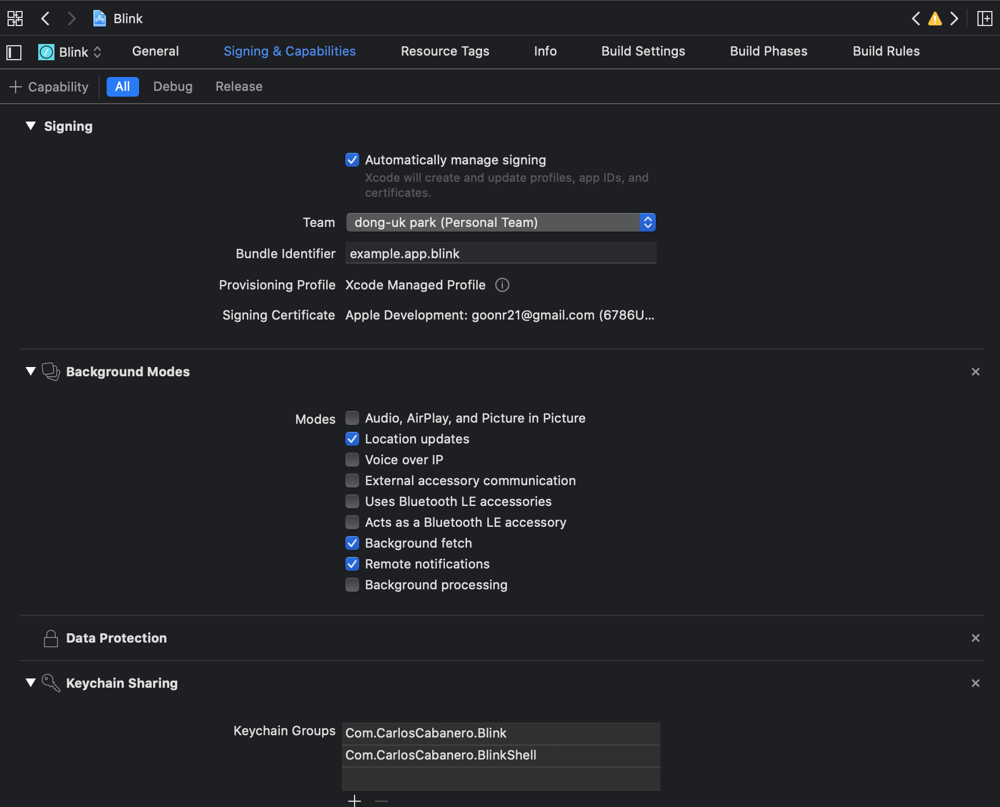

# 개발/비개발 도구

커맨드라인 도구는 [shell](./shell.md)에서 관리한다.

## 북마크 매니저 shiori

[https://github.com/go-shiori/shior](https://github.com/go-shiori/shiori)

Go로 구현되고, 웹 서버 + 클라이언트 조합으로 구성된다.

클라에는 chrome와 firefox 확장 프로그램
그리고 CLI로도 사용할 수 있다고 한다.

잠깐 사용해보니 괜찮은 거 같다. 특징은..:

* 셀프 호스팅
  * 직접 북마크 데이터의 저장 정책을 결정해야 한다.
* 사용자 구분
  * 처음 서버 실행하면 기본 계정으로 로그인해서 계정 생성
  * 시작 계정 정보는 `shiori`/`gopher`. 왜 서버 시작시 알려주지 않지?
* 태그 기능
* Archive 가능!
  * 레이아웃 그대로 저장되지 않는다.
  * 기본적으로 비공개지만, 공개할 수 있다.
  * 공개 취소가 안되더라... 버그인가?
* 클라로 크롬 확장프로그램을 사용하기 위해서는
https://github.com/go-shiori/shior
여기서 직접 확장프로그램을 로드해야 한다.

### 간단하게 사용해보기

[https://github.com/go-shiori/shiori/wiki/Usage](https://github.com/go-shiori/shiori/wiki/Usage)

위 링크에 잘 나와 있다.

크롬 기준 테스트 해본다:

1. 도커로 서버 실행: `docker run -d --rm --name shiori -p 8080:8080 -v $(pwd):/srv/shiori radhifadlillah/shiori`
2. [https://github.com/go-shiori/shiori-web-ext/releases](https://github.com/go-shiori/shiori-web-ext/releases)
zip 파일 받아서 압축 해제한다.
3. [chrome://extensions/](chrome://extensions/)
`Load unpacked` 압축 해제한 폴더 선택
4. shiori 아이콘이 생성되었으면 `우클릭 메뉴 - Options`
5. shiori 로그인 팝업 출력되면 입력:
Server: `http://localhost:8080`
Username: `shiori` Password: `gopher`

## MySQL

### MySQL Workbench

https://www.mysql.com/products/workbench/

`brew cask install mysqlworkbench`

가끔씩 발생하는 버그가 답답해서 요즘은 Datagrip을 많이 쓴다. 유로다.

### mycli

https://www.mycli.net

기본 mysql cli 보다 다양한 기능을 제공하는 도구.

`\dt`, `\G` 등 유용한 shortcuts.


## RedisInsight - GUI Redis Client

- https://redis.com/redis-enterprise/redis-insight
- https://github.com/RedisInsight/RedisInsight

osx는 `brew install --cask redisinsight`로 설치한다.

GitHub 릴리즈 날짜 기준 21년 11월에 최초 배포된 것으로 나온다.
지금 23년 기준으로 정말 얼마 안되었다.

redis 공식 도구이며, redis 문서는 방문할 때 마다 친절해서 놀라운데, 그 철학이 도구에도 담겼나보다.
실행하자마자 포트 번호로 찾는지, 로컬에 띄운 레디스 서버를 목록에 보여준다.
Browser 모드와 Workbench 모드가 있는데, Workbench 모드가 익숙한 에디터 형태로 쿼리한다.
이 에디터에서 공식 문서 수준의 자동 완성 기능을 제공하는데 매우 편리하다.

## API Clients

⚠️  2023년 9월. Insomnia가 버전 8.0.0으로 넘어오면서 로그인을 하도록 정책을 변경했다.
그러면서 기존의 로컬 데이터는 모두 사라지는 현상이 발생한다.
로그인하지 않아도 로컬 작업을 시작할 순 있지만 업데이트 이전에 사용하던 데이터를 불러오지는 않는다.
데이터 자체는 로컬 어딘가에 저장이 되어 있나보다. 나는 GitHub Private Repository에 연동해 두었기 때문에 push 했던 내용은 저장되어 있다.
확실치 않은데, Git 로그인 연동은 있지만 개인 저장소 동기화 방식은 사라진 듯하다. 이 기능 때문에 사용했던터라 사용 목적을 잃었다.

이번 정책은 매우 불합리하고 공격적이므로, Insomnia를 더 이상 사용하지 않는 편이 낫겠다.

Insomnia의 8.0 정책에 대한 불만들:
- [List all my stuff after the upgrade to 8.0.0](https://github.com/Kong/insomnia/issues/6606)
- [Upgrading to Insomnia 8 has deleted or hidden all of my queries and configuration](https://github.com/Kong/insomnia/issues/6585)
- [enshittification / needing an account](https://github.com/Kong/insomnia/issues/6577)

Insomnia의 8.0 이전 Fork인 [Insomnium](https://github.com/ArchGPT/insomnium)이 있다.
다만 Homebrew 설치를 아직 제공하지 않는다. 이걸 사용하거나 다른 대체제를 찾아야겠다.

---

standalone 버전인 Postman, Insomnia 그리고 IntelliJ 내장형 `.http`. 사용해보고 비교한다.

꼭 필요로 하는 기능은 다음과 같다:

* private 데이터 동기화
* api auth token, api path 등 민감 정보를 동기화 시 감출 수 있어야 함
* 자동 완성. `content-type` 헤더를 설정했으면 정의된 값들을 잘 알려주는 가 등
* curl로 import, export 가능

추가로 pre-request script 기능이 있으면 좋겠다. 호출 전에 토큰 정보를 받아올 때 유용하다.

### Insomnium

Insomnium은 Insomnia 8.0 이전 Fork이다.
Insomnia의 강제 로그인 정책이 제거되고 Git Sync 기능이 다시 복구된 버전이다.

https://github.com/ArchGPT/insomnium

2023년 10월 30일 기준, 아직 Homebrew에 등록되어 있지 않아서 GitHub Release에서 직접 다운받아 설치해야 한다.
Star가 1,500여개 이지만, 아직 8개의 배포만 있고 성숙한 저장소는 아니라서 조금 망설여진다.
하지만 Insomnia의 특정 버전과 같다면 사용하는데 문제는 없을 거 같다.

0.2.2까지 Git Sync 메뉴가 사라지는 문제가 있었고,
[0.2.3-a](https://github.com/ArchGPT/insomnium/releases/tag/core%400.2.3-a) 버전부터 복구되었다.

### Bruno

Insomnia 사태로 인해 Insomnium과 선택을 고민중인 API Client.

https://github.com/usebruno/bruno

Git Sync 기능을 제공한다.
Git 저장소 동기화를 매우 중요하게 생각한다고 느낌을 받았는데, 저장되는 파일 형식이 읽기 쉬운 형태로 되어있는 점이다.


`.bru`라는 별도 파일 확장자를 사용하지만 내용은 읽기 쉽다.

반면에 Insomnia는 yaml을 사용하지만 메타데이터가 많아서 읽기 어렵다.
폴더나 다른 연관 정보를 파일 내에 포함시켰기 때문인 것으로 보인다.

다음은 Insomnia의 Request 저장 내용:

```yaml
_id: req_7b1a2
type: Request
parentId: fld_8fe1d
modified: 1692343700512
created: 1675838070192
url: "{{ _.url.myApi }}/foo/bar/search"
name: 검색 /search
description: ""
method: GET
body: {}
parameters:
  - name: q
    value: 키워드
    disabled: false
    id: pair_664f8
  - name: page
    value: "1"
    disabled: false
    id: pair_5501a
headers:
  - name: accept
    value: application/json;charset=UTF-8
authentication: {}
metaSortKey: 0
isPrivate: false
settingStoreCookies: true
settingSendCookies: true
settingDisableRenderRequestBody: false
settingEncodeUrl: true
settingRebuildPath: true
settingFollowRedirects: global
```

아직 좀 더 살펴봐야 한다.
API Chaining은 어떻게 처리하는지, 자동완성 등 주요하게 봐야 할 점이 많다.

### Postman vs Insomnia vs IntelliJ builtin `.http`. 비교

|                    | Postman   | Insomnia                             | IntelliJ                             |
| ---                | ---       | ---                                  | ---                                  |
| 데이터 동기화      | 가입 필요 | Git repository 명시적 commit, push   | 파일 저장 위치를 cloud와 동기화 가능 |
| 민감 데이터 처리   | 불가      | export, 동기화 되지 않는 environment | 불가                                 |
| 자동 완성          | O         | O                                    | O                                    |
| curl exchange      | O         | O                                    | O                                    |
| pre-reqeust script | O         | O                                    | X                                    |
| open source        | X         | O                                    | X                                    |

종합적으로 Insomnia가 가장 만족스럽다.

Postman은 closed source + 데이터 저장을 postman에 위임해야 한다. 회사 토큰 정보라던지 민감 데이터가 저장되는 것은 별로다.
내 데이터를 export해서 드라이브에 저장하는 방식으로 동기했는데, 불편하다.
특히 로그인하지 않으면 매번 뜨는 로그인 유도 메시지를 무시하는 기능도 없다.

Insomnia는 version control을 기본으로, github 등에 private repository에 저장할 수 있다.
팀 간 API 공유가 필요하더라도 이 것으로 가능해 보인다. 유료 결제로 제공도 한다.

IntelliJ는 메인으로 사용해선 안되겠다. 개발하면서 에디터 방식이 편하다보니 많은 파일을 생성해 버렸는데,
IntelliJ 버전에 따른 변경사항이 있는 상황에서, 라이센스 문제로 버전을 바꾸다보니 잘 사용하던 것을 못쓰게 되기도 한다. (fallback license로 회귀)
구글 드라이브에 동기화 해놓고 사용하면 편리하긴 한데, 충돌이 잦다. 방금 수정한 데이터가 클라우드 버전과 맞지 않아 어느 것을 사용할 것인지 계속 물어본다.
그리고 이쪽이 부가기능이라 기능이 좀 부실하다. 개발 도구가 IntelliJ라면 접근성은 가장 좋다. Endpoints, Spring Annotation으로부터 바로 생성할 수도 있다.

IntelliJ가 업데이트될 때 마다 이 기능을 많이 개선되고 있다.
[2023 버전부터는 body에 대한 필드와 값도 자동완성](./jetbrains.md)을 지원한다.

## IntelliJ IDEA, DataGrip 버전을 fallback 버전으로 다운그레이드했다.

회사 라이센스가 만료되어 `2022.3` 버전에서 `2021.1` 버전으로 돌아갔다.
구매 요청하면 되지만, [perpetual 라이센스](https://sales.jetbrains.com/hc/en-gb/articles/207240845-What-is-a-perpetual-fallback-license)를 제공해서 사용하겠다 했다.
경험해보고 만족하면 개인적으로도 구매할 수 있을 거 같고, 최신 버전 사용하지 못한다고 해서 개발을 못한다고 생각하면 그건 또 자존심 상할 문제라고 생각했다.

어쨌든.. 다운그레이드했고, 몇가지 문제점은 있었다.

2023년 1월 기준 8개월 정도 사용했고, 커밋할 때 마다 매번 모두 검사하는 불편함은 있지만, 개발하는데 지장은 없다.

### 문제점 기록

#### IntelliJ scratches 폴더 미인식

[scratches](https://www.jetbrains.com/help/idea/scratches.html) 폴더를 내가 별도 설정하여 쓰고 있다.

구글 드라이브의 공유 폴더였고, 간단한 코드 조각들을 집, 회사 모두에서 쉽게 볼 수 있게하는 것이 목적이었다.
당시 kotlin 입문한 상황이라 이는 공부하는데 매우 유용한 방식이었다.

`Edit Custom Properties` 기능으로 `idea.scratch.path/scratches` 프로퍼티에 경로를 설정하였으나 먹히지 않았다.

해당 변수는 `2021.2` 버전부터 추가된 것으로 추정하고 있다.

`2021.2` 이전 버전에서는 `idea.scratch.path` 이 프로퍼티에 `scratches` 디렉토리가 있는 폴더의 경로로 설정해야 한다.

#### 프로젝트 열면 즉시 멈추거나 꺼지는 문제

처음에는 라이센스 문제인 줄 알았다. 현재 fallback license를 삭제하고 free tier로 하면 되었기 때문.

정확한 문제는 fallback license를 사용하기 위해서 로그인하고, 로그인한 계정을 동기화하면서 발생했다.

플러그인을 동기화하면서 문제가 되었는데, 플러그인 중 [Spring Initializr and Assistant](https://plugins.jetbrains.com/plugin/18622-spring-initializr-and-assistant)을 제거하니까 해당 증상이 사라졌다.

아무튼 IntelliJ에서는 어떤 이유로 종료된 것인지 메시지 없이 종료되기 때문에 찾기 어려웠다.
특히 문제가된 플러그인은 직접 설치한 것은 아닌 것으로 기억한다.

#### DataGrip 디렉토리 추가 안 됨

scratches 폴더 추가하는 것처럼 쿼리를 모아놓은 폴더를 추가하여 사용 중이다.
`Attach directory to project` 메뉴로 그냥 추가하면 된다. 문제는 해당 기능을 눌러도 아무 반응이 없다.

아직 이유를 찾지 못했지만, 새로운 프로젝트를 추가하여 재현해보면 잘 됐다. 그래서 거기다 추가하고 connection 정보도 옮겨서 사용했다.

이 문제도 메뉴를 선택해도 무반응이며, 에러 메시지도 없다.

## Blink Shell

iOS용 터미널 앱. [App Store](https://itunes.apple.com/app/id1156707581)에서 판매하는데, 가격은 매우 비싸다.

코드가 공개되어 있어서, 직접 빌드해서 사용할 수 있다: https://github.com/blinksh/blink

### Build

저장소에 쉽게 설명되어 있다.

```bash
git clone --recursive https://github.com/blinksh/blink.git && \
cd blink && ./get_frameworks.sh
```

1. 저장소 클론 받고, 쉘 스크립트를 실행하면, 관련 라이브러리를 알아서 받는다. 5분쯤 걸렸다.
2. XCode로 클론받은 저장소를 연다.
3. (필요시) Signing & Capabillity 에서 불필요한 권한을 제거한다.
4. 빌드한다. 끝.

3번에 대해서, XCode의 Signing & Capabillity에 가면 코드에 서명을 할 수 없다.
Push notification, ICloud 권한이 없다는 것인데.
개발자 등록을 하지 않았으니 사용할 수 없다. 권한을 제거하자.
해당 탭에서 스크롤을 내리면 권한이 등록되어 있는 것을 볼 수 있는데, X를 눌러 제거하자.

최종적으로 대략 이런 모양이다:



직접 빌드하면 **1주에 10회, 일주일이면 빌드한 앱은 만료**된다는 제약 사항이 붙는다.
