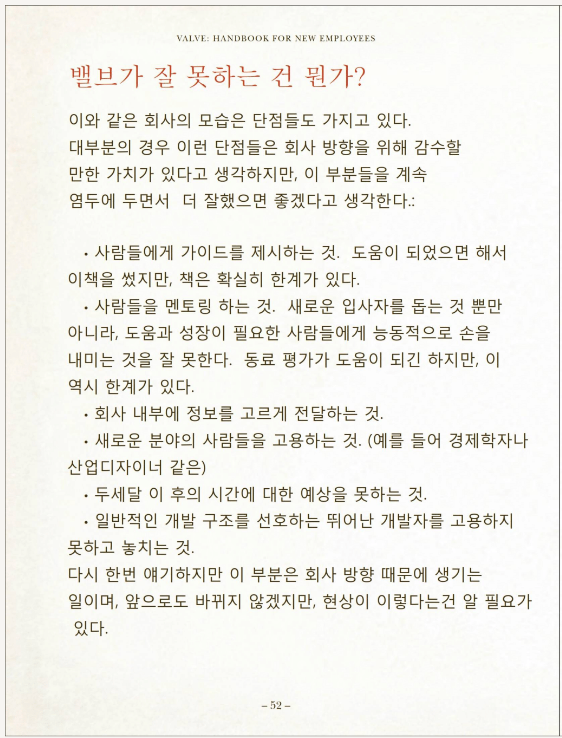

# Valve사의 신규 입사자를 위한 핸드북

https://www.google.com/search?q=valve+%EC%9E%85%EC%82%AC%EC%9E%90%EB%A5%BC+%EC%9C%84%ED%95%9C+%ED%95%B8%EB%93%9C%EB%B6%81

한국어 번역판 pdf가 공유되어 있다.

## 책갈피

### P52. 밸브가 잘 못하는 건 뭔가?

이 챕터를 보면 뛰어난 개발자를 일컫는 문장이 있다.

> 일반적인 개발 구조를 선호하는 뛰어난 개발자를 고용하지 못하고 놓치는 것.

영문으로는 이렇다:

> We miss out on hiring talented people who prefer to work within a more traditional structure.

일반적인 개발 구조가 뭘까? 누구나 직관적으로 알 수 있는 코드 구조를 말하는 건가?
