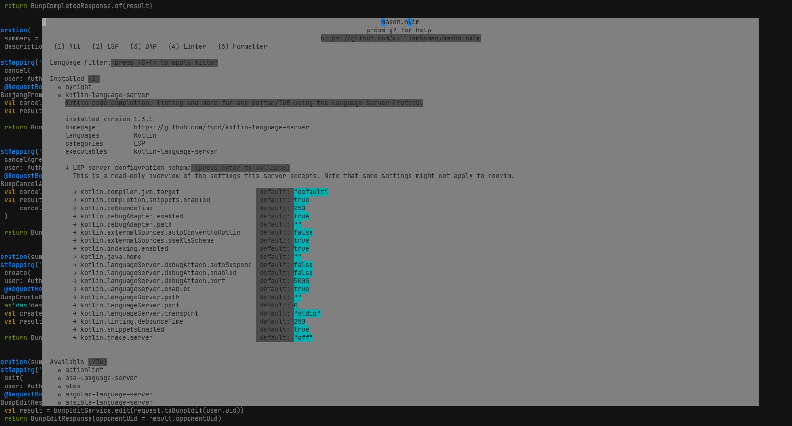
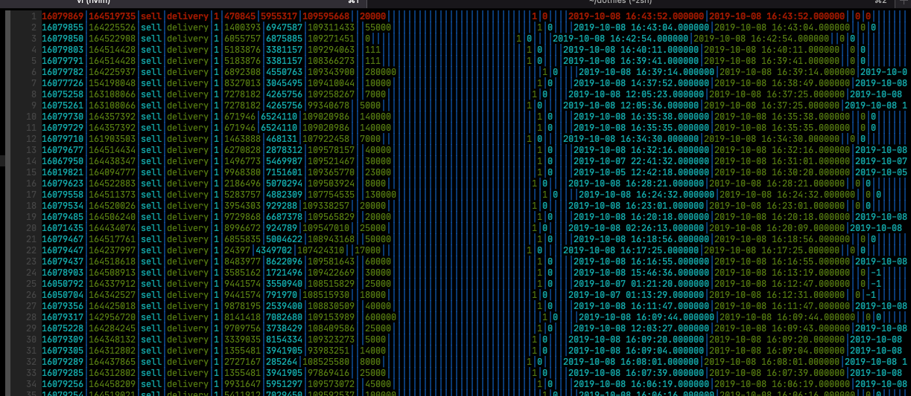
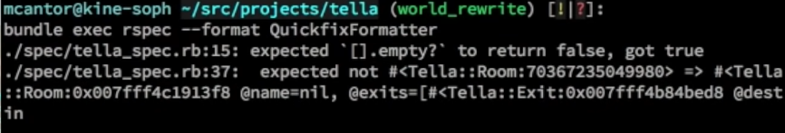

# Vim

vim 보다 [neovim](https://github.com/neovim/neovim).

My [.vimrc](https://github.com/Edunga1/dotfiles/blob/master/vim/.vimrc)

# neovim

## Lua 가이드

https://github.com/nanotee/nvim-lua-guide#modules

* 내 custom lua 파일을 가져올 때 lua/ 내에서 찾는다.
  * runtimepath간 이름 충돌이 발생할 수 있다.

## 내장 Language Server Protocol 사용하기

[Language Server Protocol](./language-server-protocol.md)

TL;DR
* [nvim-lspconfig/server_configurations.md](https://github.com/neovim/nvim-lspconfig/blob/master/doc/server_configurations.md) 제공하는 language server 목록
* `:Mason` 설치 가능한 language server 목록
* [null-js/BUILTIN_CONFIG](https://github.com/jose-elias-alvarez/null-ls.nvim/blob/main/doc/BUILTIN_CONFIG.md) 제공하는 lsp 도구 목록

vim을 IDE처럼 사용하기 위한 설정. 이제 LSP로 통일되고 있다.

[.vimrc](https://github.com/Edunga1/dotfiles/blob/master/vim/.vimrc#L28-L33)

```
Plug 'neovim/nvim-lspconfig'              " Quickstart configs for Nvim LSP
Plug 'williamboman/mason.nvim'            " Portable package manager for Neovim
Plug 'williamboman/mason-lspconfig.nvim'  " Extension to mason.nvim
Plug 'jose-elias-alvarez/null-ls.nvim'    " Inject LSP diagnostics, code actions, and more via Lua
```

[nvim-lspconfig](https://github.com/neovim/nvim-lspconfig) LSP 설정할 수 있다. 이것만 필수사항.
[mason](https://github.com/williamboman/mason.nvim) language server, 추가 도구를 관리한다. 직접 executable 설치해야 하는 수고를 덜 수 있다.
[null-ls](https://github.com/jose-elias-alvarez/null-ls.nvim) diagnostic, linter, code action을 연동해 준다.

Language Server 설치 예시: `:MasonInstall kotlin-language-server`



init.lua에서 설정 필요:
```lua
-- LSP manager
require("mason").setup()
require("mason-lspconfig").setup()

-- LSPs
require'lspconfig'.kotlin_language_server.setup{}
```

# Use cases

## 파일 검색

[fzf.vim](https://github.com/junegunn/fzf.vim)이 제공하는 기능 몇가지를 사용한다.

1. ctrl + p

```vim
nnoremap <expr> <C-p> (len(system('git rev-parse')) ? ':Files' : ':GFiles --exclude-standard --others --cached')."\<cr>"
```

이 방법은 별도 검색창이 출력되고, interactive하게 파일 이름을 검색한다.

2. `:Rg` or `:Ag`

각각 [ripgrep](https://github.com/BurntSushi/ripgrep), [the_silver_searcher를](https://github.com/ggreer/the_silver_searcher) 사용한다.
따라서 각 도구 설치가 필요하다.

보통 `:Rg wiki`와 같은 방법으로 명령어를 통해서 1차 검색하고 검색창에서 추가 필터링한다.
이 방법은 파일 내용도 함께 검색한다.

두 도구 차이점은 모르겠다. 검색 결과는 조금 다르다.

# quickfix & location list

`:h quickfix` `:h location-list`

파일 위치를 목록으로 관리한다.
quickfix는 모든 창에서, location-list는 현재 창에서만 유지한다는 점이 다르다.

ref. https://freshman.tech/vim-quickfix-and-location-list/

목록에 나타난 코드를 한꺼번에 수정할 수 있는데, 동시에 여러 파일을 수정하는 용도로 사용한다.

## commands

* `cnext`: 다음 지점으로.
* `cprevious`: 이전 지점으로.
* `copen`: 목록을 연다.

location-list의 명령어는 prefix `c` -> `l` 바꾸면 대응한다.

## grep

e.g. `:vimgrep /myfunc/ **/*.c`

`:h vimgrep` `:grep` `:lgrep`(location-list)

패턴을 검색하고 결과를 quickfix 목록으로 만든다.

## `cdo`, `ldo` 검색된 모든 entry에 명령어 적용

`cdo s/foo/bar` `ldo s/foo/bar`

quickfix, location-list 검색 결과에 명령어를 적용한다.

grep으로 검색하고, cdo로 적용, 예시:
1. `:vimgrep foo **/*.md` 모든 `md` 파일에서 `foo` 검색한다.
2. `:copen` 검색 결과 확인하고.
3. `cdo s/foo/bar` 검색 결과에서 `foo` -> `bar` 대체한다.

`:cdo s/foo/bar | update`

`| update`를 사용하면 수정과 함께 저장한다.

## `cfdo`, `lfdo` 검색된 모든 파일에 명령어 적용

`:cfdo %s/foo/bar` or `:ldo %s/foo/bar`

`cdo`와 차이점은 파일 모든 내용에 대해서 적용한다는 점이 다르다. 검색 목록에서 보이지 않는 라인도 적용되니 주의.

### `bufdo` 모든 buffer 파일에 명령어 적용

`:bufdo %s/foo/bar`

모든 buffer에 대해서 적용하므로 `:buffers`등 명령어로 적용 대상을 잘 확인하자.

# Variables

## `path`

`:find` 검색 범위를 결정한다.
`:find foo` 파일이나 디렉토리를 검색하고 연다,
<cr> 대신 <tab>으로 모든 결과를 가져오자.

https://youtu.be/GyPXYF6jgwk?t=325
netrw, find 사용법

`set path+=**` `**`를 추가하면 현재 폴더 내 모든 범위를 검색한다.
`**` 사용하기 전과 비교해보면 검색 수가 달라지는 것을 알 수 있다.
`.gitignore`의 무시한 파일, `node_modules` 같이 무거운 폴더도 검색된다.

# Plugins

사용중인 플러그인.

## chrisbra/csv.vim



csv 파일의 highlighting, 열과 행에 대한 처리 도구를 제공한다.

newline이 포함되면 큰 따옴표로 묶어서 표현되기도 하는데, 인식 못하는 문제가 있다.

### Features

`:DeleteColumn 2-4` 2~4열 제거. `:DeleteColumn 2` 2열만 제거

## tpope/vim-fugitive

https://github.com/tpope/vim-fugitive

### `:Git`

[Git Fugitive how to git add a visually selected chunk of code - stackexchange](https://vi.stackexchange.com/a/28251.md)

`:Git` 실행하면 현재 git status를 보여준다.
여기서 꽤 많은 일을 처리할 수 있는데, `g?` 입력하면 도움말을 볼 수 있다.

파일 경로에서 Enter 누르면 해당 파일의 Buffer를 연다.

원하는 라인만 stage 또는 unstage 하거나, discard 하고 싶다면:
1. 먼저 변경하려는 파일에서 `>` 눌러 변경 사항을 확인
2. 원하는 라인으로 이동해서 visual mode로 선택 후 실행
  * `s`: stage
  * `u`: unstage
  * `X`: discard

unsage 하려면 Staged 목록에서 보여지므로 이동하여 `u` 눌러야 한다.

`:Git` 입력하면 이렇게 표시된다:

```fugitive
Head: main
Merge: origin/main
Help: g?

Unstaged (1)
M docs/wiki/vim.md

Staged (1)
M docs/wiki/vim.md
```

# 용어

## `-- More --`라고 출력되는 pager

`:h pager`로 pager에 대한 정보를 알 수 있다.

`:let`이나 `:highlight` 등 명령어를 입력하면 `-- More --` 메시지가 있는 pager로 진입한다.

```vim
Special        xxx ctermfg=224 guifg=Orange
SpecialChar    xxx links to Special
Delimiter      xxx links to Special
SpecialComment xxx links to Special
Debug          xxx links to Special
DiagnosticError xxx ctermfg=1 guifg=Red
DiagnosticWarn xxx ctermfg=3 guifg=Orange
DiagnosticInfo xxx ctermfg=4 guifg=LightBlue
DiagnosticHint xxx ctermfg=7 guifg=LightGrey
-- More -- SPACE/d/j: screen/page/line down, b/u/k: up, q: quit
```

다른 화면과 달라서 처음 만나면 당혹스럽다. 어쨌든 `q`를 입력하면 빠져나오고
`hjklud`키로 이동도 된다. 하지만 검색 기능도 없고, 뭐라고 검색해야 할 지 모르니 당혹스럽다.\
일단, 검색 기능은 없다 :(

하지만 `:redir`을 통한 출력 전환으로 레지스터로 저장할 수 있다.

```vim
:redir @a    " a 레지스터에 출력을 전환
:highlight   " pager로 출력되는 명령어 실행
G<CR>        " 맨 아래로 이동하고 빠져나오자. 보여진 만큼만 저장된다.
:redir end   " 출력 전환 종료
"ap          " a 레지스터 내용 붙여넣기
```

[How can I perform a search when vim displays content using "more" pager?](https://vi.stackexchange.com/q/5729)\
이 질문에서 정보를 얻었다.

덧글에 pipeline을 통한 짧은 버전도 있다:

```vim
redir @a | sil highlight | redir end   " @a 전환, 명령(silently), 전환 종료
"ap                                    " a 레지스터 붙여넣기
```

명령어로 만들어둬도 좋겠다:

```vim
command! -nargs=1 -complete=command Redir redir @a | sil <args> | redir end | echo "Saved to @a"
```

이렇게 사용할 수 있다:
`:Redir highlight`
`:Redir let`

# Tips

## mapping 시 `:...<cr>` vs `<cmd>...<cr>`

* `nnoremap [w :lprevious<cr>`
* `nnoremap [w <cmd>lprevious<cr>`

두 코드 모두 `[w` 단축키에 `lprevious<cr>` 명령을 매핑한다.

`:h <cmd>`
> The <Cmd> pseudokey begins a "command mapping", which executes the command
> directly (without changing modes).  Where you might use ":...<CR>" in the
> {rhs} of a mapping, you can instead use "<Cmd>...<CR>".

`<cmd>`는 모드 변경없이 명령을 실행한다고 되어있다.

두 방식을 비교해보면, `:...<cr>`는 실행한 명령어가 입력창에 남아있다.
반면에 `<cmd>...<cr>`는 남아있지 않다.

## 프로파일링 하기

이유없이 느려진다면 프로파일링 해보자.

아래 함수 내용을 직접 실행하거나, 번거로우니 함수 자체를 정의해두고 `:call StartProfiling()` 호출하자.
느려지게 만드는 액션을 하고 `:profile stop` 또는 vim에서 나가면, `vim-profiling.log` 파일이 생성된다.

```vim
function! StartProfiling()
  :profile start vim-profiling.log
  :profile file *
  :profile func *
  echo 'profiling is started. log file: vim-profiling.log'
endfunction
```

## text object 개선하기

vim에서 기본적으로 `viw`로 단어를, `vip`로 문단을 선택할 수 있다.
더 나아가서 각 언어에 맞게 함수, 클래스를 선택할 수 있는 방법이 있다.

선택 단위를 text object라 한다. `:h text-objects` 참고하자.

[Python](python.md)은 들여쓰기로, [Javscript](javascript.md)는 중괄호로 함수를 표현한다.
이렇게 언어마다 달라지는 부분을 표현하기 위해서 저마다 설정이 필요하다.

파이썬에 맞는 text object를 제공하거나,
Selection을 점진적으로 확장/축소하는 기능을 제공하는 플러그인이 있다.

### vim-pythonsense

[vim-pythonsense](https://github.com/jeetsukumaran/vim-pythonsense)

[vim-textobj-python](https://github.com/bps/vim-textobj-python) 이건 제대로 동작하지 않았다.

**vim-pythonsense** 플러그인은 파이썬의 Text Object를 제공한다.
뿐만 아니라 Text Object로 점프하는 기능도 제공하는데,
나는 이 기능은 막았다.

설정을 통해 키 매핑을 비활성화 할 수 있다:

```vim
let g:is_pythonsense_suppress_motion_keymaps = 0
let g:is_pythonsense_suppress_keymaps = 0
let g:is_pythonsense_alternate_motion_keymaps = 0
```

### vim-expand-region

[terryma/vim-expand-region](https://github.com/terryma/vim-expand-region)

Expand Selection, Shrink Selection 기능을 제공하는 플러그인.

VSCode, Intellij 에서도 이 기능이 있다.

`+` 키를 누르면 단어 -> 문자열 -> 괄호 -> 한 줄 -> 함수 -> 클래스 순서로
점진적으로 Selection 한다. `-` 키는 그 반대로 동작한다.

`vim-textobj-python` 플러그인이 없으면, 함수, 클래스 레벨에서 제대로 동작하지 않는다.

별다른 설정을 하지 않으면, 첫 레벨부터 렉이 있어서,
다음과 같이 설정하여 사용하고 있다:

```vim
call expand_region#custom_text_objects('python', {
  \ 'af' :1,
  \ 'if' :1,
  \ 'ac' :1,
  \ 'ic' :1,
  \ })
```

## `command` 대신 `command!`를 사용하자.

`.vimrc`를 리로드하면 이미 정의된 command라고 에러가 나는 경우가 있다:

```bash
Error detected while processing /home/pair/.vimrc:
line  375:
E174: Command already exists: add ! to replace it
```

해결하기 위해선 힌트 그대로, `!` 만 붙여주면 된다. 그러면 replace 하므로 에러가 발생하지 않는다.

다음과 같은 구문이 있으면

```bash
command TestCore call <SID>run_test_core()
```

다음과 같이 변경해주면 된다.

```bash
command! TestCore call <SID>run_test_core()
```

# `:make` and `makeprg`

`:make` 명령은 `makeprg`에 설정한 것을 실행한다.
출력이 quickfix 양식이면 quckfix과 연동할 수 있다!

## build integration - How to Do 90% of What Plugins Do

https://youtu.be/XA2WjJbmmoM?t=3062

영상 52분의 build integration 주제에서 설명한다.
vim 내에서 테스트를 실행하고, 실패한 테스트가 있으면 quickfix를 통해 실패 지점으로 네비게이션할 수 있다.

영상 일련 과정:

1. `makeprg` 설정한다.: `set makeprg=bundle\ exec\ rspec\ -f\ QuckfixFormatter`
2. `:make` 명령으로 `rspec` 테스트 실행한다.
3. 테스트 실패한 지점을 quickfix로 보여준다.

`rspec`명령에 `--format QuckfixFormatter` 옵션으로 quickfix에서 사용할 수 있는 양식으로 출력된다.



다만 기본 제공되는 것은 아니고, 플러그인 같아 보인다. 문서에는 `QuickfixFormatter`에 대한 내용이 없다.

ref. python traceback을 quickfix와 연동할 수 없냐는 질문: [Quickfix support for Python tracebacks](https://vi.stackexchange.com/questions/5110/quickfix-support-for-python-tracebacks)

# Issues

## Typescript filetype 문제

typescript language server에서 JSX 문법을 확인하지 못한다면 파일 타입을 확인해보자.
`:set ft?`로 확인했을 때 `typescriptreact`가 아니라 `typescript`면 문제가 있다.

`:set filetype=typescriptreact`로 변경하면 JSX의 하이라이팅이나 타입 체크가 정상적으로 동작한다.

`.vimrc`에 filetype을 변경하도록 설정하자:
```vim
" set filetypes as typescriptreact
autocmd BufNewFile,BufRead *.tsx,*.jsx set filetype=typescriptreact
```

ref. https://github.com/peitalin/vim-jsx-typescript#vim-jsx-typescript
> Changelog: filetypes were updated from typescript.tsx to typescriptreact Please set filetypes as typescriptreact, not typescript.tsx as in prior versions in your .vimrc if you have any issues

ref. https://github.com/leafgarland/typescript-vim/issues/158#issuecomment-589954199
> This brings a new problem. Typescript language server excepts from a typescript file to not have JSX in it. Which means that <> is considered a type assertion, JSX is not recognized as JSX but as regular Typescript syntax and the list goes on.

## `vim-colors-solarized` colorscheme 플러그인이 점점 느려지게 만드는 현상

vimwiki로 문서 수정할 때, `<cr>` *엔터를 꾹 누르고 있으면 점점 느려지는* 문제.
vimwiki가 키보드 엔터 시 함수 호출이 많다. 그래서 더욱 돋보이는 듯 하다.

프로파일링 결과:
```
FUNCTIONS SORTED ON TOTAL TIME
count  total (s)   self (s)  function
    4   1.671452   0.000150  <SNR>199_CR()
    4   1.669305   0.000430  vimwiki#lst#kbd_cr()
    4   1.667958   0.000952  <SNR>211_cr_on_empty_line()
    1   0.261215   0.000028  vimwiki#u#count_exe()
    1   0.261187   0.000350  vimwiki#lst#kbd_o()
    5   0.093622   0.009607  <SNR>211_get_corresponding_item()
   16   0.087560   0.002484  airline#check_mode()
```

colorscheme 옵션을 제거하면 괜찮다.
`soliarized`로 사용하고 있었다:
```vim
colorscheme solarized
```

`:echo g:colors_name`로 현재 colorscheme을 알 수 있다. 변수를 찾을 수 없으면 사용하지 않는 것.

colorscheme을 제외하고 재현하면 간헐적으로 느려지긴 한다. 하지만 곧바로 복구된다. colorscheme을 사용할 때는 한 번 느려지면 다시 vim 실행하기 전까지는 복구되지 않는다.

## Ubuntu에 설치한 vim이 시작 시 `.vimrc`에서 많은 에러가 발생하는 현상

askubuntu 질문: [vi, getting multiple "Sorry, the command is not available in this version..." after reinstall](https://askubuntu.com/questions/284957/vi-getting-multiple-sorry-the-command-is-not-available-in-this-version-af)

올바른 vim 버전인지 확인하자. vim.tiny로 설치되었을 수 있다:
```bash
$ readlink -f `which vim`
/usr/bin/vim.tiny
```

ubuntu에서는 풀 버전의 vim을 설치하지 않는다고 한다. `/usr/bin/vim.basic`을 가르켜야 한다.
최근에는 neovim을 사용하고 있어서 이 편이 더 좋을지도.
