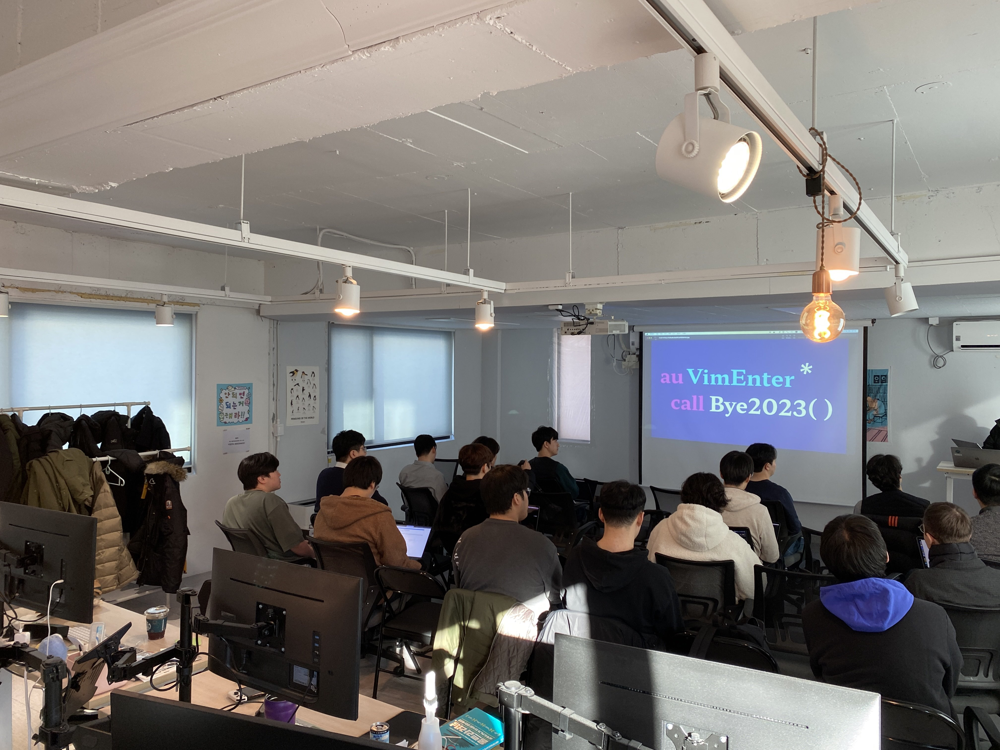

# VimEnter 2023

Vim 커뮤니티 모임 VimEnter 2023 참가 후기.

2023년 12월 23일 토요일에 진행되었다.

## 기대

회의든 컨퍼러스든 어떤 이벤트가 있으면, 어떤 이야기를 할 지 예측하는 재미가 있다.
맞아떨어지면 내가 사전 준비를 잘한 것이니 좋고, 그렇지 않으면 무엇을 놓쳤는지 생각해 볼 수 있기 때문이다.\
이 행사는 그러지 않았다. [vim](./vim.md) 밋업에 대한 이야기라 설렘이 컸기 때문이다.

티켓 링크는 https://event-us.kr/vim/event/74978 이다.\
3만 원이라는 참가비가 컸지만 설렘이 있고, Save the Children에 참가비가 기부된다 하여 흔쾌히 신청했다.

일정은 오후 3시부터 6시까지였다.

VimEnter 2023은 진행할 계획은 없었지만, Korean Vim User Group 디스코드 서버를 개설하고,
개설자 분의 도움으로 진행하게 되었다고 한다.

디스코드에 행사장 사진을 올려주셔서 얻을 수 있었다 :)

Bram Moolenaar에 대한 추모와 함께 시작했다.

행사 이름은 `au VimEnter * call Bye2023()`인데, 모든 파일 타입에 대해서 시작 시 `Bye2023()` 함수를 호출한다는 의미다.
실제로 vim을 시작하면 크리스마스 트리가 출력되도록 `Bye2023()`을 구현한 것을 보여주셨다 :D

## 세션

순서별로 정리했다.

### Vim 힘들고 빠르게 배우는 방법

행사 장소를 빌려주신 회사의 한윤석님의 발표.
vim을 배우는 방법에 대한 이야기.

---

vim 외 에디터를 모두 제거하여, 항상 사용할 수 밖에 없는 환경을 강제한다.

이 방법이 무책임한 방법은 아니다.
[울트라 러닝](https://www.yes24.com/Product/Goods/87490484)이라는 책에서 영감을 얻었다.

책 저자는 모국어를 사용할 수 없도록, 배우려는 언어의 나라로 가서 환경을 강제한다고 한다.
이 방법으로 몇 개월 이내에 언어를 배우는데, 언어당 몇 개월 이내로 배울 수 있다고.
책에서는 한국어도 배우는데, 가장 어려운 언어라고 한다.

vim을 알려주는 멘토가 있었다.
vim은 다른 에디터에서 제공하는 기능이 없는 경우가 있는데, 멘토는 구현해야 한다고 했다.
그래서 현재 커서의 테스트 함수를 실행하는 플러그인을 직접 구현했다고 한다.

이런 경험을 바탕으로 VSCode의 번역 플러그인 등을 구현했다.

---

VSCode의 플러그인을 구현했다는 점이 인상적이었는데,
vim을 사용하다보면 도구에 대한 관점이 조금은 달라지는 거 같다.
다른 도구는 주어지는 기능과 플러그인을 사용하는 정도에 그치지만,
vim을 사용해 보면 내 입맛에 맞게 도구를 수정하고픈 욕구가 생긴다.
발표자분도 그래서 VSCode의 플러그인을 만들어 본 것이 아닐까.

### toggleTerm 플러그인으로 내 손에 맞는 터미널 환경만들기

Front-end 개발자 조성진님의 발표. 주로 [Typescript](./javascript.md)와 lua를 사용하신다고.

2개 플러그인을 소개하고 응용한 경험을 공유했다.

---

Lua로 vim 구성하고 있어서 lazy.nvim을 플러그인 매니저로 사용한다.

소개하려는 플러그인은 [toggleterm.nvim](https://github.com/akinsho/toggleterm.nvim) 터미널 세션을 관리한다.

프로젝트 작업을 하면서, 서버를 하나 띄우는 터미널과 단발성으로 사용하는 터미널을 구분하고 싶다.

toggleterm.nvim으로 완성한 환경은 다음과 같다.

- `c-\`로 터미널 연다. 이 방법으로는 항상 새로운 터미널 세션을 연다.
- 특정 명령어로 서버를 띄우는 터미널을 연다. `esc`로 터미널을 닫고, 나중에 이 세션을 다시 열 수 있다.
- vim을 종료하면 서버를 띄웠던 터미널도 종료한다.

tmux도 사용은 하나, 불편함이 있어서 toggleterm.nvim을 사용한다.

응용하여 다양한 터미널 세션을 만들 수 있는데,
jira-cli를 이용해서 할당받은 task만 확인하는 터미널을 띄우는 명령어도 사용중이다.

두 번째 플러그인은 [alpha.nvim](https://github.com/goolord/alpha-nvim) 초기화면 대시보드.

정보를 최소화하는 것을 선호하는데 그래서 alpha.nvim을 사용한다.
그리고 개발 환경에서 중요하다고 생각하는 점들이 있다.

- 터미널에 가까울수록 좋다.
- 필요한 만큼만 커스텀 가능해야 한다.
- 필요하면 개선할 수 있어야 한다.
- 개발할수록 즐거움이 있어야 한다.

유튜브에서 vim을 사용하는 넷플릭스 개발자(누군지 못찾겠다.)로부터 영감을 받았다고 한다.

---

내가 "개발할수록 즐거움"에 대해서 질문했다.\
답변은 내가 만든 것을 잘 사용하면서 오는 뿌듯함. 물론 과정은 그렇지 않았다고 답변하셨다.

또다른 질문은 which-key를 사용하는지에 대한 질문이었다.
정보 최소화를 위해서 많은 keymap을 조심해서 사용한다고 발표했는데, 여기에 대한 질문인 듯.\
답변은 `:Telescope`의 keymap 으로 확인하지만 사용할 일이 없다고 한다.

which-key는 https://github.com/liuchengxu/vim-which-key 플러그인 말하는 듯?

### VimWiki 전용 LSP를 만들자

이종립님의 발표. 개인적으로 기대하는 발표였다.

나만의 [LSP](./language-server-protocol.md)를 만드는 것 자체가 멋져 보였고,
vim 외에도 문제를 인식하고 해결하는 방법이 세련되다고 평소에 생각한다.

- 발표자료: https://johngrib.github.io/wiki/article/vimwiki-lsp/
- lsp project: https://github.com/johngrib/johngrib-wiki-lsp

---

[vimwiki](./vimwiki.md)를 Fork하여 사용중이다. 사용하지 않는 기능을 제거하고, 필요한 기능을 추가했다.

*johngrib-wiki-lsp* 이름으로 LSP를 만들었다. vimwiki 링크 기능을 개선하고 싶었다.

Intellij와 소켓 통신하여 kotlin 개발을 도와주는 플러그인이 있는데, 사용해 보면서 내가 개선할 수 있는 환경에 대한 요구사항이 생겼다.

vim은 작은 코드 조각으로 동작하는 점이 매력적이다. 그러나 vimscript는 그렇지 않다.
Hammerspoon 등에서 사용중이지만, Lua도 좀처럼 익숙해지지 않는 언어이다.

(그래서 플랫폼에 종속되지 않는 방법으로 환경을 개선할 수 있었으면 한다.)

vimwiki lsp를 만드는 과정은 chatgpt 도움을 받아서 구현하고, coc.nvim으로 vim과 연동하면 쉽겠다고 판단했다.\
vimwiki lsp를 만들면 vim을 잘 모르더라도 사용할 수 있도록 환경을 만들 수 있을 거 같았다.

(vimwiki는 자체 제공하는 vimwiki 파일 타입과 markdown 파일 타입 모두 제공하는데) vimwiki와 markdown 링크의 간극이 있다.

관리하는 문서가 많아지면서, 일일이 문서 경로를 찾기가 어려웠다. 그래서 링크를 fzf, telescope로 직접 찾아서 등록하고 싶었다.\
(vimwiki는 `<cr>`로 문자열 그대로 링크를 생성한다.)

더 나아가서 슬래시를 입력하면 문서 링크를 찾을 수 있게 하고싶다. 이를 위해선 LSP가 필요하다.\
LSP를 구현하는 간단한 [튜토리얼](https://www.toptal.com/javascript/language-server-protocol-tutorial)이 있어서, 본격적으로 개발하기 전에 참고하였다.

몇 가지 기능을 구현했는데, 자동 완성 기능은 문서 링크나 리소스 파일 경로를 자동 완성한다.
잘못된 경로는 diagnostics 판단해 알려준다.

또다른 기능은 문서 링크에서 문서 제목을 보여주는 기능이다.
lsp diagnostics에 커서를 올리면 경고 문구를 보여주는 것처럼 문서 링크에 커서를 올리면 문서 제목을 파싱하여 보여준다.

lsp를 구현하면서 좋았던 점은 플랫폼에 종속되지 않는 방법으로 구현했다는 점이다.
vimscript, lua를 사용하지 않고 구현했으며, 해보진 않았지만 vscode 에서도 동작할 수 있을 거 같다.

### Windows Unreal Engine 개발자의 Neovim

게임 개발자인 이효승님의 발표.

unreal engine 개발 이전부터 사용해왔음
게임 엔진 자체가 매우 무거운 프로그램인데, 에디터까지 무거운 매우 불편한 환경이라 neovim으로 가벼운 에디팅 환경이 필요했다.
visual studio는 매우 무겁다. 다른 게임 엔진들도 visual studio 사용을 가정하고 tool chain이 제공된다.
neovim으로 UE에서 debug는 하지 않는다.
UE에서 neovim lsp 사용하는 것이 목표.

windows에서 neovim 설치부터 시작하자.
`winget` 사용. config는 `%AppData%`에 있음.
GUI 사용하는 편이 편리함. Neovim-QT. neovim 설치하면 기본으로 설치됨. neovide라는 선택지도 있다.
마우스 인터랙션 잘 됨
윈도우즈는 c빌드가 필요한 플러그인 설치함에 어려움 있음. 기본적인 도구가 제공되지 않기 때문. 따라서 별도 설치해야 한다.
developer command prompt for vs 2022 설치 필요.
telescope, treesitter 플러그인이 빌드가 필요함.
UE는 c++ 사용하므로 clang lsp 사용.

UE Project Setting
모듈 단위로 dll 생성하여 링크함. 모듈마다 dependency 관리됨.
엔진에서 자동으로 생성하는 소스 코드
PS, xbox 등 게임 플랫폼마다 달라지는 매크로들. 빌드 타켓에 따른 매크로.
Unreal Build Tool(UBT)라는 도구로 Compile DB 생성, clang lsp로 인덱싱하여 LSP 사용.
이제, UE가 제공하는 정의에 대해 접근할 수 있다.
인덱싱 매우 느림. 1만가지 심볼에 대해서 수십시간 소요.

결론: UE + neovim + clang 쓸만하지만 완벽하지 않다. neovim의 생산성이 좋다.
메인을 vs, 서브로 neovim 사용.

### 트리시터로 나만의 플러그인 만들기

[classy.nvim](https://github.com/jcha0713/classy.nvim) 플러그인을 만든 차주훈님의 발표.

https://github.com/nvim-treesitter/playground

트리시터는.. 구문 분석 framework. 점진적 구문 분석.
기존 IDE가 가진 문제점. 특정 언어에 특화된 기능, 파일 크기에 비례하는 하이라이트 등 처리 속도.
neovim 0.5 부터 tree-sitter 공식 지원.
LSP도 0.5부터 지원함. lsp는 프로젝트 범위에서 언어 기능을 위한 프로토콜.
tree-sitter는 하나의 버퍼에 대한 기능.
classy.nvim은 html "class" 속성을 제거, 닫은 태그에서 사용할 수 있고, html 외 파일에서도 동작하는 플러그인.
플러그인 제작에 영감받은 플러그인은 되지 않았다.
tree-sitter API를 이용하여 속성 추가, 제거 등 처리한다.
html과 jsx와 다른 부분을 이해해야 했음. jsx에서는 className을 사용.
tree-sitter 플러그인 개발하려면 treesitter/playground가 필요한데, 0.10 버전부터는 내장되어 별도 설치 필요 없음.
`:InspectTree`라는 명령어로 언어위에서 적용되는 treesitter 구문을 열 수 있음. 실시간 적용가능한 도구를 제공해서 유용.

### Neovim으로 생산성 퀀텀점프하기 Part 2

이재열님의 발표.

이전 발표에서 이어지는 점.
내 workflow를 meovim으로 개선하자.
read, w, m, select, d로 우리가 하는 작업을 atomic 분해할 수 있겠다.
행동에서 소용되는 시간을 최적화 하자.
- 손을 움직이는 것을 줄이는 것
- 인지부하를 줄이는 것
- snippet 등으로 명령을 줄이기
의미론 단위로 일을 처리하면 단순화할 수 있다.

## 소감

TBD
