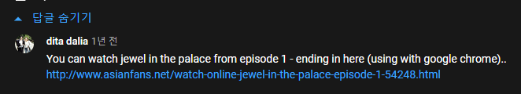
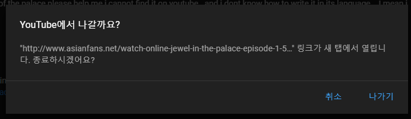
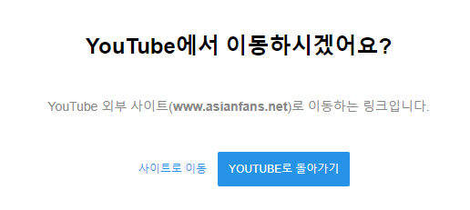

# 웹 개발

# GDG WebTech Workshop "측정하는 놈, 로딩하는 놈, 그리는 놈"

[2016-08-27 GDG WebTech Workshop "측정하는 놈, 로딩하는 놈, 그리는 놈"](2016-08-27-gdg-webtech-workshop-nnn)

웹 브라우저 특히 크롬의 렌더링 개선 방법과 오프라인 서비스에 대한 내용

# React 렌더링 동작에 대한 완벽한 가이드

https://velog.io/@superlipbalm/blogged-answers-a-mostly-complete-guide-to-react-rendering-behavior

**jsx, createElement**

> 컴포넌트 렌더 출력은 일반적으로 JSX 구문으로 작성되며 자바스크립트가 컴파일되고 배포를 위해 준비될때 React.createElement() 호출로 변환됩니다

**호스트 컴포넌트?**

> // HTML 처럼 보이는 "호스트 컴포넌트"의 경우
> return <button onClick={() => {}}>Click Me</button>

사용자가 만든 커스텀 컴포넌트와 구분한다. html 기본 제공하는 컴포넌트.

# HTML Entity: `&amp;`, `&gt;`

https://developer.mozilla.org/en-US/docs/Glossary/Entity

`&amp;` 는 `&` 를 나타내고, `&gt;` 는 `>` 을 나타낸다. Entity라고 부르며, 이 중 특수문자를 Reserved characters라고 한다.

# 외부 사이트 이동 기능. Redirect Token.

유튜브 댓글에 다른 사용자가 하이퍼 링크를 입력하면 텍스트는 링크한 사이트로 표기되지만, 실제 링크는 유튜브의 redirection 페이지로 변경되어 있다.
변경된 페이지로 이동 시 실제 사이트 주소와 추가 정보를 URL 포함하여 전달하는데, 그 용도에 대해서 알아본다.

**Youtube Use case**




링크를 누르면 이동 대신 경고창으로 정말로 이동할 것인지 묻는다.



나가기 버튼의 링크로 직접 이동하면 위와 같은 화면으로 이동한다.

## redir_token?

변경된 링크는 아래처럼 생겼다:

```
https://www.youtube.com/redirect
?event=comments
&redir_token=QUFFLUhqbFY2dUdkYjFSNmxnTnZQdnJtLWdUdFNVLW42UXxBQ3Jtc0trdkt2UW1fMWRYdDY0MU1JVTh4ODg0SjVCSUhITi1ualBvN3dUU3ZVR0xjV2h1SnQ5NHdpM2hHdVZmT1JTTWszel9BZlBLQUp4RjJnSDNGVTBuVVdwVnR0VVZ3WURweGE3TUZXalFBQTJIOVhxNXpXdw
&q=http%3A%2F%2Fwww.asianfans.net%2Fwatch-online-jewel-in-the-palace-episode-1-54248.html
&stzid=Ugzm01czczwhYRrJQHV4AaABAg.96QNPi1HE5n96bf_VU_ja9
```

실제 이동할 사이트 주소를 가진 `q`와 알 수 없는 `redir_token`, `stzid`가 포함되어 있다.

`stzid` 의미는 이름에서 유추하기 어려워 보인다.
`redir_token`은 redirect token을 의미하는 거 같은데, 어떤 용도로 사용하는지 그 정보가 많이 없다.

https://help.canary.tools/hc/en-gb/articles/360021010477-How-do-I-create-a-Slow-Fast-Redirect-Token-

여기선 slow redirect, fast redirect 방식에 따라 토큰에 포함되는 정보를 달리 하는데, 브라우저와 플러그인 정보의 포함 차이라 한다.

사용자 세션에 따라 달라지는 값은 아니다.
시크릿 탭에서 열어도 같은 값을 가진다. 따라서 사용자마다 생성하는 것은 아닌것으로 보인다.
