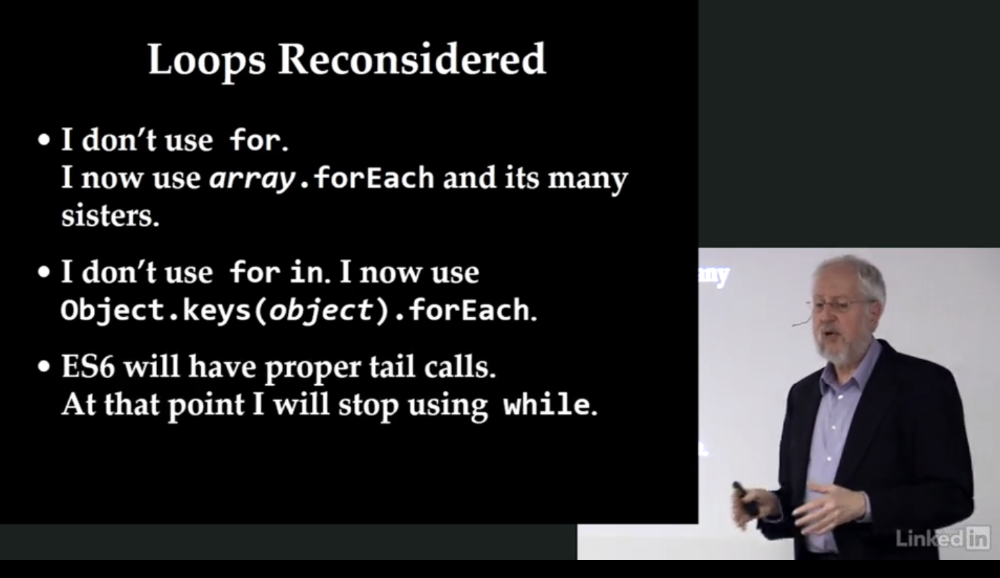

# Douglas Crockford's Javascript The Good Parts - 권장하지 않는 것.

## Good Parts Reconsidered

- I stopped using **new** years ago.
- I have stopped using **Object.create**
- I have stopped using **this**
- I have stopped using **null**
- I have stopped using falsiness

### No prototypal pattern에 대한 이야기

더글라스 크락포드는 이전에 **new** 대신 **Object.create** 사용을 권장했었다.
그런데 **Object.create**도 사용하지 않기를 권장한다. 그 이유는 **this** 키워드를 사용을 권장하지 않기 때문.

보안적인 코드를 작성하기 위해서
페이스북의 FBJS, 구글의 Caja project, 마소의 Web Sandbox, 크락포드의 [ADSafe](http://www.adsafe.org/)와
같은 도구들이 있었다. 공통적으로 **this**의 단점
(*해석이 잘 안되는데, this는 글로벌 오브젝트를 가르키는데 글로벌 오브젝트를 찾기 위해서 느려진다는 거 같다.*)을 집었다.
그리고 **this**를 배제함으로써 더 쉬워졌다. 그리고 prototypal pattern가 쓸모 없어지면서 functional pattern에 집중하게 되었다.

### null, falsiness에 대한 이야기

자바스크립트에는 두 가지 [Bottom Type](https://en.wikipedia.org/wiki/Bottom_type)(값이 없는 타입)이 있다. **null**과 **undefined**.
**undefined** 하나만 사용하기로 했다. 더 많이 입력해야 하지만 문제없다. (ㅋ)

falsiness는 `false`를 나타내는 값들인데 대표적으로 빈 문자열 `''`, `0`, `NaN`, `undefined` 등이 있다.
falsiness는 좋은 아이디어지만 크락포드는 논리식에서 falsiness에 의존하지 않기로 했다. 가능한 명시적으로 비교해야 한다.

## Loops Reconsidered

- I don't use `for`
- I don't use `for in`
- ES6 will have proper tail calls.

## 요약

**new**, **Object.create**, **this**, prototyping 모두 사용하지 않는 것을 권장한다.
함수형 패러다임을 사용하는 것을 추천한다.

**null** 대신 **undefined**를 사용하는 것을 권장하고, `''` 같은 falsy value를 사용하지 말고 명시적으로 비교문을 작성하자.

반복문은 `for` 구문보다 `Array.protoype.forEach`와 같은 배열 메서드를 이용하거나, 꼬리 재귀 함수를 사용하자.
오브젝트를 순회하고 싶다면 `Object.keys(obj)`로 키를 배열화하여 사용한다.
